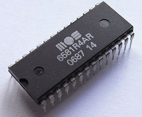
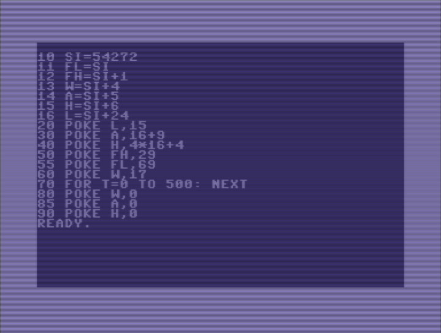
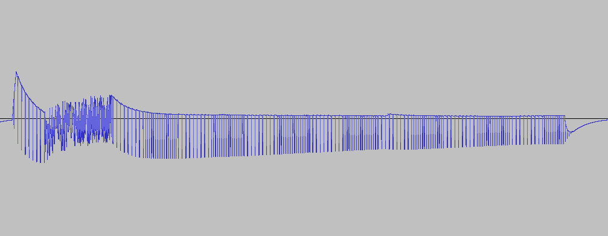
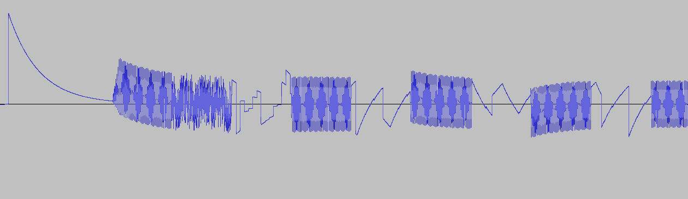

## Edizione Agosto/Settembre 2017

Back to [Home](index);

<!--
Scarica le <a href="./slides/Game Engines Game Sound Techniques maggio 2017.pdf" >slides</a> delle lezioni!
-->

TODO: Description

* Go to the [Part 1](#pt1);
* Go to the [Part 2](#pt2);
* Go to the [Part 3](#pt3);

---

## Pt1:
TODO

## Pt2:

### SID

Il SID (Sound Interface Device) era il chip sonoro utilizzato dal Vic20, C64 e C128, sviluppato da _Robert Yannes_ di _MOS technology_ il quale, oltre al background tecnico, ne sapeva molto anche di musica.

Il suo intento era sviluppare un chip di sintesi sottrattiva totalemente differente dai sistemi sonori presenti nei computer dell'epoca e il risultato fu qualcosa di innovativo.

Il chip era programmabile in BASIC o in linguaggio macchina e possedeva molte caratteristiche interessanti, le principali elencate qui di seguito:

* 3 generatori di suono (voci);
* 4 diverse forme d'onda disponibili (sawtooth, triangle, rectangle w/ pulse width modulation, noise);
* 3 modulatori d'ampiezza (adsr);
* 1 controllo di Master volume (in 16 steps);

Erano possibili **effetti** come la _ring modulation_ o l'[_hard sync_](https://en.wikipedia.org/wiki/Oscillator_sync#Hard_Sync) tra gli oscillatori.

Inoltre il SID disponeva di un **filtro programmabile** (low pass, bandpass, high pass), con frequenza di taglio e risonanza selezionabile. Il funzionamento del filtro era possibile grazie alla presenza di alcuni componenti analogici che completavano il circuito: 2 capacitori. Questa caratteristica rendeva il suono del SID unico e difficilmente replicabile fedelmente, anche al giorno d'oggi.

Ecco qui di seguito un piccolo programma d'esempio:

Da ricordare che, usando l'istruzione `poke` del linguaggio di programmazione BASIC è possibile accedere e scrivere sui singoli registri interni del SID specificando sia l'indirizzo, sia il valore numerico da memorizzarvi.

Il programma usa la prima voce impostata come _onda triangolare_ per riprodurre una nota A440 di durata pari a circa 500 millisecondi. Le istruzioni usate sono:

1. indirizzamento del SID `SI=54272`;
2. impostazione del volume master (registo 4: `L=SI+24` con valori da 0 a 15, volume basso/alto);
3. impostazione dell'envelope con 4 bit per ciascuna fase = 2 byte per la memorizzazione (registri 5 e 6: `A=SI+5` e `H=SI+6`, rispettivamente per attack/decay e sustain/release);
4. impostazione della frequenza (registri 0 e 1: `FL=SI` e `FH=SI+1` )
5. selezione dell'onda (registro 4). Alcuni valori possibili sono:
  * tringolare: 17;
  * dente di sega: 33;
  * rettangolare: 65 --> parametro addizionale "_duty cycle_" (registri 2 e 3 `TL=SI+2`, `TL=SI+3`);
  * noise: 129;
6. ciclo _for_ per la durata della nota.

#### Riferimenti e Links

* [.sid files collection/database](http://hvsc.c64.org/)
* [VICE](http://vice-emu.sourceforge.net/index.html#download), importante emulatore commodore;
* SID [datasheet](http://www.waitingforfriday.com/?p=661) e [wiki](https://www.c64-wiki.com/wiki/SID)

#### Hubbard

Il SID è uno chip che dispone di sole 3 voci ma non è detto che nelle mani di capaci musicisti programmatori non possa ricreare la polifonia e la ricchezza timbrica di un ensamble molto più numeroso

<iframe width="100%" height="315" src="https://www.youtube.com/embed/pgPEaI0GHBI?list=PLXhLeiiveJmNhFf5ShVwwXspGfgt-ww8c" frameborder="0" allowfullscreen></iframe>

Ecco le tracce separate per apprezzare meglio la ricchezza di variazioni, il timing e intuire l'ingegnosità dei programmi scritti da Hubbard:

<a id="hubbard-1">
<audio controls style="width:100%">
  <source src="./music/Rob_Hubbard/commando_track1_voice1.ogg" type="audio/ogg">
Your browser does not support the audio element.
</audio>
<a/>

<a id="hubbard-2">
<audio controls style="width:100%">
  <source src="./music/Rob_Hubbard/commando_track1_voice2.ogg" type="audio/ogg">
Your browser does not support the audio element.
</audio>
<a/>

<a id="hubbard-3">
<audio controls style="width:100%">
  <source src="./music/Rob_Hubbard/commando_track1_voice3.ogg" type="audio/ogg">
Your browser does not support the audio element.
</audio>
<a/>

Anche dalle immagini che mostrano la forma d'onda della parte iniziale della prima voce si può comprendere la complessità della lavorazione:

Immagini e tracce sonore sono state estrapolate utilizzando il player [SIDplay2](http://sidplay2.sourceforge.net/) e [Audacity](http://www.audacityteam.org/).
{: class="dashed"}

## Pt3:
TODO
