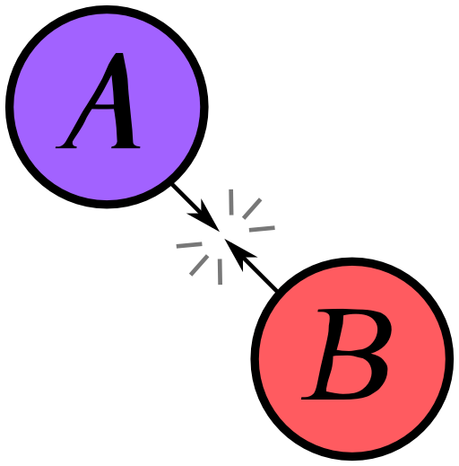
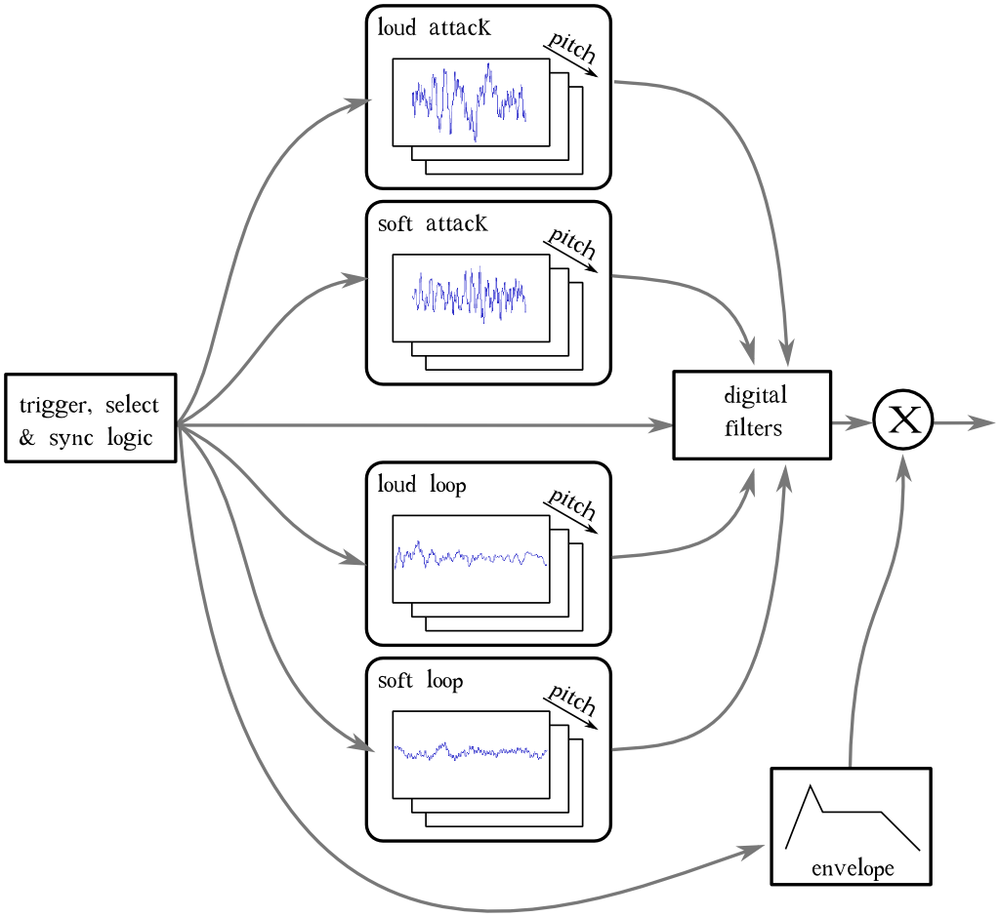
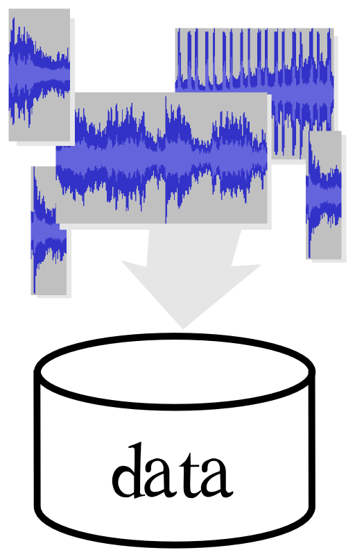

## Edizione Agosto/Settembre 2017

Back to [Home](index);
  
<!-- Scarica le <a href="./slides/Game Engines Game Sound Techniques maggio 2017.pdf" >slides</a> delle lezioni! -->
{: class="dashed"}

Di seguito parte dei contenuti trattati durante le lezioni:

* Go to the [Part 1](#pt1);
* Go to the [Part 2](#pt2);
* Go to the [Part 3](#pt3);

---

## Pt1: Game Engines
TODO

## Pt2: Game Sound overview

### Panoramica storica
TODO

coin-op, consoles, PC, MOD format, MIDI, MT-32

#### SID

Il SID (Sound Interface Device) era il chip sonoro utilizzato dal Vic20, C64 e C128, sviluppato da _Robert Yannes_ di _MOS technology_ il quale, oltre al background tecnico, ne sapeva molto anche di musica.

{: width="60%"}

Il suo intento era sviluppare un chip di sintesi sottrattiva totalemente differente dai sistemi sonori presenti nei computer dell'epoca e il risultato fu qualcosa di innovativo.

Il chip era programmabile in BASIC o in linguaggio macchina e possedeva molte caratteristiche interessanti, le principali elencate qui di seguito:

* 3 generatori di suono (voci);
* 4 diverse forme d'onda disponibili (sawtooth, triangle, rectangle w/ pulse width modulation, noise);
* 3 modulatori d'ampiezza (adsr);
* 1 controllo di Master volume (in 16 steps);

Erano possibili **effetti** come la _ring modulation_ o l'[_hard sync_](https://en.wikipedia.org/wiki/Oscillator_sync#Hard_Sync) tra gli oscillatori.

Inoltre il SID disponeva di un **filtro programmabile** (low pass, bandpass, high pass), con frequenza di taglio e risonanza selezionabile. Il funzionamento del filtro era possibile grazie alla presenza di alcuni componenti analogici che completavano il circuito: 2 capacitori. Questa caratteristica rendeva il suono del SID unico e difficilmente replicabile fedelmente, anche al giorno d'oggi.

Ecco qui di seguito un piccolo programma d'esempio:

<a id="c64-sound">
<audio controls style="width:100%">
  <source src="./resources/sounds/c64-sound.ogg" type="audio/ogg">
Your browser does not support the audio element.
</audio>
<a/>

Da ricordare che, usando l'istruzione `poke` del linguaggio di programmazione BASIC è possibile accedere e scrivere sui singoli registri interni del SID specificando sia l'indirizzo, sia il valore numerico da memorizzarvi.

Il programma usa la prima voce impostata come _onda triangolare_ per riprodurre una nota A440 di durata pari a circa 500 millisecondi. Le istruzioni usate sono:

1. indirizzamento del SID `SI=54272`;
2. impostazione del volume master (registo 4: `L=SI+24` con valori da 0 a 15, volume basso/alto);
3. impostazione dell'envelope con 4 bit per ciascuna fase = 2 byte per la memorizzazione (registri 5 e 6: `A=SI+5` e `H=SI+6`, rispettivamente per attack/decay e sustain/release);
4. impostazione della frequenza (registri 0 e 1: `FL=SI` e `FH=SI+1` )
5. selezione dell'onda (registro 4). Alcuni valori possibili sono:
  * tringolare: 17;
  * dente di sega: 33;
  * rettangolare: 65 --> parametro addizionale "_duty cycle_" (registri 2 e 3 `TL=SI+2`, `TL=SI+3`);
  * noise: 129;
6. ciclo _for_ per la durata della nota.

#### Hubbard

Il SID è uno chip che dispone di sole 3 voci ma non è detto che nelle mani di capaci musicisti programmatori non possa ricreare la polifonia e la ricchezza timbrica di un ensamble molto più numeroso

<iframe width="100%" height="315" src="https://www.youtube.com/embed/pgPEaI0GHBI?list=PLXhLeiiveJmNhFf5ShVwwXspGfgt-ww8c" frameborder="0" allowfullscreen></iframe>

Ecco le tracce separate per apprezzare meglio la ricchezza di variazioni, il timing e intuire l'ingegnosità dei programmi scritti da Hubbard:

<a id="hubbard-1">
<audio controls style="width:100%">
  <source src="./resources/music/Rob_Hubbard/commando_track1_voice1.ogg" type="audio/ogg">
Your browser does not support the audio element.
</audio>
<a/>

<a id="hubbard-2">
<audio controls style="width:100%">
  <source src="./resources/music/Rob_Hubbard/commando_track1_voice2.ogg" type="audio/ogg">
Your browser does not support the audio element.
</audio>
<a/>

<a id="hubbard-3">
<audio controls style="width:100%">
  <source src="./resources/music/Rob_Hubbard/commando_track1_voice3.ogg" type="audio/ogg">
Your browser does not support the audio element.
</audio>
<a/>

Anche dalle immagini che mostrano la forma d'onda della parte iniziale della prima voce si può comprendere la complessità della lavorazione:

TODO: ascolto del brano su multitraccia **Audacity**.

Immagini e tracce sonore sono state estrapolate utilizzando il player [SIDplay2](http://sidplay2.sourceforge.net/) e [Audacity](http://www.audacityteam.org/).  
[.sid files collection/database](http://hvsc.c64.org/)
[VICE](http://vice-emu.sourceforge.net/index.html#download), importante emulatore commodore;
SID [datasheet](http://www.waitingforfriday.com/?p=661) e [wiki](https://www.c64-wiki.com/wiki/SID)
{: class="dashed"}

### Re-Re-Repetition

Scott Selfon di _Microsoft Corporation_ parla della ripetizione nel videogioco al GDC 2014 in un [talk](http://www.gdcvault.com/play/1020319/Techniques-for-Fighting-Repetition-in) intitolato "_Techniques for Fighting Repetition in Game Audio_":

<audio controls style="width:100%">
  <source src="http://twvideo01.ubm-us.net/o1/vault/gdc05/audio/techniques.mp3" type="audio/mpeg">
Your browser does not support the audio element.
</audio>

#### Quando la ripetizione è un bene

La ripetizioni nel sonoro per un videogame non è sempre un male: talvolta al giocatore va dato una sorta di feedback, una **audio reward** ad indicare che si sta facendo qualcosa di giusto o qualcosa che migliora la propria condizione (es. bere la pozione rinvigorente in "_Prince of Persia_").

{: width="60%"}

<a id="prince-of-persia">
<audio controls style="width:100%">
  <source src="./sounds/prince-glu-glu.ogg" type="audio/ogg">
Your browser does not support the audio element.
</audio>
<a/>

Anche nell'abito dei suoni associati alla **UI** la ripetizione è quasi necessaria: un particolare suono sta ad indicare che si sta selezionando una opzione specifica e lo stesso suono ripetuto serve a sottolineare il fatto. Se l'interfaccia utente proponesse suoni diversi mentre l'utente si muove nell'interfaccia, anche interagendo con il medesimo pulsante, la cosa causerebbe non poca confuzione.

#### Quando la ripetizione è un male

Quando siamo fruitori di opere di intrattenimento - libri, cinema, teatro, etc... - tra noi e gli autori dell'opera si instaura una sorta di tacito accordo. Da una parte nasce (inconsciamente) in noi volontà di sospendere l'incredulità ([_suspension of disbelief_](https://it.wikipedia.org/wiki/Sospensione_dell'incredulit%C3%A0)) per mettere da parte per un momento le nostre facoltà critiche, ignorare le incongruenze secondarie e godere dell'opera di fantasia. Come spettatori ci lasciamo guidare e ci abbandoniamo alla narrazione.

Dall'altra parte l'autore si impegna nell'introdurci e nel guidarci attraverso un percorso comune allo scopo di raccontarci una storia.

La sospensione dell'incredulità nasce da un equilibrio molto sottile, tanto più difficile da creare quanto da mantenere da parte dell'autore dell'opera, soprattutto in epoca moderna dove si è bombardati da flussi continui di informazione e da moltissime forme diverse di intrattenimento.

Declinando il concetto al mondo videoludico, un suono ripetitivo viene riconosciuto dal nostro cervello come un **pattern**.

Il nostro cervello è abilissimo ad identificare pattern, strutture ricorrenti di ogni tipo (footsteps), è quando questo avviene il contratto si rompe.

---

I casi in cui la ripetizione NON è bene son quelli in cui causerebbe la rottura dell'illusione: se il suono che udiamo è lo stesso che abbiamo già ascoltato, il nostro cervello intuisce immediatamente che qualcosa non funziona come dovrebbe.

Un suono che si ripete sempre uguale a se stesso due volte di fila è quanto di più innaturale si possa percepire in un videogioco. Nella realtà di tutti i giorni non si verifica mai nulla di simile, basta considerare semplicemente _la posizione della nostra testa_ all'interno dell'ambiente, essa non è mai nella stessa esatta posizione in istanti ravvicinati (le nostre orecchie non mentono e sanno riconoscere ogni tipo di variazione).

La ripetizione può verificarsi nell'ambito dei:
* **dialoghi**: immaginiamo una sitzaione in cui affrontiamo uno schieramento di nemici e ognuno di essi pronunci un grido di battaglia assolutamente identico a quello pronunciato dai vicini;
* **fooley**: esempio tipico è quello dei _footsteps_, in cui lo stesso identico suono si sente ripetuto più e più volte durante il gioco. L'effetto suona innaturale e contribuisce a buttare fuori lo spettatore rompendo l'illusione;
* **fisica**: se il physics engine lavora per simulare, ad esempio, una lattina che rotola al suolo, e l'integrazione prevede che un suono venga riprodotto a loop ad intervalli di tempo regolari, ecco che si ha lo stesso tipo di problema (indipendentemente che il suono ben si sposi con l'immagine renderizzata a schermo);
* **suono senza corrispondenza visiva** (o per meglio dire, con _errata_ corrispondenza visiva): una cosa che accade tipicamente con i suoni d'ambiene, spesso pre-prodotti e inseriti nel gioco senza che ci sia poi una comunicazione tra i game e audio engines. Un esempio potrebbe essere il bubolare del **gufo** o l'**ululato** del lupo in uno scenario di un bosco pauroso. La traccia ambientale potrebbe essere prerenderizzata (mono, stereo o multicanale), tuttavia non risultare realistica quando il gufo suoni sempre "_pannato_" a destra nonostante l'avanzare e il muoversi del player nel bosco.

#### Grandi matrici

Tutto questo fa sì che ci sia bisogno di un gran numero di variazioni e che si debba lavorare per "_riempire gli spreadsheet_" (parte dell'_audio design document_) e registrare continaia se non migliaia di suoni diversi. Una matrice ad incroci enorme che richiede un sacco di tempo e risorse per essere prodotta.

Il workflow comunce infatti può essere compreso se si pensa a come l'audio viene normalemnte implementato all'interno del videogioco: come un evento che corrisponde ad un determinato suono.

Eventualmente poi il suono associato all'evento viene prodotto o elaborato successivamente a seconda di uno o più parametri che derivano dall'game engine. Alcuni esempi potrebbero essere:
* il _carico_ per un automobile in corsa;
* il livello di _salute_ per il player;
* il _punteggio_ della partita a regolare il livello di eccitamento del pubblico sugli spalti dello stadio.

Qui risiede la grande abilità del sound designer il cui talento e capacità sono fondamentali nella riuscita.

Ammesso che la relazione `martello-->colpisce-->incudine` produca lo stesso suono di `incudine-->colpisce-->martello`, i suoni da ricreare sono comunque tantissimi: la **crescita** dei sound assets è **combinatoria**!

{: width="60%"}

Un oggetto può essere colpito in un particolare punto o subire un impatti da un corpo che poi rimane in contatto. Può essere strisciato e causare una eccitazione da frizione, soffiato per eccitarne eventuali cavità d'aria oppure scosso da una vicina sorgente ad esso accoppiata ed essere portato in risonanza.

Inoltre tutto questo può accadere in aria oppure anche sott'acqua il che modificherebbe la velocità del suono e la sua propagazione. Oppure possono accadere mentre l'oggetto, l'ascoltatore o il mezzo di propagazione è in movimento causando l'effetto Doppler, etc...

Per fare un altro esempio si potrebbe considerare ancora quello dei _footsteps_: senza troppo eccedere, potremmo supporre che il gioco contenga 20 diverse superfici calpestabili come legno, metallo, ghiaia, sabbia, cemento e così via.

Per ottenere il numero di file audio da produrre, dobbiamo moltiplicare questo numero per quello dei personaggi più importanti per il gioco, i quali hanno bisogno d'essere caratterizzati particolarmente nei loro movimenti.

Questi personaggi possono poi indossare diversi tipi di calzari e possono poi camminare a diverse velocità: anche questo incide dal momento che sappiamo che "il correre" non suona come "il camminare".

All'interno dell'equazione potremmo poi inserire anche il paramtro _peso_, dato dal numero di oggetti trasportati nell'inventario personale, oppure ancora considerare la pendenza del terreno, e così via...

Come si vede la matrice degli assets sonori in un caso come questo diventerebbe davvero gigantesca e multidimensionale.

Un caso id studio interessante potrebbe essere quello illustrato da _Alastair MacGregor_ della _Rockstar games_ al GDC 2014 rigaurdo agli assets del gioco GTA V (vedi minuto ]13:47](https://youtu.be/L4GuM15QOFE?t=13m47s))

#### Realtime

La soluzione a questo è computare quanto più possibile in **realtime**, usando le capacità offerte dai dispositivi **hardware** della piattaforma ove possibile oppure programmando via **software** (a basso livello magari) le features che ci interessano per creare varaizione.

Un altro modo per risolvere problemi di ripetitività è quello di **tenere traccia delle variazioni**.

Tenere traccia in qualche modo, di quale sia stato l'audio appena riprodotto per operare delle scelte intelligenti sul nuovo audio da riprodurre così da sincerarsi di non ripetersi e non essere ridondanti.

Le principali accortezze che si potrebbero avere sono in questi ambiti:

##### Volume / attenuation

Si tratta di un sistema facile ed economico da metter in atto perchè comporta operazioni CPU base. Fornisce già una discreta illusione della profondità e della spazialità, tuttavia non è uno dei sistemi più incisivi per vincere la ripetitività;

##### Pitch changes

L'orecchio umano è meno abile nel riuscire a percepire differenze di intonazione. Inoltre questo sistema non è sempre applicabile, specie nelle linee di dialogo, per le quali invece una variazione risulterebbe particolarmente fastidiosa.

La causa di questo è da ricercare nel fatto che tutti questi cambiamenti nel pitch avvengono attraverso cambiamenti di sample rate, nel dominio del tempo quindi, con conseguente variazione nella durata.

Così facendo la voce diventa rapidamente innaturale (quando una voce è "_pitchata_" verso l'alto ad esempio in incorre nel problema legato alle armoniche superiori che, superata la frequenza di nyquist, finiscono per ripresentarsi nella parte bassa dello spettro, causando distorsioni e artifatti percepibili).

Inoltre da considerare la banda di trasferimento dati da disco a memorie/processore: con un pitch di un ottava sopra mi ritrovo un audio dalla velocità raddoppiata il che necessità un più veloce accesso ai dati.

Pitch shifting più avanzati possono essee usati: si tratta dei pitch shifting che agiscono invece nel dominio della frequenza e si basano quindi sulla FFT. Sono pitch shifting con la preservazione delle formanti che garantiscono alle voci di mantenere la loro credibilità. Con questi tipi di pitch shifting inoltre lo streaming dei contenuti audio da disco resta coerente.

##### Filtering

Spesso l'hardware dei dispositivi su cui il gioco verrà giocato permette di effettuare operazioni di filtraggio in modo diretto senza costi di alcun tipo. In caso questo non sia possibile invece è comunque semplice implementare lo stesso tipo di filtri base come un LPF o un banco di BPF, via codice DSP.

Usare i filtri sul sonoro e anche sulle voci permette di raggiungere un alto grado di variabilità. Non importa se il filtraggio non rispetta con accuratezza la fisica del fenomeno, il semplice fatto che ci sia un filtro fa suonare il tutto più naturale.

Applicare variazioni randomiche sul filtto di una voce infatti, aiuta a illudere il giocatore sulla presenza di elementi attenuanti come l'umidità ad esempio, ma soprtattutto fornisce la sensazione di direzionalità: nell'esperienza quotidiana, come ascoltatori ci accorgiamo che la nostra testa non è mai perfettamente ferma nello stesso punto e, anche piccole variazioni nella posizione, possono modificare lo spettro dell'audio percepito.

Anche questa è una tecnica relativamente economica da applicare.

##### Timing/variation

Di nuovo in questo caso si può citare l'esempio dei _footsteps_. Il suono dei passi è infatti un suono molto articolato, per questo si può pensare di **spezzarlo nelle sue componenti individuali** e applicare variazioni casuali a ciascuna di qieste per ottenere un risultato molto più ricco.

Un altro espediente è quello di **variare il tempo** che intercorre tra i vari elementi. In un suono ambientale che debba generare un tappeto costante di sottofondo, un particolare altamente riconoscibile come un ululato o il suono di un gufo può destare l'interesse dell'ascoltatore, pertanto una ripetizione a loop dell'audiofile, verrebbe immediatemente classificata come finta.

In questi casi meglio separe le diverse parti e lavorare con tempi diversi e casuali frapposti tra i suoni che possono essere più problematici.

##### Silence

Talvolta il silenzio può risultare un grande alleato quando si cerchi di sconfiggere la ripetitività. Semplicemnte usare il silenzio come una delle possibili opzioni di una scelta casuale può aggiungere un po' di varaizione in più!

##### Envelope

Applicare curve di inviluppo su volume o frequenza di taglio dei filtri aggiungono ancora ulteriore variabilità.

Ad esempio una mitragliatrice che abbia terminato la sua raffica potrà avere diverse curve di iniluppo applicate alla coda del suoni in decadimento.

##### Positional variation

La variazioni applicata al posizionamento dei suoni nell'ambiente è importante; in particolare per tutti quei suoni che non hanno un proprio corrispettivo visivo.

Il bubolare di un gufo nell scenario del bosco deve essere posizionato con cognizione e mantenere la propria posizione coerentemente con i movimenti del giocatore.

Inoltre, considerando che i suoni non sono quasi mai omnidirezionali, occorre considerare anche quale la direzione verso cui la sorgente sonora è orientata.

Un _epic fail_ in questo caso è il sentire un gufo sul proprio lato destro quando, sopraggiungendo dal bosco, si è ormai arrivati a costeggiare sulla destra un alto edificio.

##### Environmental variation

L'ambiente deve interagire con il suono prodotto dagli emitter: il mondo 3D in cui siamo immersi può essere sfruttato per creare variazione.

Per continuare con l'esempio del muro, il suono dei nostri passi dovrebbe in questo caso essere arricchito da una serie di early reflection. Ascoltando il suono così realizzato non soltanto si avrebbe una percezione di variazione ma anche una maggiore sensazione di immedesimazione nell'ambiente.

Un esempio potrebbe essere il plug-in [Reflect](https://www.audiokinetic.com/products/wwise-add-ons/reflect/) di Wwise il cui compito è proprio quello di realizzare le early reflection dinamicamente su base della struttura 3D del mondo.

Ad oggi la cosa può sembrare scontata ma, forse qualcuno se ne ricorderà, prima che il calcolo dinamico delle occlusioni diventasse possibile e venisse implementato massicciamente, poteva capitare che si sentisse il suono di un nemico sopraggiungere dal lato ma che, voltandosi verso la direzione di provenienza del suono, non ci fosse nulla se non un muro. Il nemico c'era ma aldilà della parete.

### When to apply all those effects

#### Dialoghi

Aggiungere variazione non è sempre facile: il dialogo è la cosa più difficile da manipolare dinamicamente su cui è più difficile applicare quanto visto fino ad ora..

Per questo la variazione la si ottiene in fase di registrazione, con l'attore e il direttore del ADR che registrano battute con differenti intenzioni ed intonazioni.

Interessanti saranno i futuri sviluppi dell'**intelligenza artificiale** per la sintesi vocale la quale potrebbe presto soppiantare la necessità di disporre di attori in carne ed ossa per la registrazione di linee di dialogo (vedi il progetto [WaveNet](https://deepmind.com/blog/wavenet-generative-model-raw-audio/) ad esempio).
{: class="note"}

Nel caso dei dialoghi eventualmente si possono applicare modifiche in real-time come il **voice-masking** (usato tra l'altro per ridurre il gender gap (flip gender) nell [interviste di lavoro on-line](https://youtu.be/p6m8hvIo0VI), inducendo un artificiale "_gender flip_") oppure ancora per una "_radializzazione_" (voice coming from the radio).

In tale caso è possibile aggiungere più o meno rumore, crakcles o distorsione in modo dinamico e in termpo reale.

Resta comunque il fatto che la stessa frase non può essere mai detta identicamente 2 volte di fila! E' inaccettabile all'ascolto.

Un altro aspetto interessante che dovrebbe essere gestito è nell'interazione di più characters durante il dialogo: siamo naturalmente in grado di ascoltarci e aspettare il nostro turno per esprimere la nostra opinione. In caso di sovrapposzione è possibile interrompere l'interlocutore alzando la voce oppure restare in silenzio fino a che colui che parla non si interrompe.

Un gioco non è normalemnte in grado di fare questo. Interessante sarebbe capire come ed in che modo introdurre sistemi intelligenti per simulare questo tipo di interazioni per restituire una suono più verosimile.

Una nota va spesa per citare i sistemi di **speech recognition** come shortcut sostitutivi all'uso dei controller fisici per agire all'interno del gioco (implementati ad esempio in titoli come "_Mass Effect 3_", "_The Elder Scrolls V: skyrim_").
{: class="note"}

Importante comunque generare variazioni come la già citata _positional variation_ considerando che il suono proveniente dalla bocca non è direzionale e pertanto va opportunamente filtrato a seconda dei movimenti.

#### Sound fxs

Come già detto, le variazioni hanno ampia applicazione sugli effetti sonori.

#### Music (case study: iMuse)

Anche la musica è una elemento che può certo avvantaggiarsi delle tecniche di variazione fino ad ora discusse.

Un sistema davvero interessante è quello ideato dai compositori Michael Land e Peter McConnel nel 1991, quando all'epoca lavoravano ai videogiochi di avventura della _LucasArts_: **iMuse**.

Nasce nel 1991 ([brevettato nel 1994](https://www.google.com/patents/US5315057)); è un sistema che premette l'introduzione di componenti di audio dinamico in un linguaggio di scripting. Fondamentalmente iMuse è un database di sequenze musicali che possono contenere **punti di decisione** o **markers** all'interno delle tracce.

Il sistema, utilizzando eventi SysEx nei file MIDI, permette l'interazione tra le azioni del giocatore e il sonoro del gioco.
Gli eventi in questione sono di due tipi: **markers** e **hooks**.

* Un _marker_ viene inserito nel file MIDI nel punto che, una volta raggiunto dal lettore MIDI, deve triggerare l'esecuzione di un particolare comando da parte dello script del gioco. Il comando in questione è inserito in una lista (_coda  fifo_) è ne viene attivata l'esecuzione non appena il MIDI player raggiunge un marker con un determinato ID. I comandi possono essere qualsiasi cosa, dal fade in/out alle pause;
* Un _hook_ contiene un ID e l'azione da eseguire una volta che l'hook viene raggiunto. Lo script lancia un comando che si occupa di aspettare che un certo hook venga incontrato (_callback_), e quindi di mettere in esecuzione il comando contenuto in quest'ultimo.
Gli hook si distinguono in vari tipi, quali ad esempio salti, trasposizioni, abilitazione/disabilitazione di strumenti.

Vediamone un paio di esempi sfruttando il motore _ScummVM_ e giocando a _Monkey Island 2: LeChuck revenge_ (nota: nella particolare dimostrazione usiamo una emulazione software della scheda _Roland MT-32_, all'epoca lo stato dell'arte dell'audio nel mondo videoludico);

{: width="100%"}

---

Per la musica si potrebbe aprire un intero capitolo a parte parlando di composizioni interattive, musica generativa/algoritmica, passando per iMuse, Farnell,

Forse in una lezione futura :)



linear music (shuffling) 37:00 / radio GTAV - ducking, changing mix, djishing thing, cross fade - interactive composition
markers, timing (iMuse style of stuff)

---

### dall'edizione precedente:

non linearità

* variazione del tempo (space invaders + mario alla fine di ogni livello)
* variable pitch ( a che vedere con le limitazioni tecniche della memoria)
* variabile rhythm/meter (esempio fraseggiatore o Zen games)
* volume and dynamic
* variable DSP (reverb and distorsion)
* variable melody
* variable harmony
variable mix (sostituzione di strumenti o di layers)

_vedi Roads_

Concetti di [musica generativa](https://en.wikipedia.org/wiki/Generative_music), esempio sono _Music for Airports_, _Discreet Music_ etc...
architetto e compositore vs gardener (intervento di [Brian Eno](https://vimeo.com/55969912))

Individuazione dei metodi formali, delle regole nella composizione della musica: Guido D'Arezzo (1026), Mozart, etc...
Composizione automatica
contollo delle sequenze --> musica algoritmica (Xenakis, Koenig, Truax)

processi stocastici
    + tabelle della probabilità
    + distribuzione di probabilità
    + catene markoviane

---

## Catene Markoviane

(Andrey Markov 1856 - 1922) è il nome che viene assegnato ad una macchina a stati statistica discreta nella quale lo stat osuccessivo è determinato da una matrice dei pesi di probabilità assocaiti ai passaggi tra stati diversi all'interno di una sequenza.

Dati statistici possono essere estratti da una musica data per ottenere poi una nuova composizione generata nello stile esaminato.

citando Farnell:
> For example, a Markov machine can quickly be trained to under stand 12 bar blues and notice that more often than not a F7 follows a C and that a where a
chord has a major 3rd the melody will use a flattened one. This is interesting when data from more than one composer is interpolated to see what Handel, Jean Michel Jarre and Jimi Hendrix might have written together.

### Case Study: Zen Game

esempio [Zen Games](http://www.limulo.net/games/ZenGame/)
Le note sono prese a prestito dalla scala pentatonica maggiore di C
set di regole:
* durata nel tempo
* durata della frase che condiziona il verificarsi di una pausa e la durata della stessa
* probabilità di scegliere una nota all'interno dell'accordo
* probabilità di scegliere una nota successiva che si trovi nelle vicinanze di quella appena cantata
* probabilità che la nota da cnatare sia acuta piuttosto che grave

## Artificial Intelligence

memoria ritenuta diventa conoscenza

conoscenza + processo.

### AI adattiva

### Sistemi esperti

per semplificare all'estremo si può dire che i sistemi esperti sono quelli che possiedono un libr od iregole (l'armonia jazz, il rock, etc...) dal quale possono attingere per operare delle decisioni. Ma questa conoscenza non è fissa. Quello che definisce i sistemi esperti come AI è il fatto che questi possono correggere la loror conoscenza.

### Neural Networks

### Cellular Automata

Gli automi cellulari sono una collezione di programmi molto piccoli che vivono in un ambiente circoscritto e interagiscono tra loro. Ognuno è una macchina a stati che evolve su base di una matrice di regole e anche dell'input esterno.

Una **intelligenza emergente** si ottiene dalla rispettive interazioni e dal modo in cui gli output di alcuni diventa input per altri.

Esempio game of life in Processing

### Algoritmi genetici

Condisioni ambientali possono far prosperare o uccidere le nuove generazioni le quali portano con sè, talvolta mutato, il patrimonio genetico dei genitori.

---

Frattali (auto similarità) - 1/f rumore frazionale
Chaos generator
Grammatiche
Pattern matching / search tecniques
    Constraints



### Game audio engine tradizionale

Audio engine
middleware

---

Il game audio engine è una componente del game engine, oppure un modulo middleware da affiancare ad esso, che si occupa della gestione di tutto ciò che è suono all'interno di un videogioco.

Quali sono i compiti e le caratteristiche principali di un game audio engine tradizionale?

#### Switching

Logiche e meccanismi per dare priorità ai suoni da riprodurre e assegnare le voci disponibili, dal momento che si tratta di risorse limitate.
Un esempio potrebbero essere i sintetizzatori dove si parla di [voice stealing](http://electronicmusic.wikia.com/wiki/Voice_stealing).

Un esempio di voice stealing nel videogioco lo si ha in _Super Mario Bros_, dove il sound engine agisce sulla voce assegnata alla melodia principale (il suono più acuto), deallocandola e riassegnandola per la sintesi degli effetti sonori delle monete.

<iframe width="100%" height="315" src="https://www.youtube.com/embed/Dp7fVUfj8oI?start=123" frameborder="0" allowfullscreen></iframe>

Lo switching è guidato anche dal ruolo che il particolare suono riveste all'interno della **narrazione**: in una sitauzione in cui sono presenti molti suoni, sono quelli meno importanti ai fini di quanto si deve raccontare ad essere sacrificati per primi.

#### Random

Come abbiamo ampiamente detto poco fa, la randomicità può essere una grande risorsa per aggiungere varaibilità.

Il game audio engine dispone di una serie di strumenti integradi per aggiungere variabilità pressochè a ciascun parametro disponibile.

#### Blending

Crossfade parametrico tra campioni diversi, quello che nella sintesi prende il nome di **multisampling**. Questa tecnica è implementata in gran misura nei campionatori i quali infatti rispondono a diverse velocity di tocco con un mix tra campioni corrispondenti.

Immaginiamo una caduta di un oggetto da diverse altezze; questo comporta intensità diversa ma non solo, anche variazione timbrica.

#### Mixer, Grouping and Buses

Molti game audio system incorporano un mixer del tutto analogo a quallo in uso nelle grandi produzioni: un banco large frame con gruppi, mandate e ritorni, etc...
La differenza è che, mentre per una produzione tradizionale la configurazione del banco rimane statica, praticamente invariata lungo tutta la durato di Un medesimo brano o album, nel caso di un videogioco  il mixer deve spesso riconfigurarsi del tutto in pochi istanti.

<table>
<tr>
<td>

</td>
<td>

</td>
</tr>
</table>

Un esempio potrebbe essere il passaggio da una sitauzioni in-game ad un menù di interfaccia (pausa o salvataggio).

#### Real time controllers

Il game sound engine deve fornire un'interfaccia per ricevere parametri real time dal game engine ed usarli, spesso mappandoli sulle frequenze cutoff di filtri o sul controllo di volumi piuttosto che pitch.

#### Positioning

Come funziona l'audio in un gioco: **emitters** sono oggetti nello spazio tridimensionale che emettono suono e uno o più **listeners** (mono, stereo o multicanale; va pensato come un array di microfoni), in genere solidale col player.
E' un sistema che si occupa di calcolare in run-time le funzioni di trasferimento e i filtri da applicare al suono riprodotto per dare all'ascoltatore la percezione che gli emettitori si trovino immersi nello spazio virtuale circostante.
Il panning "_reale_" è più complcato rispetto ad una semplice variazione di volume tra i canali.
panning, multicanale (stereo, 5.1, 7.1, ambisonic (non usato), binaurale);

#### Ambience

Parlando di sample, quando si registra si predilige il suono diretto e si fa di tutto per escludere quello riverberato
Questo perchè il suono d'ambienza viene calcolato in tempo reale da processori dedicati.
reverb, delay, doppler effect, filtering, fast realtime convolution.

#### Attenuation & damping

attenuazione esmorzamento: un discorso legato alla distanza tra emitter e listener, grandezza geometrica ricavata dal modello tridimensionale, in base alla quale viene modificato in tempo reale la frequenza di taglio di un filtro passa basso e un amplificatore di livello.
Lo stesso si applica in casi in cui ci sia un ostacolo tra emittere e listener: occlusione ottenuta con filtri opportunamente settati. Materiali diversi

#### Dialogues

Il game audio engine deve essere in grado di interfacciarsi e gestire complessi database di informazioni. Uno di questi è rappresentato dall'insieme degli audio file associati a tutte le varie linee di dialogo (in una o più lingue) presenti nel gioco.

#### Music

Il game audio engine deve essere in grado di gestire l'eventuale colonna sonora musiclae interattiva (vedi ad esempio il sistema _iMuse_).

#### Alignement

Uno scenario in cui più giocatori prendono parte ad un partita multiplayer.
Un server preposto al controllo e al master clock per la ricezione e ridistribuzione dei pacchetti.
A seconda della contingeza ci possono essere latenze che si sommano e si accumulano, e possono essere diverse da caso a caso, e da giocatore a giocatore e cambiare nel tempo.
Il game engine, e più nello specifico l'audio engine per quanto concerne il suono, deve essere in grado di gestire situazioni come questa e di riordinare opportunamente i pacchettin in arrivo per dare un audio sempre corerente
esempio PS3 (chiedi a Vale di intervenire)

#### Encoding/Decoding, data streams

L'audio engine deve interfacciarsi con quella parte di software in carico di gestire gli accessi al disco e che si occupa del memory management. Da ricordare che l'audio è immagazzinato sul supporto in forma compressa in modo da risparmiare spazio di archiviazione, il che, nel momento della riproduzione, impone un pre fetching e un buffering per la decompressione prima dell'effettiva riproduzione.

### Suono come modello event based/data driven

{: width="60%"}

A ben vedere nell'ultima parte della sua storia, come analizzato fino ad ora, il suono nel videogioco si presenta come un modello guidato dai dati (**data driven model**).

In altri termini, è costituito da una moltitudine di file audio, compressi per ragioni di spazio e utilizzo delle risorse, raccolti in un database e che vengono messi in riproduzione all'occorrenza, in seguito al verificarsi di particolari eventi (**event based**).

Ai sample che vengono riprodotti si possono certo applicare delle **modificazioni in tempo reale** come abbiamo già detto (attenuazione dovuta alla distanza, combinazioni e layering, random e granularità).

A ben vedere però questo sistema basato sui sample audio sembra in contraddizione netta con il dominio visivo, caratterizzato invece da un comportamento **continuo** e guidato da uno stream di parametri piuttosto che da eventi **discreti**.

### Souno come processo

#### come funziona un FDS

#### Realismo (?!)
porta
lastra percossa
anlog and virtual analog
physical modelling
Perry Cook and Andy J. Farnell
audio procedurale

perchè scegliere il procedurale e quando sceglierlo.

New skills

#### vantaggi e svantaggi del paradigma procedurale

#### New skills, the future

- tecniche audio procedurale
	- papers
	- animazione a partire dal suono
	- musica generativa (?)

### The Future

In un futuro presumibilmente non troppo lontano, il paradigma procedurale avrà preso piede e il modno del lavoro nel settore dell'audio per videogiochi dsi arricchira di tutta una serie di nuove figure professionali.

Proprio come negli ultimi 20 anni sono nate specializzazione di ogni tipo nel mondo della computer grafica (professionisti che si occupano esclusivamente di _rigging_, _textures_, _animazione_, _modellazione_, _light_, _visual fxs_, etc...), così anche nel mondo dell'audio procedurale ci saranno nuove figure speciallizzate nella modellazione di suoni e fenomeni fisici differenti (acqua e [bolle](http://www.cs.cornell.edu/projects/Sound/bubbles/), fuoco, [fracture sound](http://www.cs.cornell.edu/projects/FractureSound/), impatti, [frizioni e sfregamenti](http://independent.academia.edu/StefaniaSerafin), [accartocciamenti](http://www.cs.columbia.edu/cg/crumpling/), [acustica delle stanze](http://www.ness-music.eu/wp-content/uploads/2013/04/TASL2256897.pdf), etc...).

#### Animation driven by audio

C'è addirittura che si specializza nel processo inverso, ovvero nel ricreare animazioni basandosi sul suono in una sorta di [**inverse fooley**](http://www.cs.cornell.edu/projects/Sound/ifa/), il che può portare a risultati davvero sorprendenti:

<iframe width="100%" height="315" src="https://www.youtube.com/embed/EGkQkdCKztM?start=130" frameborder="0" allowfullscreen></iframe>

Se, come spesso accade, l'audio è considerato come accessorio e secondario rispetto alla parte grafica/visiva, ci sono tuttavia alcuni casi in cui questo andamento è ribaltato: `event --> sound` diviene qui `sound --> event`.

**Automatic lip sync**: un sistema studiato da moltissimo tempo per animare grafiche e modelli 3D in modo automatico basandosi sul segnale audio (vedi [patent Sierra](https://patentimages.storage.googleapis.com/c3/e3/32/01720ae146f119/US5430835.pdf)).

**Procedural animation**: [Tom Clancy's Ghost Recon Advanced Warfighter 2](https://en.wikipedia.org/wiki/Tom_Clancy%27s_Ghost_Recon_Advanced_Warfighter)) (Ubisoft 2007) case study: un aeroplano precipitato nel deserto esplode e continua a bruciare a terra. Le fiamme sono sferzate a destra e a sinistra da un vento irregolare. Polvere e fumo sono generati proceduralemtne in base al livello dell'audio pre-prodotto.

Vedi [questo talk](http://www.gdcvault.com/play/1017780/Crossing-the-Streams-Game-Audio) di Scott Selfon al minuto 23:14!

## Pt3: Game Sound workshop

### FMOD
TODO

* pt motors / parametrization
* pt footsteps
* pt music

### PureData: esempi di audio procedurale e musica generativa

Abbiamo detto che il paradigma del suono procedurale prevede una stratificazione delle diverse fasi. Questo significa che ciascuna di esse può essere svolta con un particolare strumento hardware o software piuttosto che un altro, a seconda delle esigenze del progetto o delle particolari propensioni del suon designer.

{: width="60%"}

Tipico è il caso del layer di _implementazione_: in questa fase infatti qualsiasi strumento software può essere usato per implementare il modello, come ad esempio Chuck, SuperCollider, CSound o PureData.

Vedremo ora alcuni esempi tratti dal lavoro di _Andy Farnell_, il quale usa PureData come linguaggio di programmazione.

Che cosa è PureData? [PureData](http://puredata.info/) è un linguaggio di programmazione a nodi nato a metà degli anni '90 ad opera di Miller Puckette che all'epoca lavorava all'IRCAM di Parigi.

Esempi di procedurale: bells, clocks, water, insects, engine, guns, helicopter (thanks to _Andy Farnell_, _Alexey Reshetnikov_ and _Rod Selfridge_).

Per utilizzare [questi esempi](https://github.com/Limulo/game-sound-sae2017/tree/master/resources/procedural/PureData_examples) è necessaria l'installazione di [PureData](http://puredata.info/) e delle seguenti librerie aggiuntive:
* list_abs (for the **[list_dot]** and **[list_emath]** objects);
* zexy (for the **[>~]** and **[<~]** object);
* iemlib (**[prvu~]**, **[init]**, **[t3_bpe]**, **[t3_line~]** and **[t3_delay]** objects); iem_t3_lib (the
* motex (**[ln~]** object);
* lyonpotpourri (**[adsr~]** object);
* creb (**[ead~]** object);
* cxc, cyclone, purepd (**[Uzi]**, **[acos]**, **[atan~]**, **[delta~]** objects);
* ggee (**[image]** object);
{: class="dashed"}

### Godot & libpd integration
TODO

#### Call for partecipants

Si tratta di un lavoro in corso che permetterà di integrare il motore audio _PureData_ all'interno del game engine _Godot_. [Qui](https://github.com/Limulo/godot) il link al repository sul quale _limulo.net_ sta facendo i primi test: ogni contributo è benvenuto!
