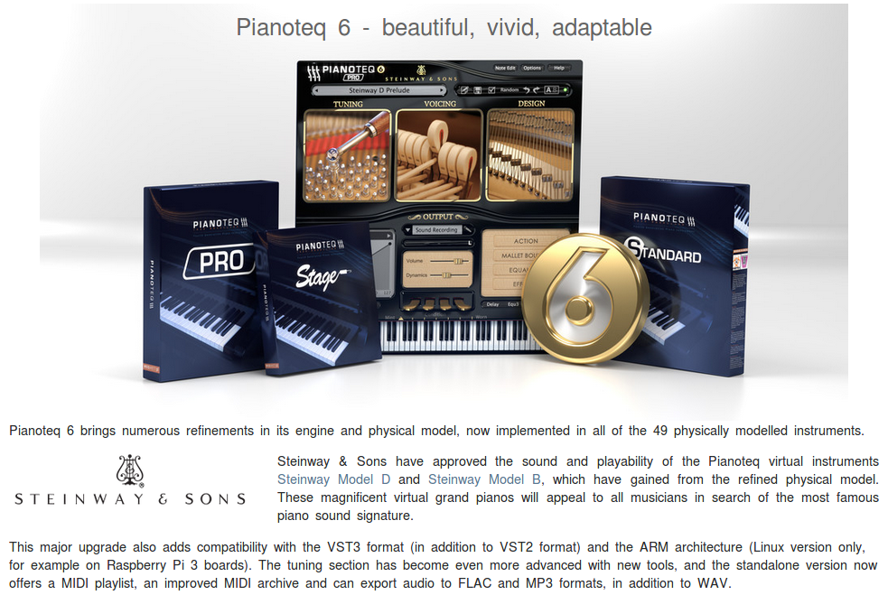
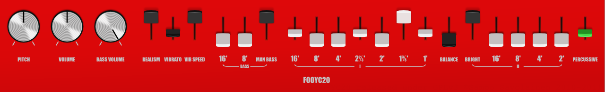

## Edizione Aprile 2018

Back to [Home](index);
  
Ecco le slides delle lezioni: [pt1, pt2 e pt3](http://www.limulo.net/res/GEGST/2018-apr/)!
{: class="dashed"}

---

Per una versione testuale dei contenuti trattati a lezione, fare riferimento alle edizioni precedenti (in particolare quella di [Dicembre 2017](ed-dicembre-2017)).

Di seguito alcuni piccoli aggiornamenti rispetto a quanto potete trovare in quella sezione.

La nuova versione di Pianoteq è accurata a tal punto nella riproduzione del suono di pianoforte tramite la tecnica dei modelli fisici che la stessa casa costruttrice di pianoforti **Steinway & sons** lo ha riconusciuto concedendo a Moddart di utilizzare il loro logo per pubblicizzare il software.

Interessante notare che è prevista prossimamente l'uscita di un altro strumento a modelli fisici da parte di Modartt, questa volta per la riproduzione di suoni di organo a canne: si tratta di [Organteq](https://www.modartt.com/organteq).

Un altro interessante strumento è il [fooYC20](http://foo-yc20.codeforcode.com/) emulazione virtual analog del famoso organo elettronico del 1969.

[qiano](https://github.com/claytonotey/qiano) a physical modeled piano!
