## Edizione Dicembre 2017

Back to [Home](index);
  
Ecco le slindes delle lezioni: [pt1](http://www.limulo.net/res/GEGST/2017-dec/slides/pt1/), [pt2 e pt3](http://www.limulo.net/res/GEGST/2017-dec/slides/pt2-3/)(interattive)!
{: class="dashed"}

Di seguito parte dei contenuti trattati durante le lezioni:

* Go to the [Part 1](#pt1);
* Go to the [Part 2](#pt2);
* Go to the [Part 3](#pt3);

---

## Pt1: Game Engines

TODO

## Pt2: Game Sound overview

### Re-Re-Repetition

Quando siamo **fruitori di opere di intrattenimento** - libri, cinema, teatro, etc... - tra noi e gli autori dell'opera si instaura una sorta di tacito accordo.

Da una parte nasce (inconsciamente) in noi volontà di [sospendere l'incredulità](https://it.wikipedia.org/wiki/Sospensione_dell'incredulit%C3%A0) per mettere momentaneamente da parte le nostre facoltà critiche, ignorare le incongruenze secondarie e godere appieno dell'opera di fantasia. Come spettatori ci lasciamo guidare e ci abbandoniamo alla narrazione.

Dall'altra parte l'autore si impegna ad introdurci e nel guidarci attraverso un percorso comune per raccontare una storia.

La sospensione dell'incredulità nasce da un equilibrio molto sottile, tanto più difficile da creare quanto da mantenere da parte dell'autore dell'opera, soprattutto in epoca moderna dove si è bombardati da flussi continui di informazione e da moltissime forme diverse di intrattenimento.

L'illusione si può spezzare a causa di una storia poco convincente, un personaggio poco caratterizzato oppure qualche battuta di dialogo non troppo azzeccata.

Anche il suono può talvolta essere causa di questa rottura: un effetto sonoro di troppo o uno mancante, un volume inadeguato all'interno del mix oppure un **suono ripetitivo**.

Un suono ripetitivo viene riconosciuto dal nostro cervello come un **pattern**. Il nostro cervello è abilissimo ad identificare pattern, strutture ricorrenti di ogni tipo.

In natura non esiste nulla che si ripeta esattamente identico a sè stesso e, quando questo avviene, il cervello entra in stato di _allarme_ riportando la nostra coscienza sul piano del reale più concreto.

---

Scott Selfon di _Microsoft Corporation_ parla della ripetizione nel videogioco al GDC 2014 in un [talk](http://www.gdcvault.com/play/1020319/Techniques-for-Fighting-Repetition-in) intitolato "_Techniques for Fighting Repetition in Game Audio_".
{: class="dashed"}

#### La ripetizione è un male

Un suono che si ripete, sempre uguale a sé stesso, anche solo due volte di fila, è quanto di più innaturale si possa percepire. la ripetizione di un suono può quindi essere un male e deve essere evitata in tutti quei casi in cui provochi la rottura dell'illusione:

* **dialoghi**: immaginiamo una situazione in cui affrontiamo uno schieramento di nemici e ognuno di essi pronunci un grido di battaglia assolutamente identico a quello pronunciato dai vicini;
* **fooley**/**sdfx**: esempio tipico è quello dei _footsteps_, in cui lo stesso identico suono si sente ripetuto più e più volte durante il gioco. L'effetto suona innaturale e contribuisce a "_buttare fuori_" lo spettatore;


* **fisica**: se il physics engine lavora per simulare, ad esempio, una lattina che rotola al suolo, e l'integrazione prevede che un suono venga riprodotto a loop ad intervalli di tempo regolari, ecco che si ha lo stesso tipo di problema (indipendentemente che il suono ben si sposi con l'immagine renderizzata a schermo);
* **suono senza corrispondenza visiva** (o per meglio dire, con _errata_ corrispondenza visiva): una cosa che accade tipicamente con i suoni d'ambiente, spesso pre-prodotti e inseriti nel gioco senza che ci sia una comunicazione tra i game e audio engines (discuteremo meglio questo aspetto fra poco).


Ora, prendendo in esame il **cinema** perchè quanto di più vicino di può essere al genere videogioco (non fosse altro perchè contempla la fruizione attraverso il mezzo _schermo_), sappiamo che si tratta di un **media lineare**. Esiste ciò solo un modo di fruire del prodotto di intrattenimento: dall'_inizio_ alla _fine_.

La cosa può sembrare banale ma vedremo che non è così.
Quando si lavora alla sonorizzazione di un prodotto di questo tipo è dunque presumibile che si possa avere un certo grado controllo sulla ripetizione e si possa dunque evitarla quando non necessaria o addirittura nociva.

Ben intesi, in certi casi la ripetizione in sè, proprio perchè innaturale, può essere usata come espediente comico.
  
In altri casi invece la ripetizione diventa una sorta di licenza poetica, una sorta di firma sonora inequivocabile come il caso del famoso **Wilhelm screem**.
{: class="dashed" }

Arrivando al mezzo _videogioco_ invece è quasi scontato dire che si tratti invece di un mezzo di intrattenimento per nulla lineare.

Non è infatti possibile prevedere quando il giocatore compirà determinate scelte, non è possibile prevedere quali personaggi incontrerà, quali oggetti userà e quali no, quali le battute di dialogo che pronuncerà, quali difficoltà dovrà affrontare, nè come la trama potrà snodarsi durante il tempo di gioco. Esiste certo una sorta di intelaiatura predisposta dal _game designer_ ma ben lungi da essere veramente rappresentativa dell'esperienza di gioco individuale.

Molteplici sono le possibilità, per non dire infinite come _idealmente_ infiniti dovrebbero essere i contenuti sonori da riprodurre in modo da contemplare tutte le varie possibilità. Tuttavia **le risorse sono limitate**, sia in termini di costi che di tempi di realizzazione. Inoltre occorre pensare che il videogioco deve essere fruito usando supporti fisici o connessioni internet che intrinsecamente sono caratterizzate cciascuna con le proprie limitazioni.

Ricorrere al compromesso è dunque la soluzione più ragionevole e l'unica percorribile ma questo fa sì che nel videogioco diventi più difficile mantenere il controllo sulla ripetitività.

#### Quando la ripetizione è un bene

Ben intesi, nemmeno nel videogioco la _ripetizione_ è sempre da considerarsi un male a presindere. La ripetizione si rende talvolta indispenzabile per trasmettere e afferamre al giocatore un messaggio chiaro.

Anche nell'ambito dei suoni associati alla **UI** ad esempio, la ripetizione è quasi necessaria: un particolare suono sta ad indicare che si sta selezionando una opzione specifica e lo stesso suono ripetuto serve a sottolineare il fatto. Se l'interfaccia utente proponesse suoni diversi mentre l'utente si muove nell'interfaccia, anche interagendo con il medesimo pulsante, la cosa causerebbe non poca confuzione.

Al giocatore va data una sorta di feedback, una **audio reward** ad indicare che si sta facendo qualcosa di giusto o qualcosa che migliora la propria condizione (es. bere la pozione rinvigorente in "_Prince of Persia_").

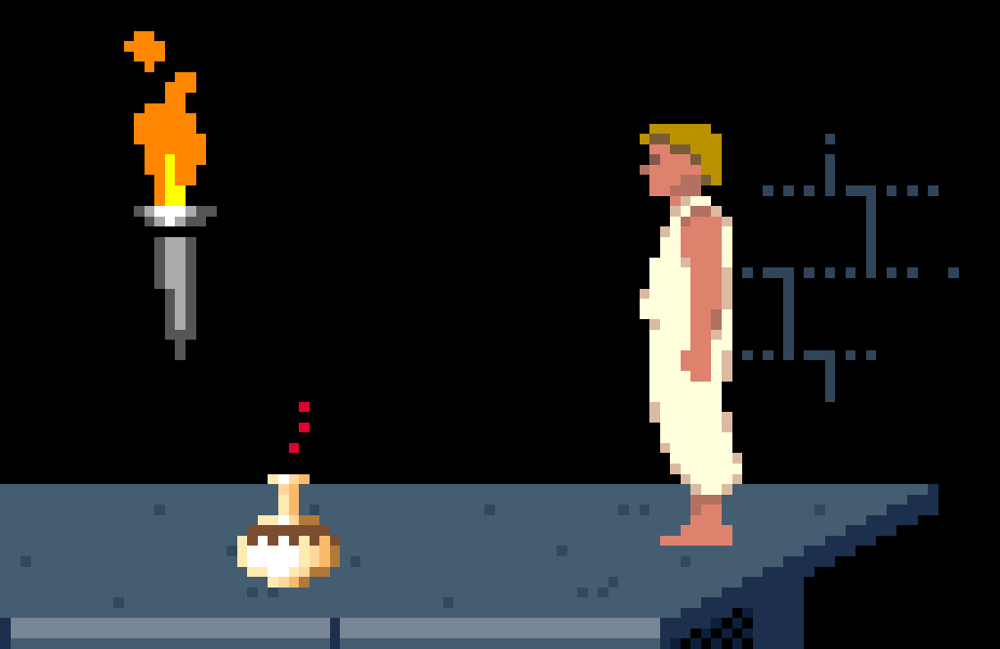{: width="60%"}

<a id="prince-of-persia">
<audio controls style="width:100%">
  <source src="./sounds/prince-glu-glu.ogg" type="audio/ogg">
Your browser does not support the audio element.
</audio>
<a/>

#### Grandi matrici

Come punto di partenza, la ripetizione si può evitare assegnando a ciascun **evento** del gioco un **suono** caratteristico ben preciso: una spada che collide con uno scudo in legno non suona certo come un _footstep_ su una superficie erbosa.

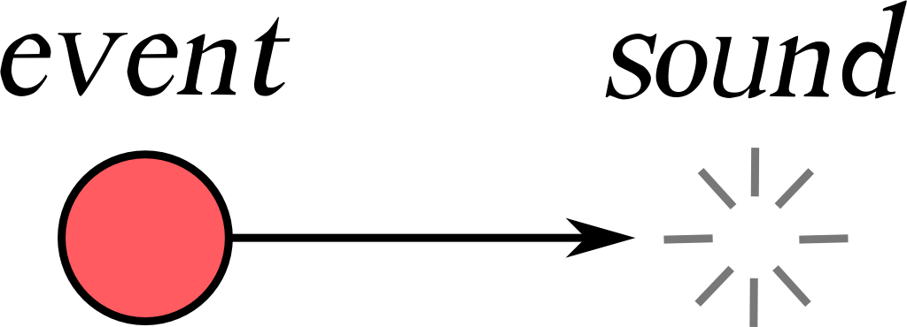{: width="60%"}

Che cosa si intende per evento? All'interno del game engine, un _evento_ potrebbe essere qualsiasi verificarsi di una qualche condizione. Ad esempio:
* il click del mouse;
* il raggiungimento di un determinato punteggio;
* il superamento di un traguardo in un gioco di corse autombilistiche;
* il fatto di pronunciare una determinata frase oppure no;
* oppure ancora una collisione tra due corpi rilevata e riportata dall'engine di fisica.

Concentriamoci per ora su questa parta della produzione e chiediamoci: "_Quanti diversi suoni devono essere creati per sonorizzare il nostro videogioco?_"

Supponiamo di avere una oggetto `A` ed un oggetto `B`. Supponiamo poi che l'evento `A colpisce B` "_suoni_" esattamente l'evento `B colpisce A`. E' facile vedere come un singolo suono sia per ora sufficiente.

Aggiungiamo ora un terzo suono `C` ed arriviamo a 3 diversi suoni.

Complichiamo ulteriormente le cose e contempliamo anche collisioni fra oggetti della stessa tipologia: vediamo ora che gli _assets_ sonori da produrre sono diventati rapidamente il doppio.

---

Il caso esaminato qui è certo un caso fin troppo semplice ma, per chi di voi sia più interessato alla matematica in gioco, ci mostra che la formula usata per il calcolo è quella delle **combianzioni con ripetizione**.

Proviamo ad applicarla ora ad un caso più complesso: quanti suoni servono per sonorizzare un videogioco che contempli 13 differenti oggetti? poco più di 90 suoni diversi sono necessari in questo caso! Sorprendente no?

A ben vedere la cosa è più complicata di così: anche ammesso di avere un suono per ciascun evento possibile, cosa succede se lo stesso evento si verifica ripetutamente (come il collidere dei passi con il suolo o il colpire ripetutamente il nemico con la stess spada)? la risposta è _ripetizione_!

Non è sufficiente infatti che ogni **varietà** di evento abbia il proprio specifico suono, ma occorre che all'evento siano associati anche altre **varianti** dello stesso suono così da garantire un certo grado di varaibilità!

Anche perchè un oggetto non ha solo un singolo modo di "_suonare_"!

Un oggetto può essere colpito in un particolare punto o subire un impatto da un corpo che poi rimane in contatto. Può essere strisciato e causare una eccitazione da frizione, soffiato per eccitarne eventuali cavità d'aria oppure scosso da una vicina sorgente ad esso accoppiata ed essere portato in risonanza.
  
Inoltre tutto questo può accadere in aria oppure sott'acqua il che modificherebbe la velocità del suono e la sua propagazione. Oppure può accadere mentre l'oggetto, l'ascoltatore o il mezzo di propagazione sono in movimento causando l'effetto Doppler, etc...
  
Per fare un altro esempio si potrebbe considerare ancora quello dei _footsteps_: senza troppo eccedere, potremmo supporre che il gioco contenga 20 diverse superfici calpestabili come legno, metallo, ghiaia, sabbia, cemento e così via.
  
Per ottenere il numero di file audio da produrre, dobbiamo moltiplicare questo numero per quello dei personaggi più importanti per il gioco, i quali hanno bisogno d'essere caratterizzati particolarmente nei loro movimenti.
  
Questi personaggi possono poi indossare diversi tipi di calzari e possono camminare a diverse velocità: anche questo incide sul suono (il _correre_ non suona come il _camminare_).
  
All'interno dell'equazione potremmo poi inserire anche il paramtro _peso_, dovuto ad esempio dal numero di oggetti trasportati nell'inventario personale, oppure ancora considerare la pendenza del terreno, e così via...
{: class="note"}


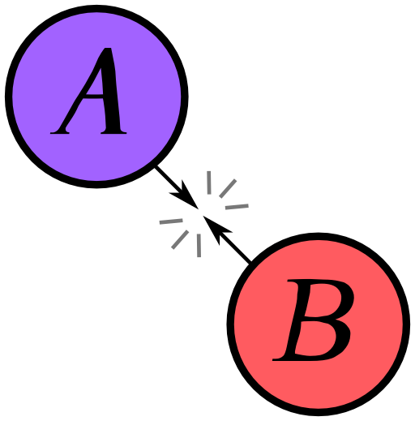{: width="30%"}

Ammesso che la relazione `martello--> colpisce--> incudine` produca lo stesso suono di `incudine--> colpisce--> martello`, gli assets audio da ricreare sono comunque tantissimi: la **crescita** è **combinatoria**!

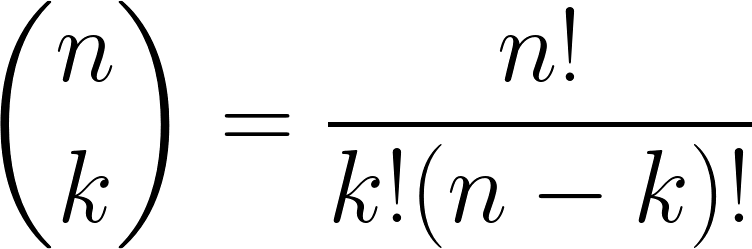{: width="40%"}

Se dovessimo realizzare un suono per ciascuna delle combinazioni possibili di due oggetti tra tutti quelli presenti all'interno del gioco ecco che ne servirebbero già un'ottantina in un caso come quello mostrato qui di seguito:

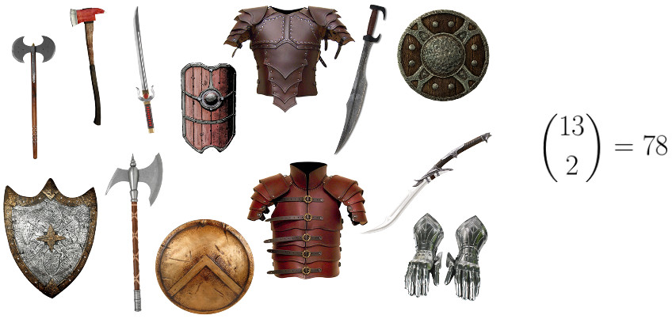


In una produzione videoludica, il normale lavoro del sound designer, dove è richiesta tutta la sua abilità, è quello di preparare un grand numero di assets sonori "_riempiendo gli speadsheed_" (derivati in fase di preproduzione dall'_audio design document_) e registrare centinaia se non migliaia di suoni diversi. Una matrice ad incroci enorme che richiede un sacco di tempo e risorse per essere prodotta.

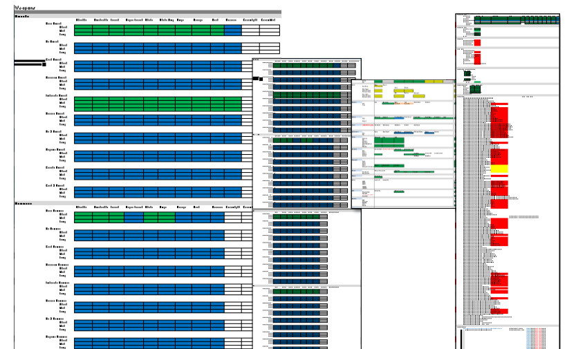

Come si vede la matrice degli assets sonori in un caso come quelli illustrati diventerebbe davvero gigantesca e multidimensionale.

---

Un caso di studio interessante potrebbe essere quello illustrato da _Alastair MacGregor_ della _Rockstar games_ al GDC 2014 rigaurdo agli assets del gioco GTA V (vedi minuto [13:47](https://youtu.be/L4GuM15QOFE?t=13m47s))

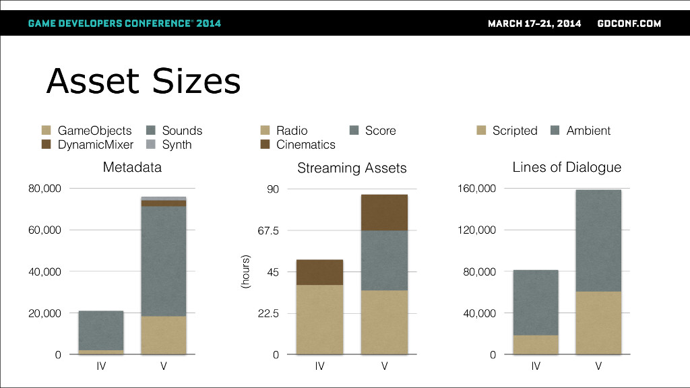

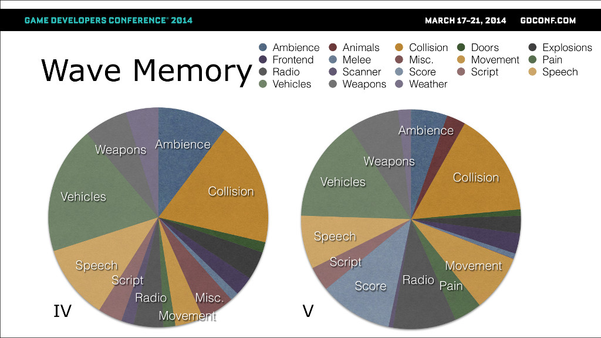

#### Realtime

Sempre maggiori sono gli assets sonori richiesti dai moderni videogames e la tendenza non cambierà radicalmente nel prossimo futuro.

Tuttavia, una possibile soluzione che aiuta anche nel ridurre la ripetitività, è quella di generare variazioni in **realtime**, usando, ove possibile, le capacità offerte dai dispositivi **hardware** della piattaforma oppure programmando via **software** le features necessarie.

Ecco le principali accortezze che si potrebbero avere:

##### Volume / attenuation

Si tratta di un sistema facile ed economico da mettere in atto perchè comporta operazioni CPU base. Fornisce già una discreta illusione della profondità e della spazialità, tuttavia non è uno dei sistemi più incisivi per vincere la ripetitività;

TODO: cosa significa **costo CPU**?
{: class="note"}

##### Pitch changes

L'orecchio umano è meno abile nel riuscire a percepire differenze di intonazione. Inoltre questo sistema non è sempre applicabile, specie nelle linee di dialogo, per le quali invece una variazione di pitch risulterebbe particolarmente fastidiosa.

La causa di questo è da ricercare nel fatto che tutti questi cambiamenti nel pitch avvengono attraverso cambiamenti di sample rate, nel dominio del tempo quindi, con conseguente variazione nella durata.

Così facendo la voce diventa rapidamente innaturale (quando una voce è "_pitchata_" verso l'alto ad esempio si incorre nel problema legato alle armoniche superiori che, superata la frequenza di nyquist, finiscono per ripresentarsi nella parte bassa dello spettro, causando distorsioni e artifatti percepibili).

Inoltre da considerare la banda di trasferimento dati da disco a memorie/processore: con un pitch shift di un ottava sopra ci ritorviamo un audio dalla velocità raddoppiata il che necessità un più veloce accesso ai dati.

Pitch shifting più avanzati possono essee usati: si tratta dei pitch shifting che agiscono invece nel dominio della frequenza e si basano quindi sulla FFT. Sono pitch shifting con la preservazione delle formanti che garantiscono alle voci di mantenere la loro credibilità. Con questi tipi di pitch shifting inoltre lo streaming dei contenuti audio da disco resta coerente.

##### Filtering

Spesso l'hardware dei dispositivi su cui il gioco verrà giocato permette di effettuare operazioni di filtraggio in modo diretto senza costi di alcun tipo. In caso questo non sia possibile invece è comunque semplice implementare lo stesso tipo di filtri base come un LPF o un banco di BPF, via codice DSP.

L'uso del filtro è fondamentale per restituire senzazioni come la **distanza** (un filtro passa basso è ottimo per ricalcare il naturale _roll-off_ delle alte frequenze) oppure per sottolineare la presenza di **elementi attenuanti** come l'umidità ad esempio (ne parleremo meglio fra poco).

Applicare variazioni randomiche sul filtto di una voce inoltre, aiuta soprattutto a fornire la **sensazione di direzionalità**: nell'esperienza quotidiana, come ascoltatori ci accorgiamo che **la nostra testa** non è mai perfettamente ferma nello stesso punto e, anche piccole variazioni nella posizione, possono modificare lo spettro dell'audio percepito.

Usare i filtri sul sonoro e anche sulle voci permette di raggiungere un alto grado di variabilità. **Non importa se il filtraggio non rispetta** con accuratezza la fisica del **fenomeno**, il semplice fatto che ci sia un filtro fa suonare il tutto più naturale.

Anche questa è una tecnica relativamente economica da applicare.

##### Timing variations

Di nuovo in questo caso si può citare l'esempio dei _footsteps_. Il suono dei passi è infatti un suono molto articolato, per questo si può pensare di **spezzarlo nelle sue componenti individuali** e applicare variazioni casuali a ciascuna di queste per ottenere un risultato molto più ricco.

Un altro espediente è quello di **variare il tempo** che intercorre tra i vari elementi. In un suono ambientale che debba generare un tappeto costante di sottofondo, un particolare altamente riconoscibile come un **ululato** o il bubolare di un **gufo** può destare l'interesse dell'ascoltatore (il cervello si aggrappa a cose di questo tipo), pertanto una ripetizione a loop dell'audiofile, verrebbe immediatemente classificata come finta.

In questi casi meglio separe le diverse parti e lavorare con tempi diversi e casuali frapposti tra i suoni che possono essere più problematici.

##### Silence

Talvolta il silenzio può risultare un grande alleato quando si cerchi di sconfiggere la ripetitività.

Semplicemente contemplare il silenzio come una delle possibili opzioni nel ventaglio di delle possibilità, può aggiungere un po' di variazione in più!

##### Envelope

Applicare curve di inviluppo su volume o frequenza di taglio dei filtri aggiungono ancora ulteriore variabilità.

##### Positional variation

La variazioni applicata al posizionamento dei suoni nell'ambiente è importante; in particolare per tutti quei suoni che non hanno un proprio corrispettivo visivo.

Il _bubolare di un gufo_ nello scenario del bosco visto poco fa deve essere posizionato con cognizione e mantenere la propria posizione coerentemente con i movimenti del giocatore (la cosa potrebbe non essere scontata: pensiamo ad un audio ambientale prerenderizzato; mono, stereo o multicanale).

Inoltre, considerando che i suoni non sono quasi **mai omnidirezionali**, occorre considerare anche quale la **direzione** verso cui la sorgente sonora è orientata.

Un "_epic fail_" in questo caso sarebbe il percepire un gufo sul proprio lato destro quando, sopraggiungendo dal bosco, si sia ormai arrivati a costeggiare sulla destra un alto edificio.

##### Environmental variation

L'ambiente deve interagire con il suono prodotto dagli emitter: il mondo 3D in cui siamo immersi può essere sfruttato per creare variazione.

Per continuare con l'esempio del muro, il suono dei nostri passi dovrebbe in questo caso essere arricchito da una serie di early reflection. Ascoltando il suono così realizzato non soltanto si avrebbe una percezione di variazione ma anche una maggiore sensazione di immedesimazione nell'ambiente.

Un esempio potrebbe essere il plug-in [Reflect](https://www.audiokinetic.com/products/wwise-add-ons/reflect/) di Wwise il cui compito è proprio quello di realizzare le early reflection dinamicamente su base della struttura 3D del mondo.

Ad oggi la cosa può sembrare scontata ma, forse qualcuno se ne ricorderà, prima che il calcolo dinamico delle occlusioni diventasse possibile e venisse implementato massicciamente, poteva capitare che si sentisse il suono di un nemico sopraggiungere dal lato ma che, voltandosi verso la direzione di provenienza del suono, non ci fosse nulla se non un muro. Il nemico c'era ma aldilà della parete.
{: class="dashed"}


TODO: nota sulla tecnologia

un'osservazione personalissima: 
* grandi variazioni in ambito audio --> comportano piccole differenze nella percezione della verosimiglianza;
* piccole variazioni in ambito grafico --> comportano immani differenze nella percezione di cosa è verosimile.
{: class="dashed"}


### Quando applicare tutti questi effetti?

#### Dialoghi

Aggiungere variazione non è sempre facile: il dialogo è la cosa più difficile da manipolare dinamicamente su cui è più difficile applicare quanto visto fino ad ora.

Per questo la variazione la si ottiene in fase di registrazione, con l'attore e il direttore del ADR che registrano battute con differenti intenzioni ed intonazioni.

Basti pensare che, già in questo modo, il risultato può sorprendere negativamente: è l'esempio di "_Beyond, two souls_". Nel gioco infatti capita talvolta che, seppure il protagonista risulti calmo nell'atteggiamento, ad esso venga associata una battuta recitata in modo concitato e aggresivo. Forse questo il risultato di una produzione dei files di localicazzazione del tutto decontestualizzata dalla reale situazione che si vevrebbe nel gameplay.
{: class="dashed"}

Interessanti saranno i futuri sviluppi dell'**intelligenza artificiale** per la sintesi vocale la quale potrebbe presto soppiantare la necessità di disporre di _voice talents_ in carne ed ossa per la registrazione di linee di dialogo (vedi il progetto [WaveNet](https://deepmind.com/blog/wavenet-generative-model-raw-audio/) ad esempio).
{: class="note"}

Nel caso dei dialoghi eventualmente si possono applicare modifiche in real-time come il **voice-masking** (usato tra l'altro per ridurre il gender gap (flip gender) nell [interviste di lavoro on-line](https://youtu.be/p6m8hvIo0VI), inducendo un artificiale "_gender flip_") oppure ancora per una "_radio-lizzazione_" (voice coming from the radio).

In tale caso è possibile aggiungere più o meno rumore, crakcles o distorsione in modo dinamico e in termpo reale.

Altro esempio è il filtering real time che si applica per simulare la voce proveniente da una comunicazione telefonica. in genere utilizzando un filtro passabanda da 300Hz a 3000Hz.
{: class="dashed"}

Resta comunque il fatto che la stessa frase non può essere mai detta identicamente 2 volte di fila! E' inaccettabile all'ascolto.

Un altro aspetto interessante che dovrebbe essere gestito è nell'**interazione di più characters** durante il dialogo: come individui nella quotidianità del mondo reale, siamo naturalmente in grado di ascoltarci l'un l'latro e aspettare il nostro turno per esprimere la nostra opinione. In caso di sovrapposzione è possibile interrompere l'interlocutore alzando la voce oppure restare in silenzio fino a che colui che parla non concluda.

Un gioco non è in grado di fare questo. Interessante sarebbe capire come ed in che modo introdurre sistemi intelligenti per simulare questo tipo di interazioni sociali per restituire una suono più verosimile.

Una nota va spesa per citare i sistemi di **speech recognition** come shortcut sostitutivi all'uso dei controller fisici per agire all'interno del gioco (implementati ad esempio in titoli come "_Mass Effect 3_", "_The Elder Scrolls V: skyrim_").
{: class="note"}

Importante comunque generare variazioni come la già citata _positional variation_ considerando che il suono proveniente dalla bocca non è direzionale e pertanto va opportunamente filtrato a seconda dei movimenti.

#### Sound fxs

Come già detto, le variazioni hanno ampia applicazione sugli effetti sonori.

#### Music (case study: iMuse)

Per la musica si potrebbe aprire un intero capitolo a parte parlando di composizioni interattive, musica generativa/algoritmica, passando per iMuse, Farnell, etc...). Forse in una lezione futura :)

Per ora ci basti dire che anche la musica è una elemento che può certo avvantaggiarsi delle tecniche di variazione fino ad ora discusse.

TODO: caso d'esempio "minigame del combattimento"

Un sistema davvero interessante è quello ideato dai compositori Michael Land e Peter McConnel nel 1991, quando all'epoca lavoravano ai videogiochi di avventura della _LucasArts_: **iMuse**.

Nasce nel 1991 ([brevettato nel 1994](https://www.google.com/patents/US5315057)); è un sistema che premette l'introduzione di componenti di audio dinamico in un linguaggio di scripting. Fondamentalmente iMuse è un database di sequenze musicali che possono contenere **punti di decisione** o **markers** all'interno delle tracce.

Il sistema, utilizzando eventi SysEx nei file MIDI, permette l'interazione tra le azioni del giocatore e il sonoro del gioco.
Gli eventi in questione sono di due tipi: **markers** e **hooks**.

* Un _marker_ viene inserito nel file MIDI nel punto che, una volta raggiunto dal lettore MIDI, deve triggerare l'esecuzione di un particolare comando da parte dello script del gioco. Il comando in questione è inserito in una lista (_coda  fifo_) è ne viene attivata l'esecuzione non appena il MIDI player raggiunge un marker con un determinato ID. I comandi possono essere qualsiasi cosa, dal fade in/out alle pause;
* Un _hook_ contiene un ID e l'azione da eseguire una volta che l'hook viene raggiunto. Lo script lancia un comando che si occupa di aspettare che un certo hook venga incontrato (_callback_), e quindi di mettere in esecuzione il comando contenuto in quest'ultimo.
Gli hook si distinguono in vari tipi, quali ad esempio salti, trasposizioni, abilitazione/disabilitazione di strumenti.

Vediamone un paio di esempi sfruttando il motore _ScummVM_ e giocando a _Monkey Island 2: LeChuck revenge_ (nota: nella particolare dimostrazione usiamo una emulazione software della scheda _Roland MT-32_, all'epoca lo stato dell'arte dell'audio nel mondo videoludico);

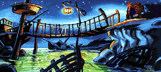{: width="100%"}

### Game audio engine tradizionale

Il _game audio engine_ è una componente del game engine, oppure un modulo _middleware_ da affiancare ad esso, che si occupa della gestione di tutto ciò che è suono all'interno di un videogioco.

Quali sono i compiti e le caratteristiche principali di un game audio engine tradizionale?

#### Random

Come abbiamo ampiamente detto poco fa, la randomicità può essere una grande risorsa per aggiungere variabilità.

Il game audio engine dispone di una serie di strumenti integrati per aggiungere variabilità pressochè a ciascun parametro disponibile.

#### Switching

Ricordiamo che abbiamo sempre a che fare con **risorse limitate**. Quando parliamo di _switching_ ci riferiamo a tutti quelle logiche e  meccanismi di **allocazione dinamica delle voci**, mirate a dare priorità ai suoni e discriminare la loro riproduzione.

Nei sintetizzatori polifonici esiste lo stesso tipo di concetto e si parla di [voice stealing](http://electronicmusic.wikia.com/wiki/Voice_stealing).

Un esempio di voice stealing nel videogioco lo si ha in _Super Mario Bros_ (1985), dove il sound engine agisce sulla voce assegnata alla melodia principale (il suono più acuto), deallocandola e riassegnandola per la sintesi degli effetti sonori delle monete, mentre lo stesso avviene per gli effetti sonori del salto per la seconda voce.

<iframe width="100%" height="315" src="https://www.youtube.com/embed/Dp7fVUfj8oI?start=123" frameborder="0" allowfullscreen></iframe>

Possiamo venderne un esempio live utilizzando il bell'emulatore [FCEUX](http://www.fceux.com/web/home.html) il quale ci consente anche di esaminare le sinagole voci nel dettaglio. Il sistema sonoro del NES era costituito da una chip PSG (Programmable Sound Generator) proprietario in grado di suonare fino a 5 voci simultaneamente: 2 _quadre_, 1 _trinagolare_, 1 _noise_ e una per la riproduzione dei campioni _pcm_.

Lo switching può essere guidato anche dal ruolo che il particolare suono riveste all'interno della **narrazione**: in una sitauzione in cui sono presenti molti suoni, sono quelli meno importanti ai fini di quanto si deve raccontare ad essere sacrificati per primi.

Ai suoni in riproduzione in un videogioco sono quasi sempre associati **valori di priorità** o **rating** in modo automatico o semi-automatico in base alle scelte del giocatore. Questi valori numerici sono fondamentali nella scelta di quali voci deallocare in un scenario di _voice stealing_/switching.

#### Blending

Il _leitmotif_ è: le **risorse sono limitate**.

Crossfade parametrico tra campioni diversi, quello che nella sintesi prende il nome di **multisampling**. Questa tecnica è implementata in gran misura nei campionatori i quali infatti rispondono a diverse velocity di tocco con un mix tra campioni corrispondenti.

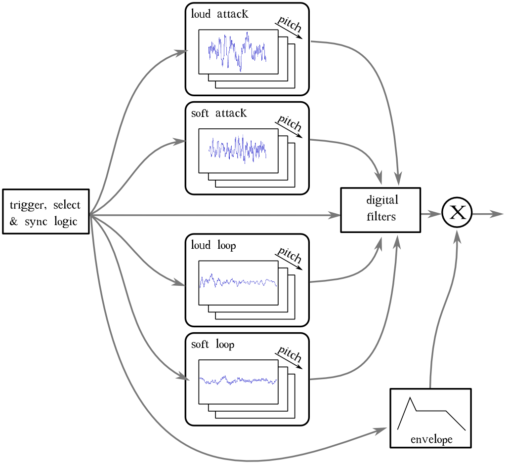

In un gioco, immaginiamo una caduta di un oggetto da diverse altezze; questo comporta intensità diversa ma non solo, anche variazione timbrica.

#### Mixer, Grouping and Buses

Molti game audio system incorporano un mixer del tutto analogo a quallo in uso nelle grandi produzioni: un banco large frame con gruppi, mandate e ritorni, etc...

La differenza è che, mentre per una produzione tradizionale la configurazione del banco rimane statica, praticamente invariata lungo tutta la durato di Un medesimo brano o album, nel caso di un videogioco  il mixer deve spesso riconfigurarsi del tutto in pochi istanti.

<table style="width:100%;">
<tr>
<td>
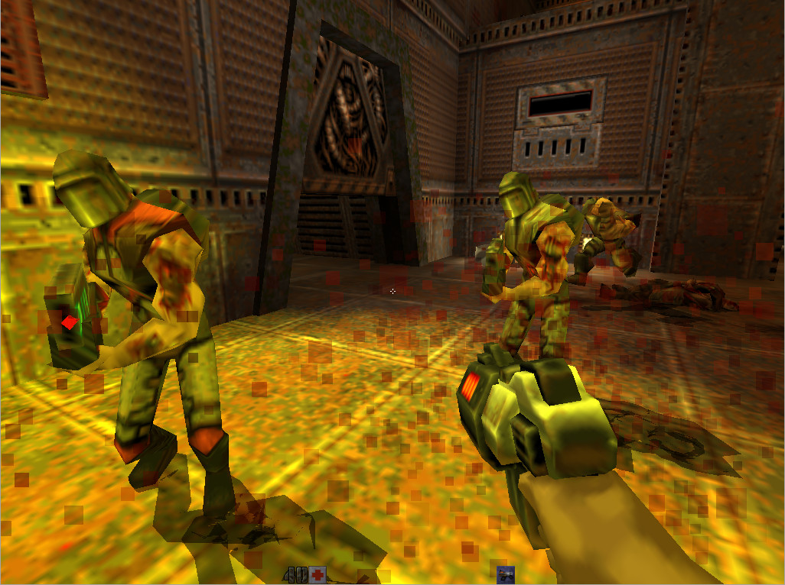
</td>
<td>
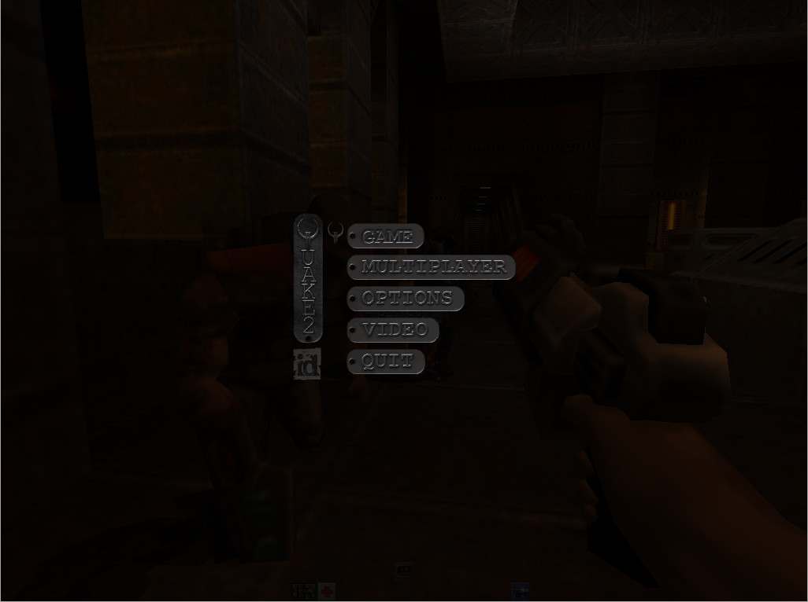
</td>
</tr>
</table>

Un esempio potrebbe essere il passaggio da una sitauzione _in-game_ ad un _menù di interfaccia_ (pausa o salvataggio).

#### Real time controllers

Il game sound engine deve stabilire con il game engine un'interfaccia per ricevere (e inviare) parametri real time da utilizzarsi per controllare interattivamente controlli quali volume, pitch o frequenza di taglio.

Alcuni esempi di parametri utilizzabile per modificare i suoni i nriproduzione potrebbero essere:
* il livello di _salute_ per il player;
* il _carico_ per un automobile in corsa;
* il _punteggio_ della partita a regolare il livello di eccitamento del pubblico sugli spalti dello stadio.

#### Positioning, Attenuation & Dampening

Come funziona l'audio in un gioco: **emitters** sono oggetti nello spazio tridimensionale che emettono suono e uno o più **listeners** (mono, stereo o multicanale; va pensato come un array di microfoni), in genere solidale col player.

Ogni emitter nel 3D world è caratterizzato dalla presenza due sfere ad esso concentriche che dividono lo spazio in 3 volumi.

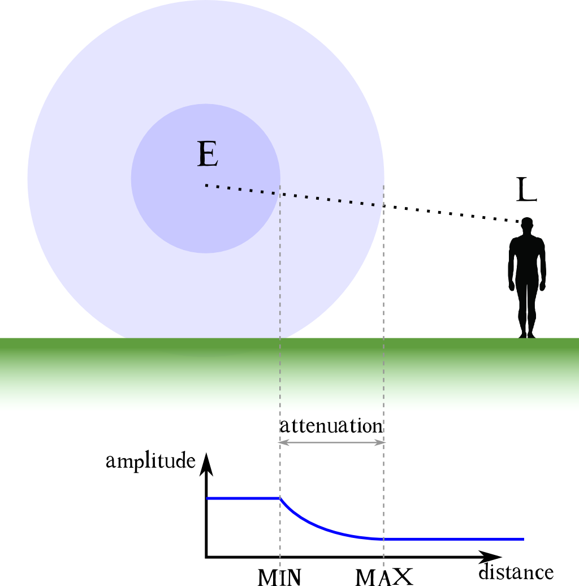

Attenuazione e smorzamento: un discorso legato alla **distanza** tra emitter e listener, grandezza geometrica ricavata dal modello tridimensionale, in base alla quale viene modificato in tempo reale l'amplificatore di livello e/o la frequenza di taglio di un filtro passa basso.

Lo stesso si applica in casi in cui ci sia un **ostacolo** tra emittere e listener: **occlusione** ottenuta con filtri opportunamente settati. Materiali diversi

In altre parole si tratta di un sistema che si occupa di calcolare in run-time le funzioni di trasferimento e i filtri da applicare al suono riprodotto per dare all'ascoltatore la percezione che gli emettitori si trovino immersi nello spazio virtuale circostante.

Il panning "_reale_" è più complcato rispetto ad una semplice variazione di volume tra i canali.
panning, multicanale (stereo, 5.1, 7.1, ambisonic (non usato), binaurale);
{: class="nota"}

---
Un esempio interessante per quanto riguarda il posizionamento del suono nello spazio lo si ha ad esempio nel gioco "_Hellblade: Senua's sacrifice_", sviluppato da [Ninja Theory](https://en.wikipedia.org/wiki/Ninja_Theory) e pubblicato pochi giorni fa.

In questo gioco l'[audio binuaurale](https://www.polygon.com/2017/8/9/16120082/hellblade-binaural-audio-psychosis) diventa importantissimo per rappresentare con efficacia le voci interiori della protagonista che soffre di un disturbo psichico.

<iframe width="100%" height="315" src="https://www.youtube.com/embed/LQQ2Jm2dgXk?list=PLbpkF8TRYizaT6GfMcKBG-RoUOQ6BJRXp" frameborder="0" allowfullscreen></iframe>

A proposito di binuaurale, mai sentito parlare del fenomeno denominato [ASMR](https://it.wikipedia.org/wiki/Autonomous_sensory_meridian_response)? Ecco un [interessante articolo](https://emshort.blog/2017/07/27/second-person-storytelling-in-asmr/) a rigurdo.
{: class="dashed"}

Nel gioco l'audio è [talvolta utilizzato](https://youtu.be/5-D57571odo?t=2m11s) come mezzo (quasi) esclusivo per riuscire ad orientarsi nel mondo tridimensionale.

#### Ambience

Parlando di sample, quando si registra si predilige il suono diretto e si fa di tutto per escludere quello riverberato
Questo perchè il suono d'ambienza viene calcolato in tempo reale da processori dedicati (reverb, delay, doppler effect, filtering, fast realtime convolution).

#### Dialogues

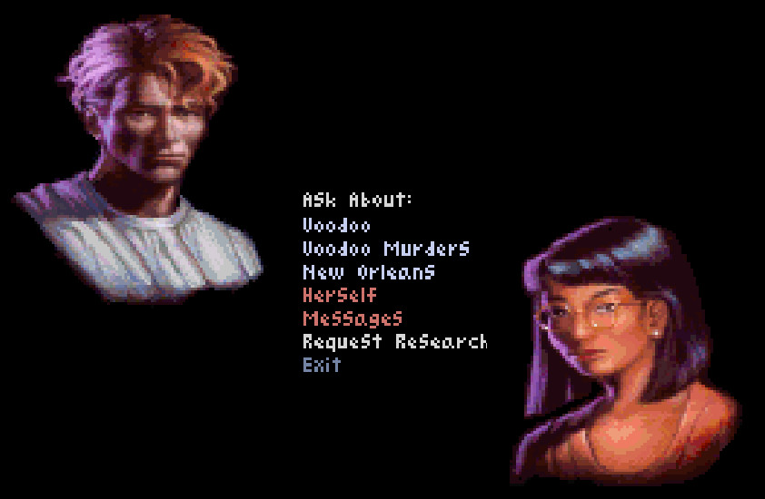

Il game audio engine deve essere in grado di interfacciarsi e gestire complessi **database** di informazioni. Uno di questi è rappresentato dall'insieme degli audio file associati a tutte le varie linee di dialogo (in una o più lingue) presenti nel gioco.

#### Music

Il game audio engine deve essere in grado di gestire l'eventuale colonna sonora musicale interattiva (vedi ad esempio il sistema _iMuse_).

#### Alignment

Uno scenario in cui più giocatori prendono parte ad un partita multiplayer.
Un server preposto al controllo e al master clock per la ricezione e ridistribuzione dei pacchetti.
A seconda della contingeza ci possono essere latenze che si sommano e si accumulano, e possono essere diverse da caso a caso, e da giocatore a giocatore e cambiare nel tempo.

Il game engine, e più nello specifico l'audio engine per quanto concerne il suono, deve essere in grado di gestire situazioni come questa e di riordinare opportunamente i pacchetti in arrivo per dare un audio sempre corerente.

#### Decoding, data streams

L'audio engine deve interfacciarsi con quella parte di software in carico di gestire gli accessi al disco e che si occupa del memory management. Da ricordare che l'audio è immagazzinato sul supporto in forma compressa in modo da risparmiare spazio di archiviazione, il che, nel momento della riproduzione, impone un pre fetching e un buffering per la decompressione prima dell'effettiva riproduzione.

alcuni esempi di codifice dei file audio potrebbero essere:
* [PCM](https://it.wikipedia.org/wiki/Pulse-code_modulation) e [ADPCM](https://en.wikipedia.org/wiki/Adaptive_differential_pulse-code_modulation)
* [MP3](https://it.wikipedia.org/wiki/MP3)
* [Ogg Vorbis](https://it.wikipedia.org/wiki/Vorbis)
* [Speex](https://it.wikipedia.org/wiki/Speex)
* [Opus](https://it.wikipedia.org/wiki/Opus_%28codec_audio%29)
* [flac](https://it.wikipedia.org/wiki/Free_Lossless_Audio_Codec)
* [musepack](https://it.wikipedia.org/wiki/Musepack)
* per Xbox: [XMA e WXMA](https://en.wikipedia.org/wiki/Windows_Media_Audio)
* per Playstation: Atrac [AT9](https://en.wikipedia.org/wiki/Adaptive_Transform_Acoustic_Coding)

## Pt3: Sound as a Process

### Suono come modello event based/data driven

Vincere la ripetitività è sinonimo di ricerca di realismo in ambito sonoro (ricordiamo che in natura non esistono suoni ripetitivi!). Nel mondo videoludico, costretto costantemente dalla ristrettezza di risorse, la soluzione adottata è quella di adottare il paradigma **data driven**.

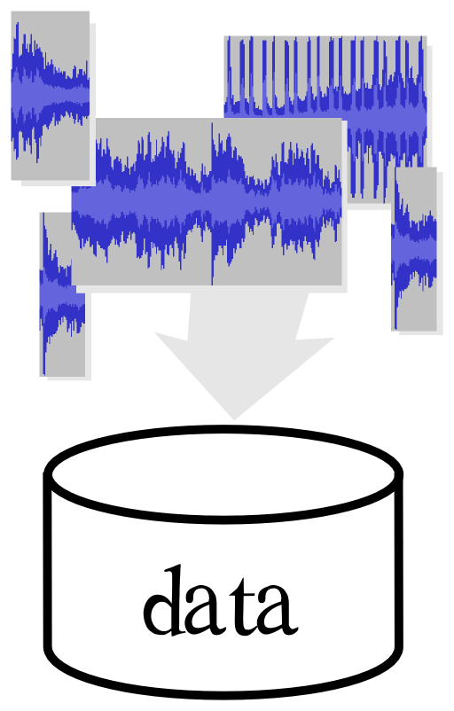{: width="40%"}

Questo modello _guidato dai dati_ in sostanza - l'abbiamo visto ampiamente la scorsa lezione - è costituito da un enorme database che racchiude al suo interno una moltitudine di file audio preprodotti.

Questi audio files vengono messi in riproduzione all'occorrenza, in seguito al verificarsi di particolari eventi (**event based**).

{: width="60%"}

Per garantire maggiore variabilità, i sample che vengono riprodotti si applicano delle **modificazioni in tempo reale** come abbiamo già detto (attenuazione dovuta alla distanza, combinazioni e layering, random e granularità).

---

La storia del vidogioco ci insegna che l'audio ha sempre rivestito un ruolo fondamentale e che per moltissimi anni è stato il **motore trainante** principale per lo **sviluppo tecnologico** del mezzo.

Ne è la prova il fatto che in molti advertise dell'epoca (di seguito una pubblicità del gioco _Jaws_ dell'Atari, siamo nel 1975) il suono venisse esplicitamente menzionato e se ne vantassero le caratteristiche di realismo!

Un altro esempio l'abbiamo visto esaminando il sintetizzatore audio a 5 voci del NES.
Questo ruolo di preminenza dell'audio è continuato a lungo culminando nel periodo d'oro delle schede audio come la fortunata _Sound Blaster_ e _Roland MT-32_ fino all'avvento del supporto CD, approssimativamente nella metà degli anni '90, periodi in cui il sample di alta qualità (44100@16bit) faceva il suo ingresso.

### Grafica per la ricerca del realismo

D'altro canto, per quanto concerne l'aspetto grafico si può evidenziare un processo evolutivo analogo che ha portato il mercato a preferire via via sempre più la grafica tridimensionale a quella storica bidimensionale.

Possiamo dire che il termine "_realismo_", se nel mondo del suono si traduce in _sample_, nella sfera della grafica esso significa _tridimensionale_ (soprattutto in certi generi)!

Premesso che il realismo non è una condizione indispensabile, anzi, ci sono videogiochi (basti pensare a PacMan, o a diverse produzioni indipendenti come Fez, Limbo, etc...) che tutt'altro ci propongono rispetto ad una esperienza "_realistica_", ce ne occupiamo perchè la ricerca del realismo in ambito grafico è stato anc'essa preponderantein abito videogames.
{: class="dashed" }

In un gioco che si basi pesantemente sull'aspetto grafico, l'immagine mostrata a schermo è fondamentale per restituire la senzazione di **realismo**.

Consideriamo un semplice modello 3D costituito da 4 facce triangolari: occorrono 3 (OpenGL ne usa 4 in realtà) valori numerici corrispondenti ai 3 assi cartesiani per identificare la posizione di ciascuno dei suoi vertici nello spazio tridimensionale.

Un modello estrapolato da un moderno videogioco tuttavia è composto da una moltitudine di poligoni, centinaia se non migliaia (_high poly_). Questi vertici e la loro configurazione nello spazio costituisce la **mesh** del modello ma da sola, non basta per creare l'illusione di realismo.

Serve una **texture** da poter mappare sulla mesh che riproduca fedelmente le caratteristiche visive come colori e dettagli dell'oggetto ([UV mapping](https://en.wikipedia.org/wiki/UV_mapping)).

Perchè il modello possa essere visto nel mondo tridimensionale occorrono **luci**: ogni oggetto dunque, colpito dai raggi irradiati da tutte le fonti di luce presenti nel mondo virtuale, verrà descritto in modo ancora più realistico, in più se il modello riporta alcuni valori per le grandezze fisice associate ai materiali di cui è composto, come coefficienti di riflessione e assorbimento, e così via, l'effetto potrà essere ancora migliore.

Moltiplichiamo il tutto per la moltitudine di modelli simultaneamente presenti all'interno del mondo 3D virtuale e avremo quanto computato da una componente del game engine, il **rendering engine** (che traspone il tutto su una superficie flat 2D: il nostro schermo), coadiuvato da una speciale componente hardware, la **GPU**, che aiuta accelerando e parallelizzando il processing.

L'interità dei modelli e delle loro mesh non sono fondamentali soltanto per ottenere una immagine 2D in uscita ma anche per creare la cosìdetta **word geometry** per il calcolo delle **collisioni**, indispensabili per prevedere e computare i comportamenti fisici.

Tutto questo è appannaggio del **physics engine** che non si occupa solo di collisioni ma valuta l'interà fisicità del mondo virtuale in cui siamo immersi: masse, densità, velocità e accelerazioni, forze, torsioni.

Ebbene tutto questo viene calcolato di continuo, sempre in funzione dei dati di movimento ottenuti dalle azioni del giocatore, 60 se non più volte al secondo.

---

Quando la grafica 3D cominciava ad affermarsi nel mondo del videogioco (siamo agli inizi degli anni '90) i modelli erano composti da un numero limitato di poligoni (_low poly_) per una questione di limitazioni della capacità hardware delle macchine del tempo, PC o PlayStation 1 ad esempio.

<table style="width:100%;">
<tr>
<td>

</td>
<td>
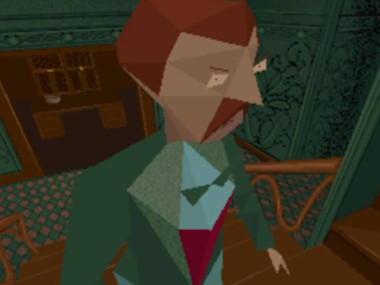
</td>
</tr>
</table>

Eppure negli stessi anni al cinema si poteva assistere alla proiezione di [Toy Story](https://en.wikipedia.org/wiki/Toy_Story), il primo film di animazione interamente realizzato in computer grafica. Nel film i modelli sono molto più definiti dei loro corrispettivi in ambito videogames, ma questo solo perchè i numerosi calcoli richiesti per renderizzare ciascuno dei frame erano svolti da grandi "_render farm_", niente di comparabile ad una contemporanea console per uso domestico. Inoltre il risultato di un rendering spesso era pronto dopo diverso tempo che i dati erano stati introdotti.

Sotto questa luce, il _low poly_ dei primi videogiochi 3D diventa una prova evidente che la grafica dovesse (e deve) necessariamente essere calcolata in tempo reale!

Interessante notare dunque che l'immagine che vediamo quando giochiamo **non esiste** prima del run-time! Quanto si vede è frutto di un calcolo basato su parametri ricavati dalle azione del giocatore.

### Suono come processo

Ci potremmo allora chiedere quindi che significato ha la parola **realismo** in ambito audio?

Il sample audio invece è una registrazione, e come tale si tratta di un qualche cosa fissato nel tempo e immutabile: una registrazione cattura la perturbazione della densità dell'aria, l'effetto di un movimento nello spazio in un particolare istante ma non ci dice nulla in merito al comportamento.

In questo senso l'audio fruito attraverso i campioni resta un procedimento **statico**, si riduce alla pressione del tasto play, una **fotografia** fissa ed immutabile anzichè vivida e dinamica.

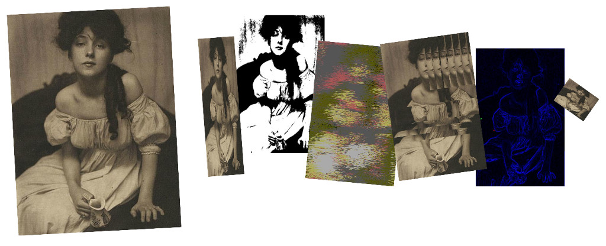

Vero che alla registrazione possono essere applicate variazioni in tempo reale ma questo non ha nulla a che spartire con quanto avviene in ambito grafico il che fa capire quanto il termine "_realismo_ sonoro" suoni alquanto **riduttivo**, soprattutto contando che anche il suono ha la sua importanza:

* il suono riveste un ruolo importante di guida emotiva all'interno del gioco;
* l'audio è una parte importante anche per la narrazione;
* contribuisce alla percezione di _verosimiglianza_ (vedi più avanti);

E' possibile descrivere adeguatamente una scultura con una fotografia?

### Niente trucchi da quattro soldi!

In generale, anche per una questione di risorse, l'audio del videogioco è stato per lungo tempo un audio sintetizzato in tempo reale. Un audio che rispecchiava linearmente le azioni del giocatore e le reazioni dell'engine.

Sotto questa luce, i "_trucchi_" descritti poco fa, usati normalmente per ridurre o mascherare la ripetitività, sono in realtà dei rimedi temporanei.

Attenzione, questo **non significa che in passato i sample non venissero utilizzati**; Nintendo, SEGA e ancora prima nelle coin-op, dove possibile, si inserivano sistemi DAC in grado di riprodurre, seppure non con la stessa qualità CD, campioni e sample pre-registrati, soprattutto per la voce.
{: class="dashed" }

Un modo alternativo, mutuato dalla storia del videogioco, è quello di pensare il sonoro come **sintetico**: in questo modo due suoni associati allo stesso evento non suonerebbero mai esattamente allo stesso modo.

Si tratta in fondo di una caratteristica peculiare della sintesi sottrattica, la quale fa uso del rumore come forma d'onda base. Anche se le differenze potrebbero essere estremamente sottili, il nostro **cervello** ha la capacità particolare di riconoscere queste sorgenti come "_vive_".

Inoltre, l'approccio _data driven_ ha i suoi svantaggi vediamo un paio di esempi:

#### La porta

Supponiamo di avvicinarci ad una abitazione sconosciuta. L'intento è quello di entravi senza destare l'attenzione di chi sta all'interno. Nel gioco guideremo il nostro avatar fin sulla soglia e, a questo punto, a seconda dell'ispirazione del momento, potremo aprire la porta di colpo e preciparci all'interno oppure socchiuderla lentamente e magari interromperci al primo sospetto di non essere soli.

{: width="50%"}

Secondo l'approccio tradizionale _sample based_ un campione preregistrato di scricchiolio viene riprodoto non appena si verifica l'evento "_collisione_" tra il nostro avatar e l'oggetto _porta_. Specie se l'audio file è lungo si nota che la riproduzione dell'audio file prosegue, anche se l'azione sulla porta si interrompe dopo breve.

Anche nel caso il game sound engine utilizzasse meccanismi di dissolvenza in uscita per temporizzare correttamente il livello, comunque risulterebbe chiara la disomogeineità tra i domini grafico e uditivo.

Immaginiamo cosa accadrebbe se poi scostassimo la porta ripetutamente, avanti ed indietro...

#### Lastra percossa

Alcuni oggetti come le campane o i tubi creano differenti suoni in base al proprio stato. un tubo che è già in vibrazione e che venga colpito in un punto diverso, incorporerà le nuove eccitazioni nel pattern di vibrazione a creare un suono diverso rispetto a quello che avrebbe fatto se colpito in stato di quiete. Niente di simile è ottenibile usando i campioni.

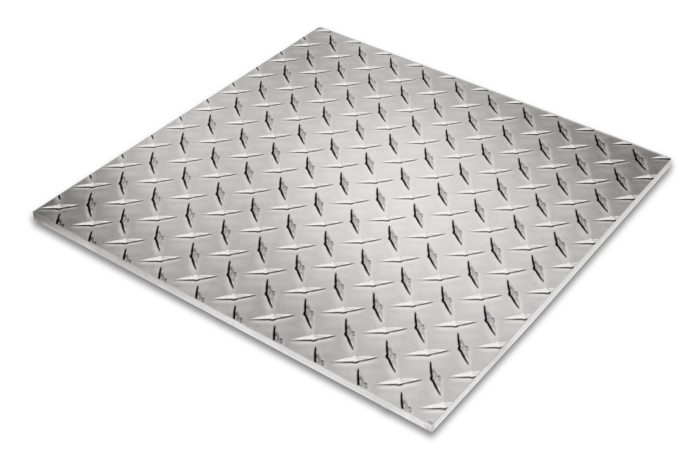{: width="50%"}

Immaginiamoci con un arma di fronte alla fortificazione di un piccolo bunker dal quale dobbiamo stanare i nostri nemici. Cominciamo a sparare e colpiamo ripetutamente una delle lastre di metallo che rivestono l'esterno della costruzione.

Ad ogni impatto (di un proiettile sulla lastra) la lastra viene eccitata e di tutti i possibili modi strutturali saranno quelli primari ad assorbire il maggior quantitativo di energia e, come risultato, percepiremo sempre più chiaramente le frequenze di risonanza della lastra mano a mano che i proiettili continuano ad incidere su essa.

Lo stesso effetto non è ottenibile riproducendo lo stesso audiofile ripetuttamente per ogni nuovo impatto.

### La sintesi in musica

Se, i videogiochi moderni hanno via via preferito i campioni, i paradigmi di audio sintetizzato, più tradizionali se vogliamo, sono sopravissuti in una parte del mercato legato all'audio: la **musica** e gli **strumenti musicali**. In questi campi ci si accorge subito delle limitazion intrinseche dell'audio per campioni (il sample è un _tradimento_ della realtà), per questo la ricerca e lo sviluppo di nuovi sistemi di sintesi continua a progredire.

Nascono i primi sistemi di sintesi basati su **modelli**: i fenomeni della fisica del suono vengono studiati e sintetizzati in modelli matematici e poi innestati all'interno dei circuiti integrati o dei software per computer.

Quando si vuole simulare i suoni dei vecchi sintetizzatori analogici, si sviluppano tecnologie volte a riprodurre in digitale tutte le idiosincrasie dei componenti elettrici discreti che li costituivano e nascono i modelli [virtual analog](https://en.wikipedia.org/wiki/Analog_modeling_synthesizer).

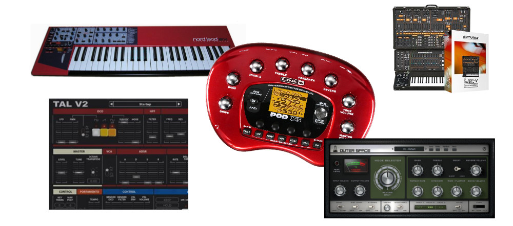

ad esempio:
* la tecnologia [True Analog Emulation (TAE)](https://www.arturia.com/products/drums/spark/tae%C2%AE) di Arturia, usata in plugin come il [mini V](https://www.arturia.com/products/analog-classics/mini-v/overview) o l'[arp-2600](https://www.arturia.com/products/analog-classics/arp2600-v/).
* Il [Pod](https://en.wikipedia.org/wiki/Pod_%28amp_modeler%29) di Line6 implementa un suond engine in grado di simulare molti preamplificatori per chitarra e basso, cabinets e acustia degli ambienti.
* Anche l'italiana [Acustica-Audio](http://www.acustica-audio.com/) usa molta [tecnologia](http://www.acustica-audio.com/index.php?option=com_content&view=article&id=14&Itemid=247) interessante all'interno dei loro plugin come il [Nebula3](https://www.geforce.com/games-applications/pc-applications/nebula-3/description) ad esempio, che "_is a multi-effect plug-in that is able to emulate and replicate several types of audio equipment and uses libraries which are created using a sophisticated “sampling approach” making it possible to “record” aspects of the sound of audio devices and play them back_".
* Interessantissimi anche i lavori dell'italiana [AudioThing](https://www.audiothing.net/);
* I virtual instruments della svizzera [Togu Audio Line (Tal)](https://tal-software.com/Products);
* [Hexter](http://dssi.sourceforge.net/hexter.html), sintetizzatore che emula gli strumenti Yamaha serie X;

---

Quando invece si vuole simulare strumenti musicali acustici o elettroacustici nascono modelli volti a riprodurre i fenomeni fisici delle sollecitazioni, vibrazioni, attenuazioni dei materiali: nasce il [physical modelling](https://en.wikipedia.org/wiki/Physical_modelling_synthesis).

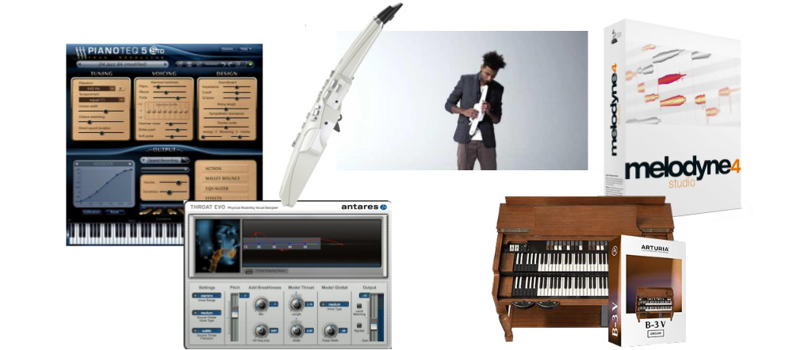

* [Arturia Stage-73 V](https://www.arturia.com/products/analog-classics/stage-73-v/overview);
* i pianoforti virtuali di [PianoTeq](https://www.pianoteq.com/home);
* Antares [Auto-tune](http://www.antarestech.com/products/detail.php?product=Auto-Tune_8_66) oppure [Throath](http://www.antarestech.com/products/detail.php?product=THROAT_Evo_14);
* Celemony [Melodyne](http://www.celemony.com/en/melodyne/what-is-melodyne) e [Capstan](http://www.celemony.com/en/start), [Izotope RX](https://www.izotope.com/en/products/repair-and-edit/rx.html).
* Altri esempi potrebbero essere l'[Aerophone AE-10](https://www.roland.com/us/products/aerophone_ae-10/) di Roland, che fa uso dell'engine di sintesi per modelli [SuperNATURAL](http://www.rolandus.com/blog/2013/06/04/what-is-supernatural/) in parallelo con la tradizionale sintesi per campioni;
* [Native Instruments B4](http://www.soundonsound.com/reviews/native-instruments-b4-ii), etc...

Solo un appunto interessante a proposito di [Pianoteq](https://www.pianoteq.com/pianoteq5): il peso del software è di soli 40MB. In confronto al [Ravenscroft Virtual Piano 275](https://www.vilabsaudio.com/Ravenscroft-By-VI-Labs) - che fa uso di 17.000 samples - che richiede 6GB per funzionare (perchè i dati sono compressi) e un HD a stato solido per garantire una performance ottimale!
{: class="note"}
---

Esistono da diversi anni scuole di pensiero volte a traslare questi metodi di sintesi, da tempo diffusisi sul mercato e molto apprezzati per le loro qualità, nel mondo videoludico e dell'interazione più in generale.

Pionieri di questa filosofia di pensiero sono persone come [Perry Cook](http://www.cs.princeton.edu/~prc/AKPetersBook.htm) e [Andy Farnell](https://mitpress.mit.edu/books/designing-sound), solo per citare i più noti, i quali ritengono possibile derivare dagli studi fatti fino ad ora, modelli finalizzati non tanto a simulare suoni appartenenti al dominio musicale ma piuttosto volti a sintetizzare una moltitudine di classi sonore associate ad oggetti e fenomeni più generali: così da rendere possibile la sintesi, potenziale, di ogni tipo di suono possibile.

<table style="width:100%;">
<tr>
<td>
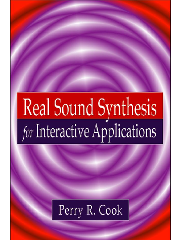
</td>
<td>
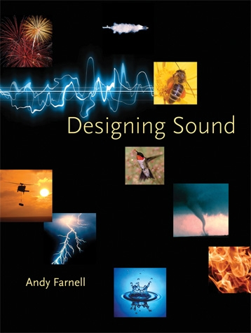
</td>
</tr>
</table>

### L'audio procedurale

Da questo punto di vista il suono nel videogioco diventa un modello inteso come processo (**sound as a process**), in contrasto con il paradigma precedente di _event driven/data driven model_.

Il termine spesso associato a questo paradigma è **audio procedurale**, eccone una definizione:

> “Procedural audio is non-linear, often synthetic sound, created in real time according to a set of programmatic rules and live input.” – "[An introduction to procedural audio and its application in computer games](http://cs.au.dk/~dsound/DigitalAudio.dir/Papers/proceduralAudio.pdf).” by Andy Farnell

Processo guidato da uno stream continuo di dati provenienti dall'interazione dell'utente, manipolati e usati come parametri per controllare in tempo reale una serie di algoritmi che sintetizzano audio.

A ben vedere il concetto di audio procedurale non ci è del tutto estraneo; un esempio a cui siamo abituati è il _riverbero digitale_ che usiamo tutti i giorni sottoforma di plug-in o di outboard fisico in studio.

#### Esempi in PureData tratti principalmente dal lavoro di Andy Farnell...

Segui [questo link](#pure-data-practice")!

#### Behaviour, Model, implementation

{: width="30%" }

TODO: argomenta immagini raster vs. vettoriali.

TODO: altro esmpio della torta e della ricetta.

### Vantaggi e svantaggi del paradigma procedurale

Tra i vantaggi possiamo considerare:

#### Posticipazione

Mentre l'atto di registrare un suono è un azione che fissa nel tempo senza lasciare alcune possibilità di intervento successivo, l'audio procedurale è dinamico e lascia che molte delle decisioni, anche strutturali, vengano rimandate al real-time.

Talvolta è semplicemente impossibile conoscere a priori quale sarà il suono che il gioco dovrà riprodurre e, di conseguenza, impossibile sapere come registrarlo o realizzarlo in fase di produzione. In un caso come questo, il moderno sound designer potrebbe avvantaggiarsi dell'audio procedurale e predisponendo un modello per il suono e lasciare che questo venga confezionato "_durante_" il gioco.

Un esempio pratico di quanto detto lo si trova nel videogame "_No Man Sky_". Il gioco si basa interamente su contenuti generati proceduralmente (non escluivamente sonori). Proprio per la natura del gioco, Paul Weir il suond designer di _Hello Games_, intento a risolvere il problema del suono delle creature, diversissime tra loro e inconoscibili prima della partita, ha realizzato il tool _VocAlien_: una sorta di plugin che integrato nel game audio engine si occupasse di sintetizzare i suoni necessari secondo dei parametri di volta in volta diversi, passatigli dall'engine di gioco. (ecco [qui il talk](http://www.gdcvault.com/play/1024067/The-Sound-of-No-Man)).

#### Differimento e Variabilità

Caratteristica fondamentale del suono procedurale che garantisce la possibilità pressochè completa di modificazione del suono in tempo reale e di produrre in questo modo risultati sonori anche molto diversi tra loro pur facendo capo ad uno stesso modello.

#### Costo dinamico (Dynamic Level of Details) e LOAD

Il suono sintetico si dimostra vincente rispetto all'approccio _data driven_ quando si debbano descrive ampie scene con innumerevoli sorgenti sonore (tra 100 e 1000 sorgenti concorrenti).

I dati sottoforma di campione hanno un costo fisso (lo streaming dati da disco non cambia se il suono deve essere riprodotto completamente dry oppure deve subire real-time processings).
Inoltre, la densità di suoni che possono essere riprodotti in una scena ha un limite:
* sia in termini di accuratezza del mix dei vari suoni (più suoni = più difficile sommarli tra loro, problemi di dinamica e saturazione);
* sia dal punto di vista psicoacustico (alcuni dei contibuti sonori sono inutili all'atto pratico perchè non posso essere uditi per via dei diversi mascheramenti, in tempo o in frequenza).

Già quando si arriva a sommare 100 suoni simultanei, si può vedere che il contributo di ogni nuovo suono aggiuntivo, in rapporto al costo computazionale associato, diminuisce.

D'altro canto, una approccio sintetico può offrire un costo variabile ad ogni sorgente: un esempio potrebbe essere il suono di un bicchiere che si infrange cadendo a terra.

Un metodo sintetico potrebbe produrre un suono molto "_realistico_" e mantenere ancora un alto grado di correlazione audio-video rimpiazzando i frammenti perimetrali con singoli segnali sinusoidali o granuli di rumore, fornendo un alto grado di dettaglio per quei frammenti che cadono vicino al player.

---

Il paradigma procedurale permette il LOAD - Level Of Audio Details - (che sfrutta le conoscenze in ambito di acustica e psico-acustica) caricamento dinamico sulla CPU esattamente come già fa la parte grafica cone il **mipmapping**.

Consideriamo una esempio quale potrebbe essere un suono in grande lontananza:
nel caso di un motore audio tradizionale, al suono verrebbe applicato notevole processing DSP in tempo reale da far sì che il sample - attenuato e filtrato - dia l'impressione di provenire da lontano. Tuttavia, nonostante il suono ne risulti pesantemente modificato rispetto all'originale, comunque il costo in termini di risorse sarebbe invariato rispetto alla normale riproduzione di un audio file.

Nel caso il problema venga affrontato con il paradigma procedurale invece, soprattutto facendosi forti del fatto che il modello è stratificato e costituito da più parti indipendenti tra loro, il carico di lavoro potrebbe essere ridotto: certe componenti del suono, proprio per via del fatto che la sorgente sonora è ascoltata da grande distanza, potrebbero essere del tutto tralasciate rispetto ad altre. Il lavoro del processore sarebbe avvantaggato.

Lo stesso dicasi se il suono riprodotto da un modello si trova riprodotto in associazione con altri suoni che causerebbero il _mascheramento_ nel tempo o in frequenza di alcune sue componenti.

#### Default forms

Dal momento che la **crescita** dei sounds assets è **combinatoria**, diventa difficile provvedere alla creazione di tutti i suond assets necessari mano a mano che il mondo virtuale cresce. Il vantaggio di un modello procedurale è che il suono può essere generato in modo automatico derivando le proprietà dagli oggetti presenti nel gioco.

Questo **non elimina** la figura del **sound designer**, il quale interviene laddove alcuni suoni necessitino di particolari caratteristiche perchè più importanti per la narrazione, ma **garantisce** che ogni oggetto abbia sempre un **suono di default** associato, senza incorrere così nel rischio che qualche evento sonoro non possa essere triggerato.

---

L'audio procedurale è da intendersi come uno dei tanti strumenti nella toolbox del sound designer. L'abilità propria del sound designer tradizionale è ancora fondamentale laddove determinati suoni abbiano bisogno di essere particolarmente caratterizzati, magari per ottenere il così detto **hyper-realism** ("_more than reality_").

Sì perchè in fondo il **realismo** non serve!
Lo sanno bene i sound designer e tutti coloro che, in generale, hanno già qualche esperienza nel mondo dell'intrattenimento, il realismo spesso delude.

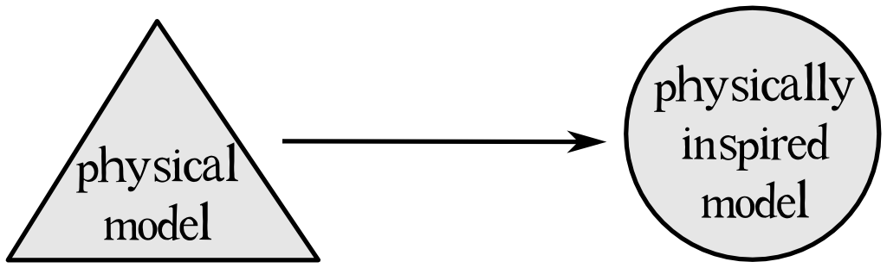{: width="80%"}

Non c'è bisogno che il suono sia perfettamente fedele al fenomeno percepito nella realtà, quello che è veramente importante è il **verosimile**, è la **resa** (come dice molto bene [Chion](http://www.lindau.it/Libri/L-audiovisione.-Suono-e-immagine-nel-cinema)).

>"Il tutto è più grande della somma delle sue parti." (Aristotele, Metafisica)

Questo perchè suono ed immagine combinati assieme generano sempre un risultato inaspettato, assolutamente assente se lo si ricercasse in una sola delle sue componenti. E' questo il concetto del **valore aggiunto** di Chion.

---

Si tratta di una cosa che si può sperimentare anche quando si fa un **mix**: supponiamo di averne ottenuto uno che suoni davvero bene.

Tutto è al suo posto e si è ricavato la propria posizione sia nello spazio sterofonico che nel range dinamico e di frequenza. Non ci sono sovrapposizioni, conflitti di alcun genere e il tutto risulta comprensibile e omogeneo.

Ora, se tornassimo ad ascoltare una delle singole tracce che compongono il mix, magari la chitarra elettrica, il basso o il pianoforte, ci accorgeremmo molto probabilmente di quanto il suono processato, se preso singolarmente, risulti in realtà molto diverso da quello emesso dallo strumento reale.

Il suono è stato probabilmente filtrato, equalizzato, compresso, ripulito di eventuali fastidiose risonanze, emagari suona anche un po' più "_piccolo_" che nella realtà eppure, se reinserito nel mix, ecco che lo strumento riacquista di colpo tutte le sue componenti e trasmette un senso tutto diverso.

Questo è possibili grazie al fatto che lo strumento è affiancato ad altri, si fa forza dell'essere parte di un insieme, arricchisce, ed è arricchito al contempo di dignificati nuovi che, non avrebbe se preso singolarmente!

### Svantaggi

Tra gli svantaggi del paradigma _audio procedurale_:

#### Industrial inertia: you gotta ship titles

Al momento attuale non sembra ci sia interesse nell'implementare quanto necessario per inserire questo paradigma nel workflow per la produzione di giochi. Spesso in questi casi ci si scontra con metodi di lavoro consolidati che sono difficili da modificare, soprattutto per via dei costi e dei tempi necessari per la transizione.

#### New workflows, new skills

Il paradigma procedurale richiede personale che sappia operare in campo audio in nuovi modi. Studiare modelli derivati o ispirati dal mondo reale e implementarli poi in una forma hardware o software richiede abilità e competenze che normalmente non fanno parte del bagaglio culturale di un sound designer tradizionale.

#### Synthesis = fake (what?)

Permane la falsa concezione che la sintesi audio sia, in qualche modo, sinonimo di finzione (sintesi = suono "_di plastica_") e, come tale, sia qualcosa di insoddisfacende, di deludente. In realtà non è così lo abbiamo visto poco fa parlando anche di _hyper-realism_ e _valore aggiunto_.

### The Future

Cosa ci riserva il futuro dell'audio nei videogames?

Se avessimo fatto questa domanda a metà degli anni '90 declinandola al mondo della grafica di sicuro nessuno avrebbe potuto immaginare che, nell'arco di pochi anni a venire si sarebbe profilata tutta una serie di nuovissime figure professionali che prima non esistevano: professionisti che si occupano esclusivamente di _rigging_, _textures_, _animazione_, _modellazione_, _light_, _visual fxs_, _compositing_ etc...

In ambito audio, in un futuro presumibilmente non troppo lontano, il paradigma procedurale avrà preso ancora più piede e il mondo del lavoro nel settore dell'audio per videogiochi si arricchirà di tutta una serie di nuove figure professionali.

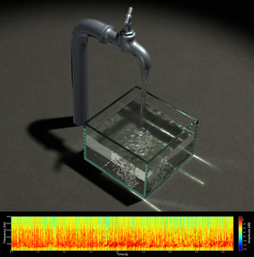

Proprio come negli ultimi 20 anni sono nate specializzazioni di ogni tipo nel mondo della computer grafica, così anche nel mondo del sound design nasceranno nuove figure speciallizzate nella modellazione di suoni e fenomeni fisici differenti (acqua e [bolle](http://www.cs.cornell.edu/projects/Sound/bubbles/), fuoco, [fracture sound](http://www.cs.cornell.edu/projects/FractureSound/), impatti, [frizioni e sfregamenti](http://independent.academia.edu/StefaniaSerafin), [accartocciamenti](http://www.cs.columbia.edu/cg/crumpling/), [acustica delle stanze](http://www.ness-music.eu/wp-content/uploads/2013/04/TASL2256897.pdf), etc...).

#### Animation driven by audio

C'è addirittura chi si specializza nel processo inverso, ovvero nel ricreare animazioni basandosi sul suono in una sorta di [**inverse fooley**](http://www.cs.cornell.edu/projects/Sound/ifa/), il che può portare a risultati davvero sorprendenti:

<iframe width="100%" height="315" src="https://www.youtube.com/embed/EGkQkdCKztM?start=130" frameborder="0" allowfullscreen></iframe>

Se, come spesso accade, l'audio è considerato come accessorio e secondario rispetto alla parte grafica/visiva, ci sono tuttavia alcuni casi in cui questo andamento è ribaltato: `event --> sound` diviene qui `sound --> event`.

**Automatic lip sync**: un sistema studiato da moltissimo tempo per animare grafiche e modelli 3D in modo automatico basandosi sul segnale audio (vedi [patent Sierra](https://patentimages.storage.googleapis.com/c3/e3/32/01720ae146f119/US5430835.pdf)).

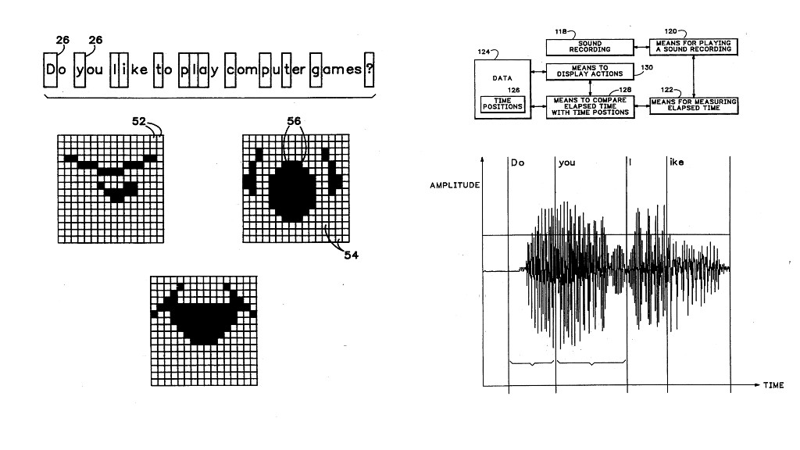

**Procedural animation**: [Tom Clancy's Ghost Recon Advanced Warfighter 2](https://en.wikipedia.org/wiki/Tom_Clancy%27s_Ghost_Recon_Advanced_Warfighter) (Ubisoft 2007) case study: un aeroplano precipitato nel deserto esplode e continua a bruciare a terra. Le fiamme sono sferzate a destra e a sinistra da un vento irregolare. Polvere e fumo sono generati proceduralmetne in base al livello dell'audio pre-prodotto (vedi [questo talk](http://www.gdcvault.com/play/1017780/Crossing-the-Streams-Game-Audio) di Scott Selfon al minuto 23:14)!

---

### Procedural Audio practice

#### Implementazione usando la sintesi
TODO

tipologie di suono: classi sonore relativamente piccole, canne, lastre di metallo o corde possono essere programmate con relativa facilità usando sorgenti di tipo generico.

#### Physical modelling

{: width="80%"}

physical modelling / physical informed modelling (differenze)
Waveguide (difetto: uso della memoria per implementare delay per la propagazione e i risuonatori)
MSD (Mass, Spring, damper)

tipologie di suono: questo approccio lavora bene per "_dropped sound_", collisions, tubi o lastre percosse, eccitazione di strutture fisse.

#### Granular approximation

Utile l'analisi statistica della densità

tipologie di suono: suoni con struttura eterogenea, onde che si infrangono sulla spiaggia, pioggia, grandi gruppi di persone (ae esempio il suono degli applausi).

### PureData: esempi di audio procedurale e musica generativa

Abbiamo detto che il paradigma del suono procedurale prevede una stratificazione delle diverse fasi. Questo significa che ciascuna di esse può essere svolta con un particolare strumento hardware o software piuttosto che un altro, a seconda delle esigenze del progetto o delle particolari propensioni del suond designer.

{: width="40%"}

Tipico è il caso del layer di _implementazione_: in questa fase infatti qualsiasi strumento software può essere usato per implementare il modello. Esistono infatti svariati linguaggi che possono essere utilizzati per la fase di implementazione (Supercollider, Csound, Faust, C++ via STK, Chuck, etc...). Ogni linguaggio possiede determinate caratteristiche che lo rendono più indicato per un task specifico.

Parleremo di Pure data, che sembra essere un valido compromesso in termini di efficienza, facilità di apprendimento, di integrazione in altri tipi di sistema come può essere un game engine esistente (grazie in particolar modo a progetti software di integrazione come libpd, vedi sotto).

Pure Data, come Godot, è _free software_ quindi aperto per essere modificato ed esteso liberamente.

#### Introduzione al linguaggio di programmazione PureData

Che cosa è PureData? [PureData](http://puredata.info/) è un linguaggio di programmazione a nodi nato a metà degli anni '90 ad opera di Miller Puckette che all'epoca lavorava all'IRCAM di Parigi.

Pure Data è un linguaggio di programmazioni a paradigma _dataflow_ e, sebbene manchi di ricorsione e di una effettiva accuratezza "_al sample_" nell'implementazione di filtri FIR, IIR, è uno strumento molto produttivo e permette di risolvere il 90% dei problemi di sound design sintetico.

Uno degli obiettivi cui si è interessati è quello di fare il minor uso possibile della memoria (evitando quindi, ove possibile, lookup table, ring buffers per dly, etc...). Si usano dunque i troncamenti delle approssimazioni in serie di Taylor delle varie funzioni anzichè ricorrere a lookup tables, il rumore è generato come numeri pseudo casuali, etc...
  
Perchè evitare l'uso della memoria? Uno dei motivi è quello di facilitare l'esecuzione del codice in un ambiente multithread, in cui i diversi thread sono distribuiti su più processori.
{: class="dashed"}

---

Vedremo ora alcuni esempi tratti dal lavoro di _Andy Farnell_, il quale usa PureData come linguaggio di programmazione (thanks to _Andy Farnell_, _Alexey Reshetnikov_ and _Rod Selfridge_).

#### Material and structure

* **telephone**: bakelite resonators

#### Wind

Il vento in sè non produce suono (molto interessante a tale proposito il [seminario "_Squeezing out noise_"](https://vimeo.com/89488861) di Chris Woolf, technical consultant per _Rycote_)

#### Water
TODO

#### Machines

Vale la pena di sottolineare che tutti i suoni prodotti dalla macchine sono il risultato di un qualche tipo di inefficienza e di frizione: in teoria, la macchina perfetta non emette alcun rumore.

* **electric motors**:

* **fans**: il suono macchine come le ventole degli impianti di areazione, le quali funzionno di continuo, è più soggetto a problematiche di _ripetizione_. Se il suono viene generato per mezzo della sintesi (usando come base il rumore in questo caso) ecco che il problema è risolto: il suono acquista una caratteristica _viva_ e il cervello non è più in grado di identificare alcun _pattern_.

* **elicopter**:

* **clocks**: Il suono di un orologio che ticchetta può essere realizzato sovrapponendo diverse componenti più semplici per ottenere un risultato finale organico. Interessante a tale proposito l'[aneddoto raccontato dallo stesso Farnell](https://youtu.be/sp83-Pq7TyQ?t=57m50s) in un seminario sull'audio procedurale all'AES nel 2013 in cui ricorda d'avere analizzato il suono di una sveglia dopo averlo registrato ad alta risoluzione e riprodotto a velocità ridotta.

* **creaking**: movimento [_slip-stick_](https://en.wikipedia.org/wiki/Stick-slip_phenomenon). Un segnale di controllo (che simboleggi la forza impiegata nel movimento) che varia da 0 e 1 produce una serie di impulsi in uscita. Questi passano attraverso una serie di filtri passabanda per riprodurre le formanti di una struttura _quadrata_ in _legno_.

Di seguito alcune belle animazioni che mostrano i _modi_ principali per una membrana rettangolare, tratte dalla [pagina](http://www.acs.psu.edu/drussell/demos.html) del professor Daniel Russel della _Pennsylvania State University_.

<table style="width=100%">
<tr>
<td>

</td>
<td>

</td>
<td>

</td>
<td>

</td>
</tr>
</table>

Sicuramente da approfondirne le caratteristiche: [Frame3dd](http://frame3dd.sourceforge.net/). Un software libero per studiare le dinamiche strutturali statiche e dinamiche. Che possa esserci utile nell'analisi dei modi?
{: class="dashed"}

---

Maggiori informazioni sulle patch e sul loro utilizzo si trovano nel file README all'interno della [apposita cartella](https://github.com/Limulo/game-sound-sae2017/tree/master/resources/procedural/PureData_examples) del [repository](https://github.com/Limulo/game-sound-sae2017).
{: class="dashed"}


Per utilizzare [questi esempi](https://github.com/Limulo/game-sound-sae2017/tree/master/resources/procedural/PureData_examples) è necessaria l'installazione di [PureData](http://puredata.info/) e delle seguenti librerie aggiuntive:
 
* list_abs (for the **[list_dot]** and **[list_emath]** objects);
* zexy (for the **[>~]** and **[<~]** object);
* iemlib (**[prvu~]**, **[init]**, **[t3_bpe]**, **[t3_line~]** and **[t3_delay]** objects);
* motex (**[ln~]** object);
* lyonpotpourri (**[adsr~]** object);
* creb (**[ead~]** object);
* cxc, cyclone, purepd (**[Uzi]**, **[acos]**, **[atan~]**, **[delta~]** objects);
* ggee (**[image]** object);


### Godot: audio architecture

[Godot](https://www.patreon.com/godotengine) è un game engine libero!

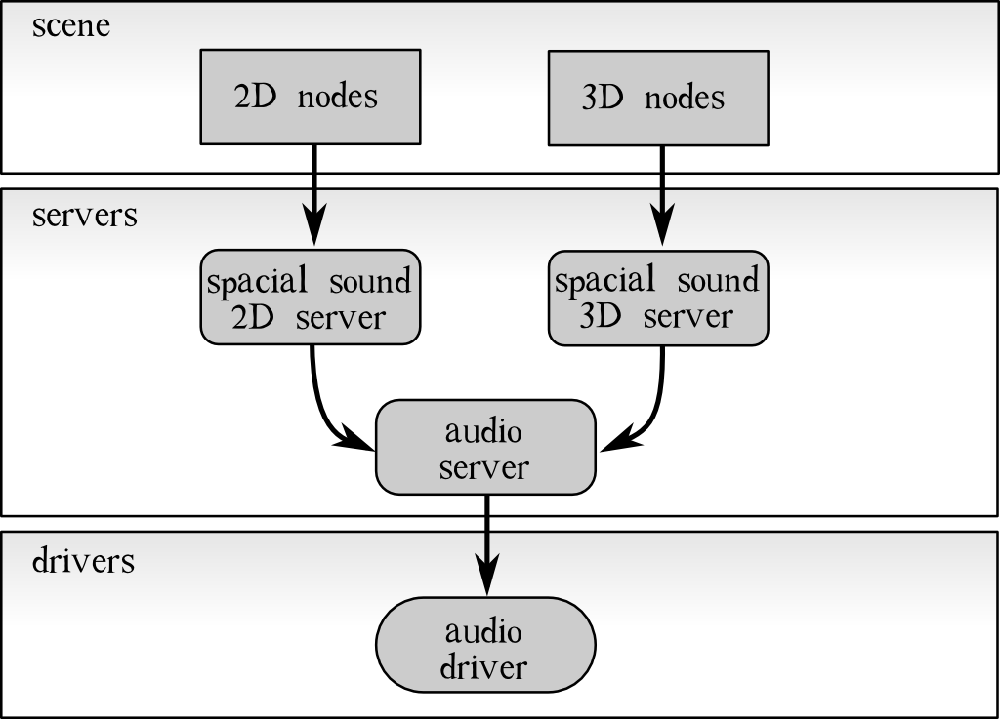

TODO: immagine audio server / audio player / stream / sample / architecture

Interrogato dal **driver**, l'**audio server** deve fornire lui tutti i _samples_ (campioni audio 32 bit) di cui ha bisogno.

Per farlo deve copiare i dati immagazzinati nel proprio _internal buffer_ sul _p_buffer_ che il driver gli ha fornito.

Ad ogni richiestadel driver, l'audio server passa in rassegna tutte le **voci** (esaminandone con cura la _coda dei comandi_ rispettiva in modo tale da sapere se la voce deve essere riprodotta, messa in pausa, eliminata dalla codam etc...) e chiede al **mixer** di mixarle. In seguito si passa ad analizzare gli **stream** e a scrivere infine sul _p_buffer_.

Il **mixer** elabora l'audio che passa attraverso i suoi **canali** provvedendo eventualmente a calcolare eventuali **effetti** da applicare sull'audio passante. Una volta fatto questo, copia i dati contenuti sul proprio _internal_buffer_ a quello dell'_audio_server_.

L'**audio player**:

Lo **stream player**:

L'**event player**:

#### Godot & libpd integration

Il software libero è vincente in quanto consente l'accesso diretto al codice sorgente rendendo più veloci e agili integrazioni, modifiche e migliorie altrimenti impossibili in progetti software proprietari.

In questo modo ci è stato possibile avviare un progetto di integrazione in Godot dell'engine audio _PureData_ grazie al wrapper [libpd](http://libpd.cc/) ideato da Peter Brinkmann.

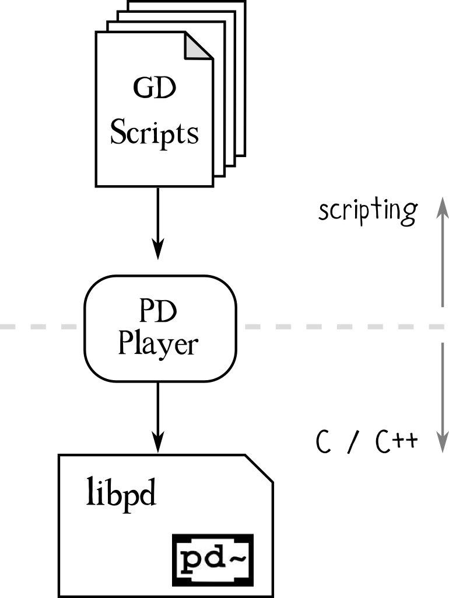{: width="60%"}

#### Call for partecipants

Il progetto è ancora in fase embrionale ma contiamo di refinirlo sempre più per poi rilasciarlo ufficialemtne al pubblico in modo che tutti possano avvantaggiarsi anche di un audio _veramente_ procedurale all'interno di Godot.

[Qui](https://github.com/Limulo/godot) il link al repository sul quale _limulo.net_ sta facendo i primi test: ogni contributo è benvenuto!

## Riferimenti e Approfondimenti

Gli argomenti sono tantissimi e nel poco tempo a disposizione non è sempre possibile dedicare agli argomenti trattati il tempo e le risorse che richiederebbero; per questo ci fa piacere indirizzarti verso la pagina [references](references) per accedere a molti link interessanti. In aggiunta puoi consultare i testi e le slides delle edizioni precedenti e future del corso.
