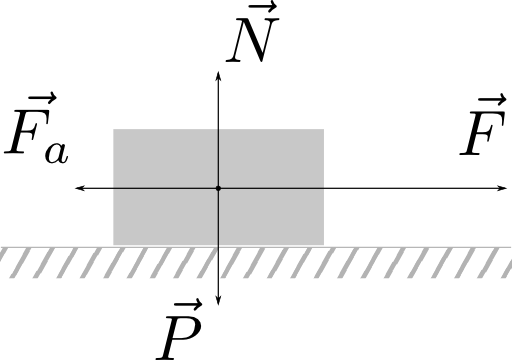
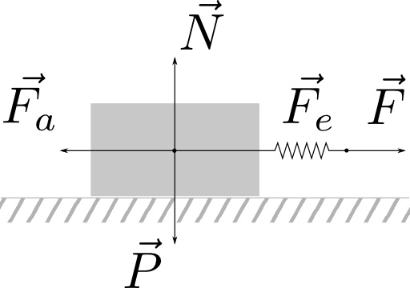
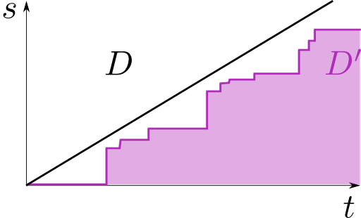
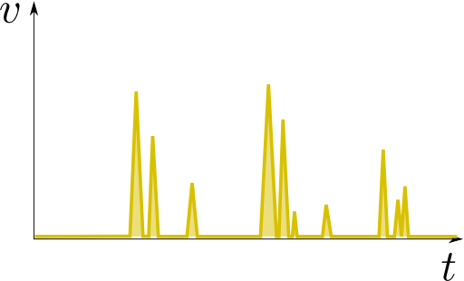
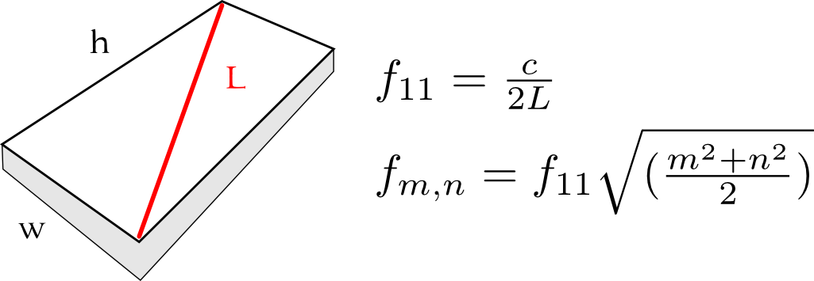

## Edizione Dicembre 2017

Back to [Home](index);
  
Presto disponibili le slides delle lezioni!
{: class="dashed"}

Di seguito parte dei contenuti trattati durante le lezioni:

* Go to the [Part 1](#pt1);
* Go to the [Part 2](#pt2);
* Go to the [Part 3](#pt3);

---

## Pt1:

>Il codice è la forma di scrittura a cui siamo maggiormente sottoposti ogni istante quotidianamente.
ref. "Speacking Code - Coding as aesthetic and political expression", G. Geoff, A. McLean, MIT Press

 ([usato all'interno della nuova versione 3 di Godot](https://godotengine.org/article/godot-30-switches-bullet-3-physics)), [Box2D](http://box2d.org/) (usato in Angry Birds), etc...
TODO: sistemi handheld
TODO: sistemi VR/headset

---

### Introduction

che cosa è un game engine

ampliamento del modulo di sound for media
perchè allora paralre di game engine (col suono ha poco a che fare)
ecco i motivi.

non parliamo nello specifico di nessun gm
ce ne sono tatni
sono più che documentati on-line
in buona parte sono gratuiti per usi non commerciali
affrontiamo il GE non tanto sul come si usa (non è il core del loro piano di studi)
affrontiamo piuuttosto per capire cosa sia e come interfacciarsi con esso o con chi ci lavora

quali i punti in comune e le differenze
per fare questo

piuttosto di utilizzare uno strumento per come ti vienee dato
cone suluzioni clichè
utilizziamo lo strumento spingendo oltre il preset (cit. di
lo strumento va conosciuto
concetti di programmazione

non trattiamo Godot perchè è gratuito ma perchè è LIBERO!
(lo capiremo meglio quando arriveremo a Puredata dentro a Godot)
Tra un software che non mi permette di ampliarlo ed uno che invece lo fa e permette di aggiungere elementi etc... scelgliamo il secondo è uno strumento.

Kim cascone min 27:30

<iframe src="https://player.vimeo.com/video/17082963?byline=0&portrait=0" width="100%" height="480" frameborder="0" webkitallowfullscreen mozallowfullscreen allowfullscreen></iframe>

approccio di indagine sullo strumento
non prenderlo ocme una cosa data

approccio multidisciplinare
come tecnici audio (vari)
vi è richiesta una certa dimestichezza con l'ambiente di sviluppo

## Pt2:

In queste due ultime lezioni vorremmo dedicarci al suono nei videogiochi, concentrandoci principalmente sull'aspetto dell'effetto sonoro e tralasciando invece quello musicale.
Verranno tuttavia fatti alcuni cenni alla musica nel videogioco e, se il tempo lo permetterà, vedremo anche alcuni esempio secondo noi particolarmente interessanti (come iMuse e alcuni esempi di musica generativa per videogames) poichè in linea con il particolare argomento che tratteremo.

TODO: Si potrebbe pensare di fare un esempio pratico in cui si contemplano 4 diversi possibili oggetti e si guarda quali sono i possibili eventi che possono verificarsi. Si conta poi il nomero di combinazioni e si giunge ad un valore numerico che, astraendo, diviene la formula di _calcolo combinatorio_ **[combinazione con ripetizione](https://it.wikipedia.org/wiki/Combinazione#Combinazioni_con_ripetizione)**: qualcosa del tutto simile a 2 estrazioni (valore **k**) da una urna contenentete **n** oggetti i quali vengano poi reinseriti nell'urna ad ogni nuova estrazione.

## Pt3:

TODO: the perfect machine doesn't make sound at all.

TODO: Fai una analisi veloce dell'occupazione di memoria da parte di memoria da parte di un qualsiasi browser (Chrome, Firefox) per confrontarla con quella del programma piano tech.

TODO: **Pholise** walking sound simulator (via PhISM). I _subevents_ nel suono dei footsteps sono importanti per identificare sesso, identià, età, etc...

* Vectorial vs raster
* una fotografia di una scultura: la puoi guardare solo da un lato.

TODO: parla di [Aeolus](http://users.skynet.be/solaris/linuxaudio/aeolus.html) + [hexter](http://dssi.sourceforge.net/hexter.html)

### Door simulation

(vedi Cook "_Real Sound Synthesis for Interactive Applications_" pg. 174)

Intuitivamente sappiamo che se spingiamo o trasciniamo un oggetto sopra ad un tappeto, facciamo esperienza di una forza che resiste al movimento che vogliamo indurre all'oggetto.

Questa forza, detta _forza di attrito_ è proporzionale al peso dell'oggetto e dipende in qualche misura dal tipo di materiali di cui sono composti i due oggetti che scivolanto l'uno sull'altro.

Sappiamo anche che questa forza si oppone in misura maggiore nel momento in cui cominciamo a spingere ma poi, mano a mano che l'oggetto acquista velocità, essa diminuisce gradualmente.

Per capire meglio come funziona immaginiamo di ingrandire notevolmente la zona soggetta allo sfregamento.

 By <a href="//commons.wikimedia.org/w/index.php?title=User:CaoHao&amp;action=edit&amp;redlink=1" class="new" title="User:CaoHao (page does not exist)">CaoHao</a> - Own work, <a title="Creative Commons Attribution-Share Alike 4.0" href="https://creativecommons.org/licenses/by-sa/4.0">CC BY-SA 4.0</a>, <a href="https://commons.wikimedia.org/w/index.php?curid=58745249">Link</a>

Se potessimo ingrandire a sufficienza ci accorgeremmo che i due oggetti non possiedono profili perfettamente lisci, anzi, la struttura del loro bordo è piuttosto costituita da una continuità di picchi e valli di dimensioni casuali. Quando accade che ci sia un sufficiente numero di picchi di un oggetto che incontrano altrettante valli dell'altro, allora la forza richiesta per liberarli è più grande.

Una volta che il movimento tra le due superfici è cominciato, avviene una sorta di separazione il che permette agli oggetti di slittare.

Un movimento lento permette ancora ad alcuni picchi di imbattersi in un certo numero di valli, il che causa una certa resistenza mentre movimenti più veloci permettono soltanto ai picchi più alti di scontrarsi tra loro, senza tuttavia che alle due superfici sia permesso di avvicinarsi a tal punto da "incollarsi" tra loro.

L'olio, l'acqua e altri lubrificanti servono appunto per riempire queste valli, aumentanddo in aggiunta lo spazio medio che separa le due superfici e facilitando inoltre lo slittamento tra i picchi e le valli.

Picchi e valli in realtà non costituiscono la sola causa di attrito più che altro quella più macroscopica: esistono altre interazioni a livello molecolare o che implicano l'elettricita statica che contribuiscono all'attrito.
{: class="dashed"}

<iframe src="https://www.youtube.com/embed/ZA_D4O6l1lo" width="100%" height="315" frameborder="0" allowfullscreen></iframe>

#### Stick/Slip

Questo tipo di meccanismo è chiamato _movimento stick/slip_ e si riscontra in fenomeni come l'archetto che scorre sulle corde tese di un violino ma anche nelle porte che stridono.

<iframe src="https://giphy.com/embed/XTsiHInoOPnyw" width="100%" height="360" frameBorder="0" allowFullScreen></iframe>

Nel fenomeno "porta che stride" il meccanismo è un po' complesso rispetto a quanto si verifica per la corda tesa (vedi Farnell "_Designing Sound_" pg. 395). Come suggerito da Farnell il fenomeno potrebbe essere modellato come mostrato nella seguente figura:

Nell'immagine è indicata **F** la forza che, rivolta verso destra, stiamo esercitando sull'oggetto. La forza che esercitiamo non è tuttavia applicata direttamente all'oggetto _mover_ ma piuttosto ad una molla coneessa ad esso.

La molla serve per modellare una sorta di _capacitanza meccanica_ **C**. Una volta che la forza che agisce sul _mover_ (data dalla somma di _F_ e _Fe_, la forza elastica della molla) eguaglia la **Fa** (forza di attrito statico), il _mover_ accelerata nella direzione di _F_, molto più velocemente di quanto avrebbe fatto solo grazie a _F_.

Questo fa sì che la tensione della molla diminuisca gradualmente. La frizione cinetica ora, minore in modulo, rispetto alla statica, agisce sul _mover_  rallentandolo fino allo stop. A quel punto il _mover_ ritorna ad essere "incollato" con la superficie d'appoggio fino ache non si sia accumulato (nella molla) forza sufficiente per staccarlo di nuovo.

Il movimento del _mover_ è quindi riassunto nel grafico sottostante dove si vede bene come il suo spostamento **D** avvenga a steps se comparato con lo spostamento costante di chi sta trainando l'oggetto.

Più lungo il tempo che intercorre tra step successivi, maggiore la forza che si accumula sulla molla e quindi maggiore la velocità di picco che il _mover_ avrà nel momento in cui si staccherà dal suolo.

Gli impulsi sono generati quando il _mover_ si slancia in avanti e in pratica questi picchi tendono a comparire in piccoli cluster dove ad un movimento ampio ne seguono altri più piccoli.

La complessità del movimento con attrito stick/slip aumenta perchè il coefficinete dell'attrito dinamico dipende dalla velocità ma non con una relazione non semplice. A velocità basse esso aumenta con la velocità fino ad un massimo; oltre questo massimo comincia a decrescere mano a mano che la velocità comtinua a crescere.

Volendo essere precisi si dovrebbero considerare anche le proprietà delle superfici di contatto le quali variano perchè soggette a calore dovuto allo sfregamento. Questo effetto sulla gomma è ben conosciuto dai piloti i quali, prima di cominciare una gara, provvedono a scaldare i pneumatici per far aumentare il coefficiente di attrito.

Dal momento che le asperità delle superfici sono casuali a livello microscopico non possiamo predire con assoluta certezza l'esatto istante di una _slip_, ma su base statistica il comportamento macroscopico può essere così predicibile da risultare praticamente periodico.

La periodicità aumenta quando l'interfaccia slip-stick appartiene ad una massa che si accopia con una sistema risonante come una molla nel nostro caso.

Il sistema risonante tenderà a produrre picchi regolari nella forza e farà sì che lo slip accada in simpatia con la frequenza risonante, proprio come accade in una corda suonata con l'archetto.

#### Model

Un cardine scricchiolante è un sistema composto da due componenti il cardine/i stesso e la porta.

Da una parte abbiamo  il cardine composto da due parti, una fissa ed un'altra mobile, e dall'altra invece abbiamo la porta che può essere fatta di materiali diversi e funge da risuonatore per le eccitazioni ricevute dallo _stick/slip_ motion che si crea sul cardine.

Una approssimazione ragionevole del suono potrebbe essere ottenuta generando un opportuno pattern di impulsi ad eccitare una struttura di filtri risonanti che modellano una struttura spessa e rettangolare (la porta).

#### DSP implementation

##### The Door: wood & resonator

Di seguito alcune belle animazioni che mostrano i _modi_ principali per una membrana rettangolare, tratte dalla [pagina](http://www.acs.psu.edu/drussell/demos.html) del professor Daniel Russel della _Pennsylvania State University_.

<table style="width=100%">
<tr>
<td>

</td>
<td>

</td>
<td>

</td>
<td>

</td>
</tr>
</table>

Sicuramente da approfondirne le caratteristiche: [Frame3dd](http://frame3dd.sourceforge.net/). Un software libero per studiare le dinamiche strutturali statiche e dinamiche. Che possa esserci utile nell'analisi dei modi?
{: class="dashed"}

##### The Hinge

Dato un parametro di controllo normalizzato in ingresso (un valore che varia tra 0.0 e 1.0), l'algoritmo ha il compito di riprodurre in uscita una serie di impulsi la cui alpiezza è proporzionale al tempo trascorso dall'impulso precendete.
