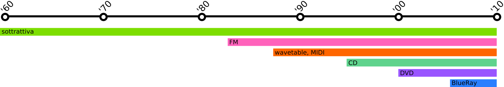
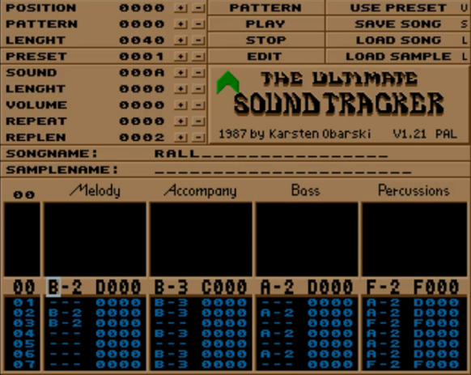
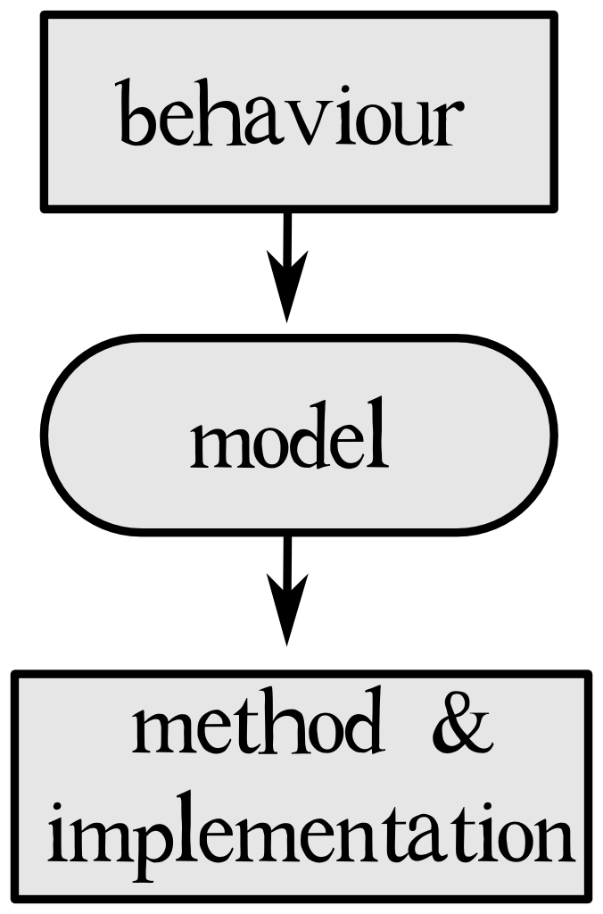

## Edizione Maggio 2017

Back to [Home](index);

Durante le lezioni si fornisce una panoramica storica dell'evoluzione del suono nei videogiochi, dagli anni '50 ad oggi; si dà poi uno sguardo alle diverse figure professionali coinvolte nello sviluppo di un videogioco e si analizzano gli strumenti impiegati nelle varie fasi (_game engines_, altri _tools_ e _middleware_).

Infine si passa ad esaminare approfonditamente il funzionamento del suono, sia come modello _data driven_ sia come paradigma _procedurale_.

In classe vengono mostrati diversi esempi pratici usando tools e middleware come _AdLib Visual Composer_, _Fasttracker_, _Unity_ e _fmod_. Inoltre vengono mostrati diversi esempi realizzati in linguaggio di programmazione _PureData_.

* Go to the [Part 1](#pt1);
* Go to the [Part 2](#pt2);

---

<a id="pt1"></a>
## Pt1: Che cos'è un videogioco?

Un videogioco è la declinazione moderna più diffusa e pervasiva del gioco.
Il gioco è un'attività che accompagna da sempre la storia dell'uomo. Se ne ritrovano esemplari molto antichi, che non si discostano molto dai giochi ai quali siamo abituati noi.

Per gioco intendiamo una **narrazione** guidata dalle **scelte** che uno o più giocatori compiono in conformità ad un insieme di **regole** che limtano il campo d'azione.

Un gioco è quindi uno strumento di intrattenimento, come un film, un libro. Si distingue da queste forme espressive, però, in virtù della propria **interattività**, privilegiando ad una narrazione lineare una narrazione a salti, non determinata a priori, ma emergente dall'interazione tra giocatore e gioco.

Il videogioco si distingue intoltre da altre forme di gioco in quanto punto di convergenza di diversi elementi eterogenei ta loro. In questo senso il videogioco è un **prodotto** di intrattenimento ( ma non solo ) **multimediale**, che si avvale cioè di almeno un paio di mezzi espressivi differenti (grafica, audio, animazione, testo, interfaccia utente, controlli hardware).

Il videogioco è un software; un software molto complesso, capace di raccogliere input provenienti da differenti domini e di farli coesistere in maniera coerente all'interno di un unico ambiente.

Di tutti i domini che concorrono a creare un videogioco ci concentriamo sulla sua componente audio, studiando l'evoluzione della tecnologia e delle tecniche nel corso della storia per meglio capire dove siamo arrivati, perchè e come possiamo inserirci professionalmente nel panorama contemporaneo.

Facciamo attenzione a quelli che sono i problemi principali che si sono dovuti affrontare nella creazione di audio per videogiochi:

* la gestione dell risorse (scarsità di memoria)
* difficoltà di programmare audio e di comporre musica in codice

E teniamo in considerazione fattori come:

* ruolo dell'audio nel gioco
* gestione dinamica del suono (transizioni)

## Once upon a time ...

Citiamo per amor di completezza quelli che sono considerati i due antesignani dei videogiochi. Siamo alla fine degli anni '50, inizio anni '60, in USA, nelle università.

* 1958: tennis for two
* 1962: spacewar!

Si tratta di software sviluppato sui **supercomputer** dei centri di ricerca, più sperimentazioni e simulazioni che veri e propri videogames. Dovremo attendere la fine degli anni '70 per avere i primi giochi su computer.

## Intanto in sala giochi...

Immaginiamo di essere nel XV secolo. Nelle corti si pratica un gioco che consiste nel guidare il percorso di sfere di metallo/legno facendo attezione ad evitare alcune buche.
Negli anni '30 questa idea diventa il **ballyhoo**, progenitore del **pinball**, che a sua volta spinge alla creazione delle cosiddette coin-operated machines, o **coin-op**: i cabinati.

Ci spostiamo quindi in **sala giochi**.
Siamo alla fine degli anni '60, inizio anni '70. Le coin-op montano _componenti elettrici discreti_, collegati tra loro attraverso cavi che si congiungono in schede madri. C'è sicuramente uno stadio di ventilazione per raffreddare le parti elettriche e meccaniche che si surriscaldano per l'utilizzo.

In una sala giochi ci sono molte coin-op che funzionano simultaneamente e ininterrottamente.

Il suono serve quindi ad attirare l'attenzione e ad invitare a giocare. Viene rubata l'idea al suono delle _slot machine_, ovvero al suono della vincita (la perdita non ha suono). Tante macchine corrispondono, statisticamente, a tanti suoni di vittoria, invitando gli avventori a tentare la fortuna, facendo credere in una facilità di vincita.

Il suono è slegato dal gioco. La musica è quasi assente e gli effetti sonori sono funzione del gameplay (se un evento richiede molte risorse l'audio è sacrificato ed il gioco rimane muto). Si implementa **sintesi sottrattiva**.



La programmazione audio avviene con collegamenti diretti di cavi al chip (o se va bene in _linguaggio macchina_ o in _assembly_).
Questa caratteristica fa sì che ogni macchina suoni in maniera differente rispetto alle altre, anche se il gioco che montano è il medesimo.

Lo sviluppo per arcade decade a inizio anni '90, e cessa definitivamente a fine anni '90.

## Una sala giochi in salotto

### Porting

Il mercato degli arcade è rimasto a lungo il settore leader per i videogiochi. Tanto da trainare la creazione, sviluppo e successo di altre tecnologie, come le **home consoles**. E' infatti grazie al _porting_ di giochi per arcade che le home console si sono imposte sul mercato. Come per le coin-op, si fa uso di sintesi sottrattiva.

Nel 1972 esce _Magnavox Odyssey_.
E' nel 1975 però che le home consoles hanno un boom con il porting di _Pong_ per la home console di _Atari_. Il successo è stato tale che nel giro di un anno sono nate quasi un centinaio di compagnie che offrivano una propria home console con un gioco simile a Pong.

Il chip che Atari usa per Pong (_General Instruments AY-3-85-00_) viene chiamato "_Pong chip_". Il chip è responsabile anche di generare il suono per il gioco. Tutte le altre compagnie usano lo stesso chip, quindi tutti i giochi pseudo-pong hanno lo stesso suono. Quel suono diventa marca sonora di un gioco, un genere ed un'epoca.

Un paio d'anni dopo Atari sviluppa il _VCS_ (Video Computer System) - noto dall'82 come Atari _2600_ - che sbanca sul mercato grazie al porting di _Space Invaders_.

Il VCS offre, a livello audio, 2 canali e la possibilità di selzionare la forma d'onda. Tuttavia i due canali hanno ciascuno un proprio tuning e, per la modalità di creazione del tune set, le note generate non appartengono ad alcuna scala, ma si discostano di alcuni (anche parecchi) centesimi di semitono (differenti tra PAL e NTSC).

_Mattel_ sviluppa _Intellivision_, un sistema che era pensato per essere espandibile e funzionare come strumento general purpose. Una di queste espandìsioni offre un sound chip aggiuntivo, arrivando a offrire 6 canali audio (record per l'epoca).

Il porting di giochi da arcade pone dei problemi per quanto riguarda la musica. A livello compositivo si predilige l'uso di **loop** di sequenze sonore (soprattutto dagli anni '80). Le **transizioni** tra scene o eventi nel gioco non vengono trattate, ma si lasciano **hard cuts**. Tuttavia l'utilizzo delle console in ambiente domestico fa mutare la funzine della musica da un richiamo urlato e fuori dal gioco a un suono più immersivo e non fastidioso, adatto all'ambiente domestico.

Negli anni '80 fanno l'ingresso sul mercato i **PSG** (Programmable Sound Generator), ovvero sintetizzatori basilari o DAC.
Il più famoso PSG è _General Instruments AY-3-8910_ usato in moltissimi arcade, in Intellivision, in ZX Spectrum e in Sega Master System.
Il suono si arricchisce e nuove possibilità creative si aprono, prevalentemente nello sviluppo di effetti sonori.

### Maturazione delle console

#### NES

A metà anni '80 il mercato delle console ristagna, saturo di una miriade di giochi tutti molto simili tra loro.
Una ventata d'aria fesca arriva nel 1983 con il _Colecovision_ di _Coleco_ che viene distribuito con _Donkey Kong_ (Nintendo).
Nel 1985 _Nintendo_ entra nel mercato delle home console con il _NES_, distribuito con _Super Mario_. Nel 1986 Nintendo rilascia _The legend of Zelda_.

Le home console si distaccano dal mondo arcade e iniziano a camminare con le proprie gambe.

Il NES monta un PSG proprietario che garantisce 5 canali audio (2 pulse, 1 tri, 1 noise, 1 DCM). La tecnologia è a 8 bit, ma l'audio prodotto è innovativo.
La gestione della memoria è ancora conflittuale, effetti e musica rivaleggiano per l'appropriazione delle risorse. Per risparmiare spazio in memoria si fa largo uso di loop.
A seguito del successo del NES NIntendo abbandona lo sviluppo per arcade.

#### Genesis

Diventa leader nello sviluppo per arcade _Sega_, che sfrutta i titoli su coin-op per lanciare le proprie conosole.
Al _Sega Master System_ fa seguito il _Sega Genesis_ (o _Mega Drive_) a 16 bit.

L'avvento dei 16 bit rendo possibile la **sintesi FM**, quindi il suono diventa più definito e ricco e la musica assume un'importanza maggiore nel gioco e per la prima volta acquisisce pari importanza rispetto agli effetti sonori come valore narrativo.

Il Genesis monta un PSG 3+1 (_Texas Instruments SN76489_) e un chip Yamaha per FM (_YM2612_) 6 canali + 1 campionatore.

La programazione audio rimane difficile, si basa ancora prevalentemente sulla conoscenza dell'hardware (si programma tramite cassette).
Quindi si riutilizzano più suoni per diversi giochi (**NOTA**: inizia a emergere il concetto di riutilizzo delle risorse)
Esempio: In "_Shadow of the Beast II_" (1992, Psygnnosis) l'organo a onda quadra è lo stesso di "_Fatal Rewind_" (1991, Psygnosis) che a sua volta condivide il suono di flauto con "_Misadventure of Flint_"(1993).

Alla tadizionale tecnica del loop si associano soluzioni creative per offrire una sensazione di variazione maggiore: la **trasposizione** di frasi sonore e la tecnica del **double tracking**.

<a id="sonic-loop">
<audio controls style="width:100%">
  <source src="./music/Sonic_Labyrinth.ogg" type="audio/ogg">
Your browser does not support the audio element.
</audio>
<a/>

Le musiche implementate nei giochi per Genesis sono esempi di una nuova sensibilità che si manifesta

* nella scelta degli strumenti e della loro interazione all'interno della composizione musicale (fiati, violini, tastiere al posto di chitarre);
* nella struttura della stessa, con piccoli riff e frasi ripetuti, sorretti da un suono di basso continuo;
* nella scelta di armonia modale, con richiami a ambienti esotici ed evocativi

#### SNES

Successore del NES è il _SuperNES_ (SNES) che monta molti elementi per la creazione e la gestione audio, tra cui un DSP Sony. Questo DSP permette di utilizzare la **sintesi wavetable**, quindi superando anche il Genesis dal punto di vista di qualità dei suoni prodotti. Nintendo tuttavia preferisce rimanere su suoni che richiamano i chiptune del NES e stilisticamente richiamare genri musicali in voga al momento, come dance, hard rock, hip hop.

<iframe width="100%" height="315" src="https://www.youtube.com/embed/dnXvGAtdhL8?start=20" frameborder="0" allowfullscreen></iframe>

<iframe width="100%" height="315" src="https://www.youtube.com/embed/r37TJdTI5M0" frameborder="0" allowfullscreen></iframe>

---
Sega mostra un'attenzione particolare per l'audio. Ne è un esempio il _Sega Dreamcast_ del 1998, a 128 bit. Il Dreamcast monta un processore audio dedicato con una memoria dedicata che permette un accesso non concorrenziale alla memoria del sistema.
Ma non ha successo e Sega scompare dal mercato.

#### PS1, PS2, PS3, Xbox : verso il PC

Con _Sony Playstation 1_, nel mercato delle home console fa il suo ingresso il **CD ROM**, che si porta dietro il CD audio. La qualità audio aumenta, lo spazio su CD è maggiore rispetto a quello delle ROM. Si possono creare molti suoni e creare layer complessi. Ma a scapito dell'interattività e della dinamicità.
Non si risolve ancora la gestione delle transizioni, che rimangono hard cuts.

La qualità audio continua a creascere, superando la qualità CD (si arriva a 48KHz), fino ad arrivare a _PlayStation 2_ che introduce il DVD ROM. _Playstation 3_ ha il supporto per il surround e permette lo stream audio 7.1 a 96KBs.

L'architettura delle console si complica, iniziano a montare microprocessori simili a quelli dei moderni computer e le loro funzionalità si diversificano sempre più, facendo della console uno strumento più general purpose rispetto al mero gioco. Il sogno di Intellivision si realizza.

Non a caso entra nel mercato delle console anche _Microsoft_ con _Xbox_. Da console di gioco si passa a lettore CD/DVD/BlueRay/streaming online.

## I computer

### I primi computer

Se agli albori i PC erano macchinari ingombranti appannaggio delle università e dei centri di ricerca, dal 1977 diventano uno dei mezzi preferiti per giocare.
_Wozniack_ stesso in un'intervista racconta di come l'Apple II sia stato dotato di speaker perchè doveva fungere da mezzo per videogiochi (Wozniack e Jobs arrivavano dal mondo degli arcade avendo sviluppato nel 1976 _Breakout_ per Atari).

I computer iniziano a diffondersi nelle case e offrono una caratteristica importantissima: possono essere programmati. I giocatori iniziano a diventare anche creatori.

_IBM_ si accorge dell'importanza commerciale dei videogiochiper computer e perlanciare il _PCJr_ nel 1984 chiede a _Sierra On-Line_ (una delle software house più importanti per videogame per computer) di creare un gioco apposito. Nasce "_King's Quest_".

Il PCJr monta un'interfaccia standard per le priferiche. Questo sarà fondamentale per la successiva creazione di schede audio e controller.

Un altro computer che nasce con il videogame in mente è _Commodore64_, che è tanto legato all'idea di console da prevedere un adattatore d'antenna per poter essere usato anche collegato al televisore, proprio come le home console.

L'audio in questa fase è ancora agli albori. Richiama per certi versi l'audio delle coin-op (spesso l'hardware è lo stesso).

### Soundcards

Un forte sviluppo dell'audio per computer si ha con la creazione di **schede audio** di terze parti che ampliano le capacità delle singole macchine.

La prima scheda audio per computer e _AdLib_ per _Amiga_. Segue _Creative Instruments/Labs_ con _Game Blaster_ (da notare il nome della scheda) poi evolutasi nella _Sound Blaster_.

Queste prime schede audio mostravano delle limitazioni, come SoundBlaster che mixa internamente i due canali audio in uno, riducendo le capacità espressive e riducendola qualità dell'audio. Si sviluppano allora moduli esterni da collegare per afruttare a pieno le potenzialità di queste nuove componenti.

La scheda audio permette di sfruttare enormemente il potere creative del computer, permettendo la programmazione di suoni e composizioni musicali grazie a tool come _Visual Composer_ e _Instrument Maker_ per Adlib.

### MIDI

In questo periodo intanto prende piede un protocollo di trasmissione dati audio: il **MIDI** ideato da _Roland_.

Il MIDI è un protocollo di trasmissione dati audio che prevede lo scambio di messaggi contenenti comandi per la creazione e la riproduzione di suoni. I suoni veri e propri non vengono trasmessi, permettendo un notevole risprmio in termini di memoria usata.
Questo fa sì che il MIDI sia massicciamente usato, tra gli altri, anche dai produttori di videogiochi.

Roland nel 1987 rilascia una scheda MIDI, l'_MT32_. Sebbene sia possibile usare l'MT32 per qualsiasi applicazione, Roland ha evidentemente in mente i videogiochi come campo priilegiato di utilizzo, infatti firma un accordo con Sierra On-Line che si impegna a rendere l'MT32 il sistema audio standard per i suoi giochi.

<iframe width="100%" height="315" src="https://www.youtube.com/embed/BMmFcs-_4x4?start=297" frameborder="0" allowfullscreen></iframe>

Tuttavia non esistendo uno standard, ogni produttore implementava a modo suo il protocollo rendendo difficile per i programmatori adattare il proprio lavoro alle varie situazioni. Nel 1991 si arriva alla definizione dello standard: **GMIDI** poi ampliato in **GSMIDI**.

Il **sequencing** è la tecnica compositiva tramite messaggi MIDI. Si tratta di una composizione lineare. In alcuni casi si è adattato il MIDI a sistema capace di creare audio dinamico e interattivo.

#### iMuse

**iMuse** (Michael Land, Peter McCowell) è il sound engine di _SCUMM_, game engine di _LucasArts_.

Nasce nel 1991 (brevettato nel 1994); è un sistema che premette l'introduzione di componenti di audio dinamico in un linguaggio di scripting. Fondamentalmente iMuse è un database di sequenze musicali che possono contenere **punti di decisione** o **markers** all'interno delle tracce.

Il sistema, utilizzando eventi SysEx nei file MIDI, si permette l'interazione tra le azioni del giocatore e il sonoro del gioco.
Gli eventi in questione sono di due tipi: **markers** e **hooks**.

Un _marker_ viene inserito nel file MIDI nel punto che, una volta raggiunto dal lettore MIDI, deve triggerare l'esecuzione di un particolare comando da parte dello script del gioco. Il comando in questione è inserito in una lista (coda - FIFO) è ne viene attivata l'esecuzione non appena il MIDI player raggiunge un marker con un determinato ID. I comandi possono essere qualsiasi cosa, dal fade in/out alle pause.

Un _hook_ contiene un ID e l'azione da eseguire una volta che l'hook viene raggiunto. Lo script lancia un comando che si occupa di aspettare che un certo hook venga incontrato (callback), e quindi di mettere in esecuzione il comando contenuto in quest'ultimo.
Gli hook si distinguono in vari tipi, quali ad esempio salti, trasposizioni, abilitazione/disabilitazione di strumenti.

Esempio: transizioni tra rooms:
* marker trigger: aspetta fino a che si raggiunga il punto appropriato prima di fare la transizione alla nuova sequenza
* jump hooks: nella sequenza mette in riproduzione un'altra parte della sequenza prima della transizione

#### MOD format

Il formato **MOD** è un formato di file usato prevalentemente per rappresentare musica. MOD è l'estensione del formato (Module/Modular). Il formato è stato ideato da Karsten Obarski per sopperire alla mancanza di tool per comporre musica per Amiga; il primo utilizzo del formato .MOD è stato con l'_Ultimate Soundtracker_ di Amiga.

I file MOD sono infatti legati al tracker come strumento compositivo, e ne hanno anche condizionato l'estetica e l'utilizzo, tanto che questi software non sono sostanzialmente cambiati dai loro primi esemplari. Quindi il formato .MOD è il formato "nativo" dei tracker.

Il file .MOD contiene **campioni** (strumenti) e pattern che indicano come e quando i campioni devono suonare ed in quale ordine.
Inizialmente si poteva disporre solo di 4 canali e 64 note. I campioni erano codificati come PCM a 8 bit ed erano riprodotti direttamente dal DAC di Amiga.

I tracker e i file .MOD si sono quindi diffusi ampiamente nello sviluppo di videogiochi, diffusione facilitata anche dal fatto che, al contrario di iMuse, il MOD non è proprietario (contro: diversità di implementazione).



### Confronto di audio in videogame

<iframe width="100%" height="315" src="https://www.youtube.com/embed/m9HvAXZgGeQ?start=20" frameborder="0" allowfullscreen></iframe>

<iframe width="100%" height="315" src="https://www.youtube.com/embed/D30r0iRH73Q" frameborder="0" allowfullscreen></iframe>

## I giochi moderni

Attualmente la grafica e la modalità di gioco spingono verso un iper-realismo. Il suono si adegua con l'uso di surround, che però fornisce una simulazione della realtà SOLO dal punto di vista del posizionamento.

Da citare la modalità di fruizione audio offerta da Nintendo Wii in cui i suoni sono emessi anche dai controller, aumentando l'immersività.

Con Xbox si inizia a delineare la tendenza delle console e dei computer a convergere in un unico sistema. Questa tendenza permane ai giorni nostri e si arricchisce di nuove potenzialità con i nuovi apparecchi per l'home entaitainment (smartTV).

#### VR

Oculus Rift e i vari sistemi di realtà virtuale stanno cambiando la modalità di gioco. Vedremo come l'audio si adeguerà a queste nuove modalità.

#### Handheld games

I giochi per dispositivi portatili sono pensati per essere giocati in pubblico, quindi la musica e i suoni non solo non sono importanti, ma devono poteressere elimimnati per non disturbare.

## Figure professionali

Abbiamo visto che il videogioco è un software. Abbiamo visto che alla sua creazione e sviluppo concorrono numerose figure professionali, dagli scrittori ai programmatori, dai compositori ai grafici.

Analizziamo ora come si configura l'industria del videogame contemporanea, attraverso quante e quali fasi si deve passare per ottenere un prodotto finito, quali figure intervengono nelle singole fasi e di cosa si occupano.

Visto che lo sviluppo di videogiochi è un ambiente variegato (ci sono piccoli sviluppatori indipendenti, grandi studios, realtà intermedie, studi che si occupano solo di una fase di produzione, ecc), consideriamo una realtà medio grande.

L'organizzazione del lavoro è gerarchica. A capo del processo c'è il **publisher**, ovvero la compagnia che investe denaro nello sviluppo del gioco. Al di sotto del publisher ci sono gli sviluppatori, o **developers** ovvero gli studi che si occupano di realizzare effettivamente il gioco.

Gli sviluppatori possono essere terze parti rispetto al publisher, quindi collaborare con questo sulla base di singoli progetti. Possono essere sussidiari del publisher, quindi studi di proprietà di quest'ultimo. Infine i developers possono essere indie (indipendenti) e affidarsi al self-publishing (auto-edizione).

A capo del progetto nello studio che si occupa dello sviluppo c'è il **producer** (produttore) che è responsabile dell'intero processo di sviluppo. Il produttore può essere interno allo studio o assunto dal publisher ad hoc.

Fanno capo al produttore i vari capireparto dei diversi dipartimenti di sviluppo:

* lead designer
* lead programmer
* audio lead / audio director
* art director

Nei vari reparti ci saranno quindi varie figure professionali, quali: scrittori (design), programmatori (programming), level designers (design), sound designers (audio), composers (music), audio programmers (programming/audio), artist (art).

Vediamo nello specifico quali sono le fasi di sviluppo del gioco.

### Pre produzione

Nella fase di preproduzione si delinea l'idea, il concept e la visione d'insieme del gioco.
Viene prodotto un documento, il **design document** che contiene:

* la storyline
* i dialoghi
* le mappe
* informazioni / idee sull'audio
* informazioni / idee sulle grafiche
* informazioni / idee di animazione
* primi abbozzi di programmazione

Questo documento deve essere approvato dal publisher.

### Sviluppo

I singoli punti del design document vengono presi in consegna dai rispettivi reparti coordinati dal produttore. Ciascuno sviluppa i propri contenuti e spesso ci si interfaccia tra vari diaprtimenti. Il design document infatti è una guida iniziale e serve a trasmettere l'idea di massima del gioco. Questo poi, in fase di sviluppo subirà modifiche, aggiustamenti, correzioni. I singoli reparti si interfacciano per portare avanti il lavoro in maniera coerente.
Ad assicurarsi che lo sviluppo non deragli dal concept espresso nel design document ci pensa il reparto QA, che sottopone il gioco a varie fasi di verifica.

### Debug

Una volta che il gioco è uscito dal reparto sviluppo e il QA ha dato la propria approvazione, si passa alla fase di debug e testing.
In questa fase vengono anche scritti i manuali e i vari documenti relativi al gioco. Si pensa inoltre anche al porting (PC, Mac, Linux, Android, iOS, Xbox, PS, ...) ed alla localizzazione.
Spesso infatti il gioco presenta dialoghi, sia parlati che sotto forma di testo, che devono essere adattati alla lingua dei vari Paesi inclusi nel piano di distribuzione.

### Release

Una volta che i test vanno a buon fine e che tutti i materiali accessori sono stati preparati, è tempo del lancio e della distribuzione. Di questa parte si occupa il reparto marketing (o uno studio a cui si affida il lavoro).

## La produzione audio

La produzione audio per un videogioco richiama per molti versi la produzione audio per i film.
Anche nei videogiochi si fa uso di foley (foley artists) e live sounds (field recording). Tuttavia c'è da ricordare che mentre il film propone una fruizione lineare dei suoi contenuti, nel videogioco il timing e le immagini cambiano dinamicamente. A differenza dei film, quindi, la fase di post produzione è diversa.
La fase di produzione varia a seconda del tipo di gioco, della piattaforma a cui il gioco è destinato e alla casa produttrice (ed editrice!) che lo sviluppa.

Rintracciamo però a grandi linee le fasi comuni:

### pre produzione - better think as a programmer

In fase di pre produzione viene prodotto l'**audio design document** (che confluisce nel design document) in cui si analizza il concetto e la possibile implemnetazione dell'audio per il videogioco.
Il documento si compone di varie sezioni, relative a musica, sound design e dialoghi.

Si è nelle fasi iniziali di sviluppo, quindi si ha a che fare con pochi elementi non precisi (storyboards e/o documenti da altri dipartimenti, abbozzi più che specifiche).

Questa fase serve a determinare il tipo di videogioco in generale (stabilendone il tema e il genere) e i conseguenti stili di suoni e musiche che lo possono rappresentare.

Inoltre si inizia a tenere traccia delle funzionalità che si prevedono per il gioco e qualsiasi comportamento specifico che l'audio deve tenere nel gioco, caratterizzandolo maggiormente rispetto alle indicazioni di massima di tipo, tema e genere.
E' in questa fase che si prende in considerazione l'interazione giocatore - gameplay. Questo è il momento in cui entra in scena l'interattività.

Un altro tipo di informazione utile definita in questa fase iniziale è lo "_spotting_" ovvero identificare quali elementi hanno componenti musicali/sonore. Si delineano i **cue points** e gli **entry points** per gli effetti sonori.

Si traccia una mappa emozionale del gioco per definire i cue points. Il suono infatti si carica di questo compito, come nel film: è repsonsabile del coinvolgimento emotivo inconscio del giocatore. Secondo Charles Deenen ci sono 6 emozioni base che il suono può veicolare:
felicità, disgusto, tristezza, rabbia, sorpresa, paura.
Le emozioni sono una componente fondamentale non solo della musica, ma anche del sound design, e aiutano a determinare il ritmo e il movimento del gioco, infatti gli effetti e suoni vengono mappati basandosi su una mappa di punti di tesione e rilassamento.

I sound designers elaborano quelli che potrebbero essere gli effetti da usare, i foley e il suono ambientale sia leggendo il design document, sia leggendo lo script (qualora sia disponibile).

I musicisti e sound designers stilano quindi un elenco di assets (armi, personaggi, UI, modelli, livelli, ...) che saranno utili in fase di sviluppo.
Si occupano anche di stabilire quali siano le limitazioni tecniche del sistema su cui si deve sviluppare (il numero di canali, surround o stereo, importanza del suono nel videogioco,...) e stilano un elenco di tools per lo sviluppo. Alcuni di questi possono già essere disponibili (banchi di effetti, editors,...), altri sarà necessario programmarli da zero. Per fare questo si deve tenere conto della piattaforma di destinazione, del sound engine che si andrà ad utilizzare e del playback engine offerto dal sistema di gioco.

### Produzione

In fase di produzione si ultima o si realizza se non lo si è fatto in preproduzione il **cue spotting**.
Si creano delle scratch tracks per il compositore, ovvero idee di massima della musica che si vorrebbe inserire nei vari passaggi, come punto di riferimento per la composizione vera e propria.
In case di produzioni grandi non è esclusa la ripresa di orchestre che eseguono dal vivo lo score composto per il videogioco.
Nella fase di produzione ci si occupa anche di creare i foley con props.

In quest fase viene creato il layering dei suoni, l'equalizzazione e si applicano gli effetti del DSP.

Un grosso vantaggio si ha con l'uso di DSP in tempo reale che risparmia il tempo di registrazione. Con un DSP in tempo reale l'audio risponde al physics engine e al graphics engine quando questi engine rilevano la necessità di un riscontro sonoro (si apre una porta, c'è una collisione,...)

#### Il dialogo

Il dialogo viene realizzato con la tecnica del **voiceover**. Spesso ci si rivolge a professionisti (attori, doppiatori, direttori di doppiaggio) per ottenere un risultato professionale e molto credibile.

Il dialogo si differenzia in:

* battute durante il gioco (script);
* parlato durante le _cutscene_ (il dialogo in questo caso è simile al dialogo cinematografico);
* _walla_ (voci presenti nell'ambiente, ad esempio persone che parlano per strada);
* narratore in voiceover;
* eventi inseriti nello script;
* cue triggerate dall'intelligenza artificiale (esempio: un cane che abbaia non appena ci si avvicina troppo ad una casa): generalmente non sono in forma verbale.

Spesso un voice actor copre più ruoli nel videogioco, la versatilità quindi è un elemento da tenere in considerazione quando effettuare il casting.
Ogni attore ha un **recording sheet** con le sue battute.
Generalmente si registrano tutte le battute di un attore invece di registrare dialoghi o seguire l'ordine di narrazione del gioco.

I dialoghi vengono registrati in studi per l'ADR. I file sono poi sottoposti al QA e se passano il controllo vengono tagliati nei singoli assets e passano al processamento degli effetti.

#### La localizzazione

TODO


```
notarget
fov
cl_testlight
gl_lightmap 0
noclip
gl_lightmap 1
noclip
cl_testlights 1
cl_testlights 0
s_show 1
s_show 0
sv_gravity 100 (default 800)
```


<a id="pt2"></a>
## Pt2: Suono come modello data driven/event based

Nell'ultima parte della sua storia, il suono nel videogioco si presenta come un modello guidato dai dati (**data driven model**).

In altri termini, l'audio di un videogioco è costituito da una moltitudine di file audio, compressi per ragioni di spazio e utilizzo delle risorse, raccolti in un database e che vengono messi in riproduzione all'occorrenza, in seguito al verificarsi di particolari eventi (**event based**).

Ai sample che vengono riprodotti si possono certo applicare delle **modificazioni in tempo reale** come ad esempio, e lo approfondiremo tra breve:
* attenuazione dovuta alla distanza;
* combinazioni e layering;
* random e granularità;

## Game audio engine tradizionale

Il game audio engine è una componente del game engine, oppure un modulo middleware da affiancare ad esso, che si occupa della gestione di tutto ciò che è suono all'interno di un videogioco.

Quali sono i compiti e le caratteristiche principali di un game audio engine tradizionale?

### Switching

Logiche e meccanismi per dare priorità ai suoni da riprodurre e assegnare le voci disponibili, dal momento che si tratta di risorse limitate.
Un esempio potrebbero essere i sintetizzatori dove si parla di [voice stealing](http://electronicmusic.wikia.com/wiki/Voice_stealing).

Un esempio di voice stealing nel videogioco lo si ha in _Super Mario Bros_, dove il sound engine agisce sulla voce assegnata alla melodia principale (il suono più acuto), deallocandola e riassegnandola per la sintesi degli effetti sonori delle monete.

<iframe width="100%" height="315" src="https://www.youtube.com/embed/Dp7fVUfj8oI?start=123" frameborder="0" allowfullscreen></iframe>

Lo switching è guidato anche dal ruolo che il particolare suono riveste all'interno della **narrazione**: in una sitauzione in cui sono presenti molti suoni, sono quelli meno importanti ai fini di quanto si deve raccontare ad essere sacrificati per primi.

### Random

Quando siamo fruitori di opere di intrattenimento - libri, cinema, teatro, etc... - tra noi e gli autori dell'opera si instaura una sorta di tacito accordo. Da una parte nasce (inconsciamente) in noi volontà di sospendere l'incredulità ([_suspension of disbelief_](https://it.wikipedia.org/wiki/Sospensione_dell'incredulit%C3%A0)) per mettere da parte per un momento le nostre facoltà critiche, ignorare le incongruenze secondarie e godere dell'opera di fantasia. Come spettatori ci lasciamo guidare e ci abbandoniamo alla narrazione.

Dall'altra parte l'autore si impegna nell'introdurci e nel guidarci attraverso un percorso comune allo scopo di raccontarci una storia.

La sospensione dell'incredulità nasce da un equilibrio molto sottile, tanto più difficile da creare quanto da mantenere da parte dell'autore dell'opera, soprattutto in epoca moderna dove si è bombardati da flussi continui di informazione e da moltissime forme diverse di intrattenimento.

Declinando il concetto al mondo videoludico, un suono ripetitivo viene riconosciuto dal nostro cervello come un **pattern**.

Il nostro cervello è abilissimo ad identificare pattern, strutture ricorrenti di ogni tipo (footsteps), è quando questo avviene il contratto si rompe.

Immaginate ad esempio cosa succederebbe se in un videogioco FPS, dove uno dei compiti primari è quello di muoversi all'interno di un mondo virtuale, il movimento dell'attore fosse evidenziato da suoni ripetitivie e sempre uguali a loro stessi.
Senza la casualità sarebbe impossibile ottenere la sospensione dell'incredulità.

### Blending

Crossfade parametrico tra campioni diversi, quello che nella sintesi prende il nome di **multisampling**. Questa tecnica è implementata in gran misura nei campionatori i quali infatti rispondono a diverse velocity di tocco con un mix tra campioni corrispondenti.

Immaginiamo una caduta di un oggetto da diverse altezze; questo comporta intensità diversa ma non solo, anche variazione timbrica.

### Mixer, Grouping and Buses

Molti game audio system incorporano un mixer del tutto analogo a quallo in uso nelle grandi produzioni: un banco large frame con gruppi, mandate e ritorni, etc...
La differenza è che, mentre per una produzione tradizionale la configurazione del banco rimane statica, praticamente invariata lungo tutta la durato di Un medesimo brano o album, nel caso di un videogioco  il mixer deve spesso riconfigurarsi del tutto in pochi istanti.
Un esempio potrebbe essere il passaggio da una sitauzioni in-game ad un menù di interfaccia (pausa o salvataggio).

### Real time controllers

Il game sound engine deve fornire un'interfaccia per ricevere parametri real time dal game engine ed usarli, spesso mappandoli sulle frequenze cutoff di filtri o sul controllo di volumi piuttosto che pitch.

### Positioning

Come funziona l'audio in un gioco: **emitters** sono oggetti nello spazio tridimensionale che emettono suono e uno o più **listeners** (mono, stereo o multicanale; va pensato come un array di microfoni), in genere solidale col player.
E' un sistema che si occupa di calcolare in run-time le funzioni di trasferimento e i filtri da applicare al suono riprodotto per dare all'ascoltatore la percezione che gli emettitori si trovino immersi nello spazio virtuale circostante.
Il panning "_reale_" è più complcato rispetto ad una semplice variazione di volume tra i canali.
panning, multicanale (stereo, 5.1, 7.1, ambisonic (non usato), binaurale);

### Ambience

Parlando di sample, quando si registra si predilige il suono diretto e si fa di tutto per escludere quello riverberato
Questo perchè il suono d'ambienza viene calcolato in tempo reale da processori dedicati.
reverb, delay, doppler effect, filtering, fast realtime convolution.

### Attenuation & damping

attenuazione esmorzamento: un discorso legato alla distanza tra emitter e listener, grandezza geometrica ricavata dal modello tridimensionale, in base alla quale viene modificato in tempo reale la frequenza di taglio di un filtro passa basso e un amplificatore di livello.
Lo stesso si applica in casi in cui ci sia un ostacolo tra emittere e listener: occlusione ottenuta con filtri opportunamente settati. Materiali diversi

### Dialogues

Il game audio engine deve essere in grado di interfacciarsi e gestire complessi database di informazioni. Uno di questi è rappresentato dall'insieme degli audio file associati a tutte le varie linee di dialogo (in una o più lingue) presenti nel gioco.

### Music

Il game audio engine deve essere in grado di gestire l'eventuale colonna sonora musiclae interattiva (vedi ad esempio il sistema _iMuse_).

### Alignement

Uno scenario in cui più giocatori prendono parte ad un partita multiplayer.
Un server preposto al controllo e al master clock per la ricezione e ridistribuzione dei pacchetti.
A seconda della contingeza ci possono essere latenze che si sommano e si accumulano, e possono essere diverse da caso a caso, e da giocatore a giocatore e cambiare nel tempo.
Il game engine, e più nello specifico l'audio engine per quanto concerne il suono, deve essere in grado di gestire situazioni come questa e di riordinare opportunamente i pacchettin in arrivo per dare un audio sempre corerente
esempio PS3 (chiedi a Vale di intervenire)

---
A ben vedere però questo sistema basato sui sample audio sembra in contraddizione netta con il dominio visivo, caratterizzato invece da un comportamento **continuo** e guidato da uno stream di parametri piuttosto che da eventi **discreti**.

## Come funziona un FPS

Consideriamo un semplice modello 3D costituito da 4 facce triangolari: occorrono 3 (OpenGL ne usa 4 in realtà) valori numerici corrispondenti ai 3 assi cartesiani per identificare la posizione di ciascuno dei suoi vertici nello spazio tridimensionale.

Un modello estrapolato da un moderno FPS tuttavia è composto da una moltitudine di poligoni, centinaia se non migliaia (**high poly**). Questi vartici e la loro configurazione nello spazio costituisce la **mesh** del modello ma da sola, non è bastevole per creare l'illusione di realismo.

Serve una **texture** da poter mappare sulla mesh che riproduca fedelmente le caratteristiceh visive come colori e dettagli dell'oggetto.

Perchè il modello possa essere visto nel mondo tridimensionale occorrono **luci**: ogni oggetto dunque, colpito dai raggi irradiati da tutte le fonti di luce presenti nel mondo virtuale, verrà descritto in modo ancora più realistico, in più se il modello riporta alcuni valori per le grandezze fisice associate ai materiali di cui è composto, come coefficienti di riflessione e assorbimento, e così via, l'effetto potrà essere ancora più realistico.

Moltiplichiamo il tutto per la moltitudine di modelli simultaneamente all'interno del mondo 3D virtuale e avremo quanto computato da una speciale componente del game engine, il **rendering engine** (che traspone il tutto su una superficie flat 2D), coadiuvato da componenti hardware che aiutano ad accelerare l'immane qunatitativo di calcoli richiesti.

L'interità dei modelli e delle loro mesh non sono fondamentali soltanto per ottenere una immagine 2D in uscita ma anche per creare la cosìdetta **word geometry** per il il calcolo e dell **collisioni**, indispensabili per prevedere e computare i comportamenti fisici.

Tutto questo è appannaggio del **physics engine** che non si occupa solo di collisioni ma valuta l'interà fisicità del mondo virtuale in cui siamo immersi: masse, densità, velocità e accelerazioni, forze, torsioni.

<table>
<tr>
<td>
<iframe width="100%" src="https://www.youtube.com/embed/cIcg5eotZlY" frameborder="0" allowfullscreen></iframe>
</td>
<td>
<iframe width="100%" src="https://www.youtube.com/embed/wKLaMN9dnjQ" frameborder="0" allowfullscreen></iframe>
</td>
</tr>
</table>

A tutto questo si aggiunge la componente di **intelligenza artificiale** che ha il compito di simulare comportamenti "_intelligenti_" per tutti quegli attori che, nel gioco, non sono comandati da un player umano.

Ebbene tutto questo viene calcolato di continuo, sempre in funzione dei dati di movimento ottenuti dalle azioni del giocatore, 60 se non più volte al secondo.

## Realismo: suono come processo

Il sample audio è una registrazione, e come tale si tratta di un qualche cosa fissato nel tempo: una registrazione cattura la perturbazione della densità dell'aria, l'effetto di un movimento nello spazio in un particolare istante ma non ci dice nulla in merito al comportamento.

In questo senso l'audio fruito attraverso i campioni resta un procedimento **statico**, come un **interruttore** che può essere solamente acceso o spento, una **fotografia** fissa ed immutabile anzichè vivida e dinamica.

Ci potremmo chiedere quindi che significato ha la parola **realismo**? premesso che il realismo non è una condizione indispensabile, anzi, ci sono videogiochi (basti pensare a PacMan, o a diverse produzioni indipendenti come Fez, Limbo, etc...) che tutt'altro ci propongono rispetto ad una esperienza "_realistica_", ce ne occupiamo perchè la ricerca del realismo sembra essere stata forse "_IL_" motore principale per lo sviluppo tecnologico nell'abito dei videogames.

Basti pensare che si è passati al massiccio uso della grafica tridimensionale non appena le tecnologie lo hanno permesso (questo vale anche per il mondo dell'**animazione**). Si ricerca sempre una maggiore definizione dei modelli. Ci si avvale del supporto di potenti motori di fisica per simulare fedelmente i comportamenti quali collisioni, esplosioni, attrazione gravitazionale, spinta del vento, forze etc...
L'intelligenza artificiale contribuisce a rendere sempre più credibili i movimenti e le azioni di attori e creature npc e la lista potrebbe continuare a lungo.

In abito audio invece quello che si fa, in pratica, è "_premere il tasto play_" quando serve, il che sembra un po' **riduttivo**, soprattutto per il fatto che:

* il suono riveste un ruolo importante di guida emotiva all'interno del gioco;
* l'audio è una parte importante per mantenere viva la senzazione di realismo;

Inoltre, un approccio _data driven_ come questo ha i suoi svantaggi vediamo un paio di esempi

### La porta

Supponiamo di avvicinarci ad una abitazione sconosciuta. L'intento è quello di entravi senza destare l'attenzione di chi sta all'interno. Nel gioco guideremo il nostro avatar fin sulla soglia e, a questo punto, a seconda dell'ispirazione del momento, potremo aprire la porta di colpo e preciparci all'interno oppure socchiuderla lentamente e magari interromperci al primo sospetto di non essere soli.

Secondo l'approccio tradizionale _sample based_ un campione preregistrato di scricchiolio viene riprodoto non appena si verifica l'evento "_collisione_" tra il nostro avatar e l'oggetto _porta_. Specie se l'audio file è lungo si nota che la riproduzione dell'audio file prosegue, anche se l'azione sulla porta si interrompe dopo breve.

Anche nel caso il game sound engine utilizzasse meccanismi di dissolvenza in uscita per temporizzare correttamente il livello, comunque risulterebbe chiara la disomogeineità tra i domini grafico e uditivo.

Immaginiamo cosa accadrebbe se poi scostassimo la porta ripetutamente, avanti ed indietro...

### Lastra percossa

Immaginiamoci con un arma di fronte alla fortificazione di un piccolo bunker dal quale dobbiamo stanare i nostri nemici. Cominciamo a sparare e colpiamo ripetutamente una delle lastre di metallo che rivestono l'esterno della costruzione.

Ad ogni impatto (di un proiettile sulla lastra) la lastra viene eccitata e di tutti i possibili modi strutturali saranno quelli primari ad assorbire il maggior quantitativo di energia e, come risultato, percepiremo sempre più chiaramente le frequenza di risonanza della lastra mano a mano che i proiettili continuano ad incidere su essa.

Lo stesso effetto non è ottenibile riproducendo lo stesso audiofile ripetuttamente per ogni nuovo impatto.

---

Il suono insomma risulta essere malamente accoppiato con il motore di gioco sottostante, incoesivo con l'esperienza complessiva. Eppure non è sempre stato così. All'inizio della storia dei videogame, delle console e dei computer, era l'audio la motivazione principale che ha guidato lo sviluppo tecnologico.

L'audio veniva generato in tempo reale e rispecchiava linearmente le azioni del giocatore e le reazioni dell'engine. L'audio veniva sintetizzato in tempo reale.
Questa tendenza si è interrotta indicativamente attorno alla seconda metà degli anni '90, momento storico dove si può collocare la comparsa sul mercato dei prini CD e che vede il diffondersi dell'audio campionato ad alta qualità (44100@16bit).

Attenzione, questo **non significa che in passato i sample non venissero utilizzati**; Nintendo, SEGA e ancora prima nelle coin-op, dove possibile, si inserivano sistemi DAC in grado di riprodurre, seppure non con la stessa qualità CD, campioni e sample pre-registrati, soprattutto per la voce. La ricerca del "_realismo_" tuttavia ha infine soppiantato i sistemi di sintesi tradizionale.

Tali sistemi però sono sopravissuti in una parte del mercato legato all'audio: la **musica** e gli **strumenti musicali**. In questi campi ci si accorge subito dell limitazion intrinseche dell'audio per campioni (il sample è un _tradimento_ della realtà), per questo la ricerca e lo sviluppo di nuovi sistemi di sintesi continua a progredire.

Nascono i primi sistemi di sintesi basati su modelli: i fenomeni della fisica del suono vengono studiati e sintetizzati in modelli matematici e poi innestati all'interno dei circuiti integrati o dei software per computer.

Quando si vuole simulare i suoni dei vecchi sintetizzatori analogici, si sviluppano tecnologie volte a riprodurre in digitale tutte le idiosincrasie dei componenti elettrici discreti che li costituivano e nascono i modelli [virtual analog](https://en.wikipedia.org/wiki/Analog_modeling_synthesizer).

Quando invece si vuole simulare strumenti musicali acustici o elettroacustici nascono modelli volti a riprodurre i fenomeni fisici delle sollecitazioni, vibrazioni, attenuazione dei materiale: nasce il [physical modelling](https://en.wikipedia.org/wiki/Physical_modelling_synthesis).

Esistono da diversi anni scuole di pensiero volte a traslare questi metodi di sintesi, da tempo diffusisi sul mercato e molto apprezzati per le loro qualità, nel mondo videoludico.

Pionieri di questa filosofia di pensiero sono persone come [Perry Cook](http://www.cs.princeton.edu/~prc/AKPetersBook.htm) e [Andy Farnell](https://mitpress.mit.edu/books/designing-sound), solo per citare i più noti, i quali ritengono possibile derivare dagli studi fatti fino ad ora, modelli finalizzati non tanto a simulare suoni appartenenti al dominio musicale ma piuttosto volti a sintetizzare una moltitudine di classi sonore associate ad oggetti e fenomeni quotidiani.
Così da rendere possibile la sintesi, potenziale, di ogni tipo di suono possibile.

Da questo punto di vista il suono nel videogioco diventa un modello inteso come processo diventa (**sound as a process**), in contrasto con il paradigma precedente di _event driven/data driven model_.

Il termine spesso associato a questo paradigma è **audio procedurale**, eccone una definizione:

> “Procedural audio is non-linear, often synthetic sound, created in real time according to a set of programmatic rules and live input.” – "[An introduction to procedural audio and its application in computer games](http://cs.au.dk/~dsound/DigitalAudio.dir/Papers/proceduralAudio.pdf).” by Andy Farnell

Processo guidato da uno stream continuo di dati provenienti dall'interazione dell'utente, manipolati e usati come parametri per controllare in tempo reale una serie di algoritmi che sintetizzano audio.

A ben vedere il concetto di audio procedurale non ci è del tutto estraneo; un esempio a cui siamo abituati è il _riverbero artificiale_.



TODO: classi di modelli (tassonomia)

## Vantaggi e svantaggi del paradigma procedurale, il futuro

tra i vantaggi possiamo considerare:

### Differimento

metre l'atto di registrare un suono è un azione che fissa nel tempo senza lasciare alcune possibilità di intervento successivo, l'audio procedurale è dinamico e lascia che molte delle decisioni, anche strutturali, vengano rimandate al real-time;

### variabilità

Caratteristica fondamentale del suono procedurale che garantisce la possibilità pressochè completa di modificazione del suono in tempo reale e di produrre in questo modo risultati sonori anche molto diversi tra loro pur facendo capo ad uno stesso modello.

### Default forms

dal momento che la **crescita** dei sounds assets è **combinatoria** (es. incudine martello), diventa difficile provvedere alla creazione di tutti i suond assets necessari mano a mano che il mondo virtuale cresce. Il vantaggio di un modello procedurale è che il suono può essere generato in modo automatico derivando le proprietà dagli oggetti presenti nel gioco. Questo **non elimina** la figura del **sound designer**, il quale interviene laddove alcuni suoni necessitino di particolari caratteristiche perchè più importanti per la narrazione, ma **garantisce** che ogni oggetto abbia sempre un **suono di default** associato, senza incorrere così nel rischio che qualche evento sonoro non possa essere triggerato.

### Costo variabile e dinamico

Il paradigma procedurale permette il LOAD - Level Of Audio Details - (che sfrutta le conoscenze in ambito di acustica e psico-acustica) caricamento dinamico sulla CPU esattamente come già fa la parte grafica cone il **mipmapping**.

Consideriamo una esempio quale potrebbe essere un suono in grande lontananza:
nel caso di un motore audio tradizionale, al suono verrebbe applicato notevole processing DSP in tempo reale da far sì che il sample - attenuato e filtrato - dia l'impressione di provenire da lontano. Tuttavia, nonostante il suono ne risulti pesantemente modificato rispetto all'originale, comunque il costo in termini di risorse sarebbe invariato rispetto alla normale riproduzione di un audio file.

Nel caso il problema venga affrontato con il paradigma procedurale invece, soprattutto facendosi forti del fatto che il modello è stratificato e costituito da più parti indipendenti tra loro, il carico di lavoro potrebbe essere ridotto: certe componenti del suono, proprio per via del fatto che la sorgente sonora è ascoltata da grande distanza, potrebbero essere del tutto tralasciate rispetto ad altre. Il lavoro del processore sarebbe avvantaggato.

Lo stesso dicasi se il suono riprodotto da un modello si trova riprodotto in associazione con altri suoni che causerebbero il _mascheramento_ nel tempo o in frequenza di alcune sue componenti.

Tra gli svantaggi:

### Industrial inertia: you gotta ship titles

Al momento attuale non sembra ci sia interesse nell'implementare quanto necessario per inserire questo paradigma nel workflow per la produzione di giochi. Spesso in questi casi ci si scontra con metodi di lavoro consolidati che sono difficili da modificare, soprattutto per via dei costi e dei tempi necessari per la transizione.

### new skills

TODO

### la sintesi è brutta

Permane la falsa concezione che la sintesi audio sia in qualche modo sinonimo di finzione (sintesi = suono "_di plastica_") e, come tale, sia qualcosa di insoddisfacende, di deludente.

In realtà non è così e, se anche lo fosse, il ragionamento non sta in piedi in quanto il **realismo** non serve!
Lo sanno bene i sound designer e tutti coloro che, in generale, hanno già qualche esperienza nel mondo dell'intrattenimento, il realismo spesso delude. Quello di cui c'è bisogno è il **verosimile** (come dice molto bene [Chion](http://www.lindau.it/Libri/L-audiovisione.-Suono-e-immagine-nel-cinema)) o addirittura dell'**hyperrealism** ("_more than reality_").

### The Future

In un futuro presumibilmente non troppo lontano, il paradigma procedurale avrà preso piede e il modno del lavoro nel settore dell'audio per videogiochi dsi arricchira di tutta una serie di nuove figure professionali.

Proprio come negli ultimi 20 anni sono nate specializzazione di ogni tipo nel mondo della computer grafica (professionisti che si occupano esclusivamente di _rigging_, _textures_, _animazione_, _modellazione_, _light_, _visual fxs_, etc...), così anche nel mondo dell'audio procedurale ci saranno nuove figure speciallizzate nella modellazione di suoni e fenomeni fisici differenti (acqua e [bolle](http://www.cs.cornell.edu/projects/Sound/bubbles/), fuoco, [fracture sound](http://www.cs.cornell.edu/projects/FractureSound/), impatti, [frizioni e sfregamenti](http://independent.academia.edu/StefaniaSerafin), [accartocciamenti](http://www.cs.columbia.edu/cg/crumpling/), [acustica delle stanze](http://www.ness-music.eu/wp-content/uploads/2013/04/TASL2256897.pdf), etc...).

C'è addirittura che si specializza nel processo inverso, ovvero nel ricreare animazioni basandosi sul suono in una sorta di _inverse fooley_, il che può portare a risultati davvero sorprendenti:

<iframe width="100%" height="315" src="https://www.youtube.com/embed/EGkQkdCKztM?start=130" frameborder="0" allowfullscreen></iframe>

## Esempi di audio procedurale (Pure Data)

Abbiamo detto che il paradigma del suono procedurale prevede una stratificazione delle diverse fasi. Questo significa che ciascuna di esse può essere svolta con un particolare strumento hardware o software piuttosto che un altro, a seconda delle esigenze del progetto o delle particolari propensioni del suon designer.

Tipico è il caso del layer di _implementazione_: in questa fase infatti qualsiasi strumento software può essere usato per implementare il modello, come ad esempio Chuck, SuperCollider, CSound o PureData.

Vedremo ora alcuni esempi tratti dal lavoro di _Andy Farnell_, il quale usa PureData come linguaggio di programmazione.

Che cosa è PureData? PureData è un linguaggio di programmazione a nodi nato a metà degli anni '90 ad opera di Miller Puckette che all'epoca lavorava all'IRCAM di Parigi.

Esempi di procedurale: bells, clocks, water, insects, engine, guns, helicopter (thanks to _Andy Farnell_ and _Alexey Reshetnikov_).

Per utilizzare [questi esempi](https://github.com/Limulo/game-sound-sae2017/tree/master/procedural/PureData_examples) è necessario installare una versione di [PureData](http://puredata.info/) e delle seguenti librerie aggiuntive:
* list_abs (for the **[list_dot]** and **[list_emath]** objects);
* zexy (for the **[>~]** object);
* iem_t3_lib (the **[t3_bpe]**, **[t3_line~]** and **[t3_delay]** objects);
* motex (**[ln~]** object);
* lyonpotpourri (**[adsr~]** object);
* creb (**[ead~]** object);
* cxc, cyclone, purepd (**[delta~]** object);
* iemlib (**[init]** object);
* ggee (**[image]** object);

## Music

TODO



non linearità

* variazione del tempo (space invaders + mario alla fine di ogni livello)
* variable pitch ( a che vedere con le limitazioni tecniche della memoria)
* variabile rhythm/meter (esempio fraseggiatore o Zen games)
* volume and dynamic
* variable DSP (reverb and distorsion)
* variable melody
* variable harmony
variable mix (sostituzione di strumenti o di layers)

_vedi Roads_

Concetti di [musica generativa](https://en.wikipedia.org/wiki/Generative_music), esempio sono _Music for Airports_, _Discreet Music_ etc...
architetto e compositore vs gardener (intervento di [Brian Eno](https://vimeo.com/55969912))

Individuazione dei metodi formali, delle regole nella composizione della musica: Guido D'Arezzo (1026), Mozart, etc...
Composizione automatica
contollo delle sequenze --> musica algoritmica (Xenakis, Koenig, Truax)

processi stocastici
    + tabelle della probabilità
    + distribuzione di probabilità
    + catene markoviane

---

## Catene Markoviane

(Andrey Markov 1856 - 1922) è il nome che viene assegnato ad una macchina a stati statistica discreta nella quale lo stat osuccessivo è determinato da una matrice dei pesi di probabilità assocaiti ai passaggi tra stati diversi all'interno di una sequenza.

Dati statistici possono essere estratti da una musica data per ottenere poi una nuova composizione generata nello stile esaminato.

citando Farnell:
> For example, a Markov machine can quickly be trained to under stand 12 bar blues and notice that more often than not a F7 follows a C and that a where a
chord has a major 3rd the melody will use a flattened one. This is interesting when data from more than one composer is interpolated to see what Handel, Jean Michel Jarre and Jimi Hendrix might have written together.

### Case Study: Zen Game

esempio [Zen Games](http://www.limulo.net/games/ZenGame/)
Le note sono prese a prestito dalla scala pentatonica maggiore di C
set di regole
* durata nel tempo
* durata della frase che condiziona il verificarsi di una pausa e la durata della stessa
* probabilità di scegliere una nota all'interno dell'accordo
* probabilità di scegliere una nota successiva che si trovi nelle vicinanze di quella appena cantata
* probabilità che la nota da cnatare sia acuta piuttosto che grave

## Artificial Intelligence

memoria ritenuta diventa conoscenza

conoscenza + processo.

### AI adattiva

### Sistemi esperti

per semplificare all'estremo si può dire che i sistemi esperti sono quelli che possiedono un libr od iregole (l'armonia jazz, il rock, etc...) dal quale possono attingere per operare delle decisioni. Ma questa conoscenza non è fissa. Quello che definisce i sistemi esperti come AI è il fatto che questi possono correggere la loror conoscenza.

### Neural Networks

### Cellular Automata

Gli automi cellulari sono una collezione di programmi molto piccoli che vivono in un ambiente circoscritto e interagiscono tra loro. Ognuno è una macchina a stati che evolve su base di una matrice di regole e anche dell'input esterno.

Una **intelligenza emergente** si ottiene dalla rispettive interazioni e dal modo in cui gli output di alcuni diventa input per altri.

Esempio game of life in Processing

### Algoritmi genetici

Condisioni ambientali possono far prosperare o uccidere le nuove generazioni le quali portano con sè, talvolta mutato, il patrimonio genetico dei genitori.

---

Frattali (auto similarità) - 1/f rumore frazionale

Chaos generator

Grammatiche

Pattern matching / search tecniques

    Constraints



---
Una interessante riflessione:

<iframe width="100%" height="315" src="https://www.youtube.com/embed/Zctp972y_Eg" frameborder="0" allowfullscreen></iframe>
