# FMOD

Back to [Home](index);

**FMOD** is a software tool by _Firelight Technologies_ (Melbourne, Australia). It helps sound designers to better organize audio assets in order to be used inside games (or interactive applications more generally).

If you take a tour of the [FMOD website](http://www.fmod.org/), you will see that FMOD comes in three flavours:
* **Studio**: similar to a DAW, FMOD Studio is a software with a graphic user interface that makes all the features of FMOD easy to use;
* **API**: is the way a programmer would use FMOD;
* **IO**: it's a sound effect store that FMOD users can directly access from FMOD Studio;

FMOD can be integrated with the principal game engines [Unity](http://www.fmod.org/documentation/#content/generated/engine_new_unity/overview.html) and [Unreal Engine](http://www.fmod.org/documentation/#content/generated/engine_ue4/overview.html).

## Getting Started

Here are some video tutorials to get started with Fmod ([link1](http://www.fmod.org/training), [link2](https://www.youtube.com/channel/UCekk9jO-MTyWEbD2l0m6PTA))

A single game corresponds to a single FMOD Studio project (it will contain all the events, music and mixer data for the game)

## Project creation

When you create your first project it's better you to save it in order to make all datafiles you will load to be also **copied** inside the project asset folder (not linked from their original location on the file system).

TODO: File Structure of a project

## Interface Overview

<!-- 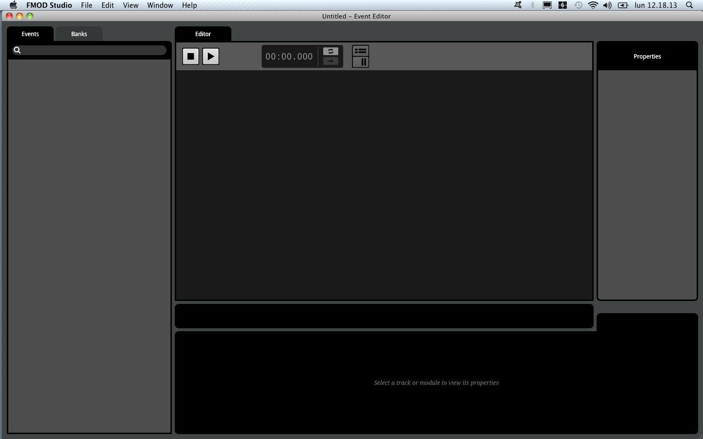 -->

1. Menu Bar;
2. Event Browser (with Tabs and Search Bar);
3. Editor (Transport Bar);

## Preferences
TODO

## Audio Bin

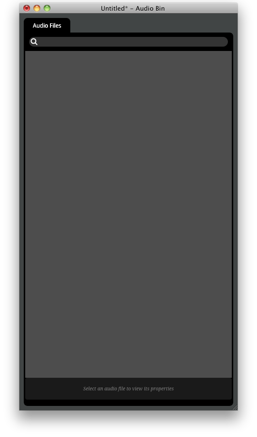

To import audio go to **Window > Audio Bin**. The Audio bin window opens. Now select the audio file from the file system and drag and drop it inside the _Audio Bin_.

## Events

<!-- 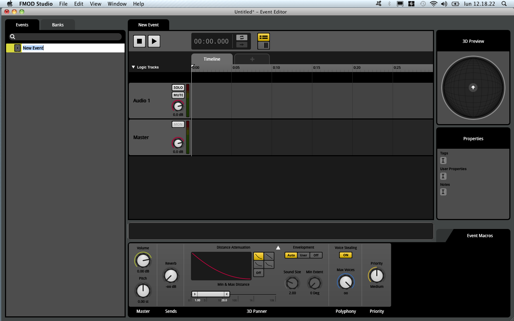 -->

They can be **triggered** and their **parameters manipulated**.
In-game events and (FMOD)events are different in the sense that a game can have multiple different instances of events which triggers the same FMOD events (i.e. multiple characters - the player and some npc - all using the same FMOD footsteps event).

Multiple instances: Game event instances each with its own timeline and parameters.

### Event browser
multiple events can be collected inside a folder in order to organize your project.

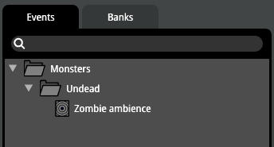

### Modules, deck and trigger regions
A **module** is a component of a signal chain characterised by its ability to be displayed in the deck when active.
**Sound modules** are modules from which the audio in an event originates. They are represented by coloured boxes on the event tracks called _trigger regions_.

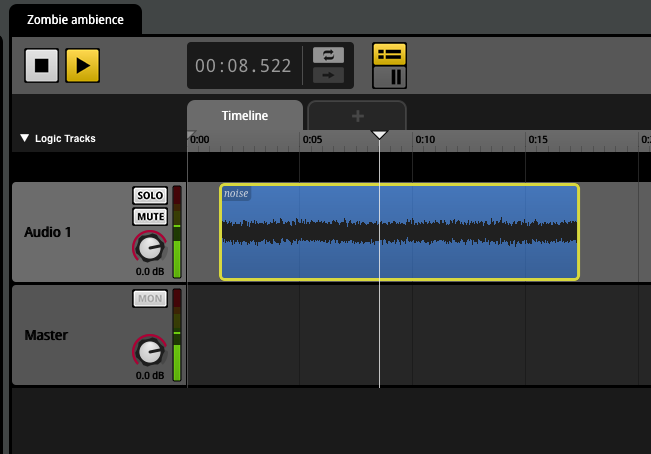

The module will emit sound as long as the cursor will stay above the _trigger region_.

<!-- 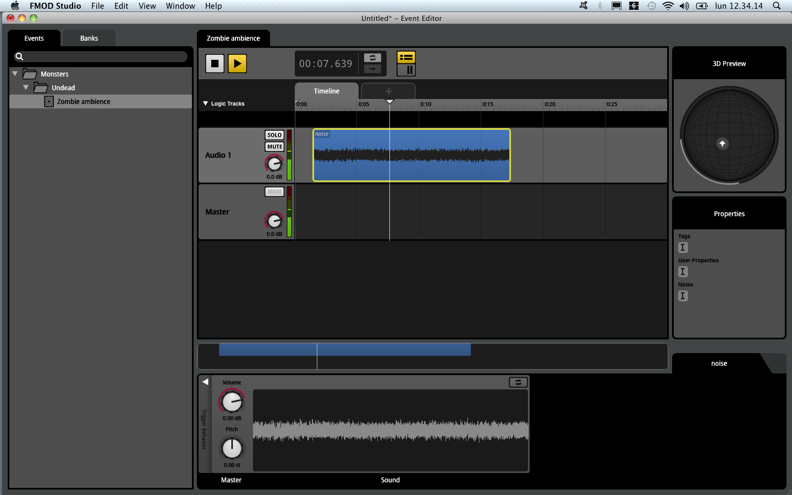 -->

On the _deck_ we see the module corresponding to the trigger region we have selected on the Editor

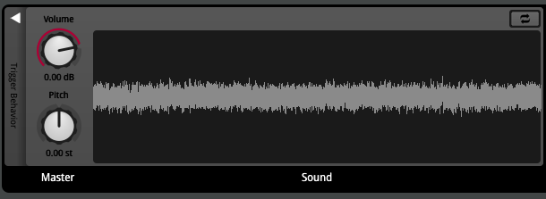

### Timelocked Sound Module

You see the waveform graphic on the corresponding trigger region. Timelock means that the audio we are going to heard is exactly what it is represented by the waveform graphic shown on the trigger region.

The **Loop Toggle button** is used when you want to extend the trigger region more than the audio file original extension and you want the audio file to continue the playback.

### Multi Sound Modules

It is not timelocked. Unlike the non­timelocked single sound module, this module doesn’t stop outputting a signal when the cursor leaves its trigger region.

<!-- 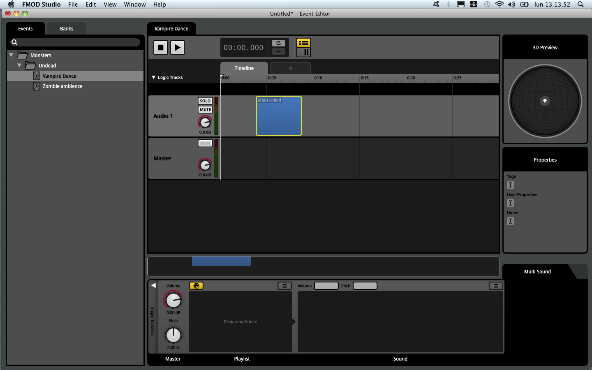 -->

Whether a module falls silent when untriggered usually depends on whether that module is set to loop.

In the other hand, if you set the **loop** toogle, the sound module stops producing output as soon as the cursor leaves the trigger region.

### Adaptive Events

In FMOD Studio, the primary way to make an event adaptive is to give it **parameters**.

<!-- 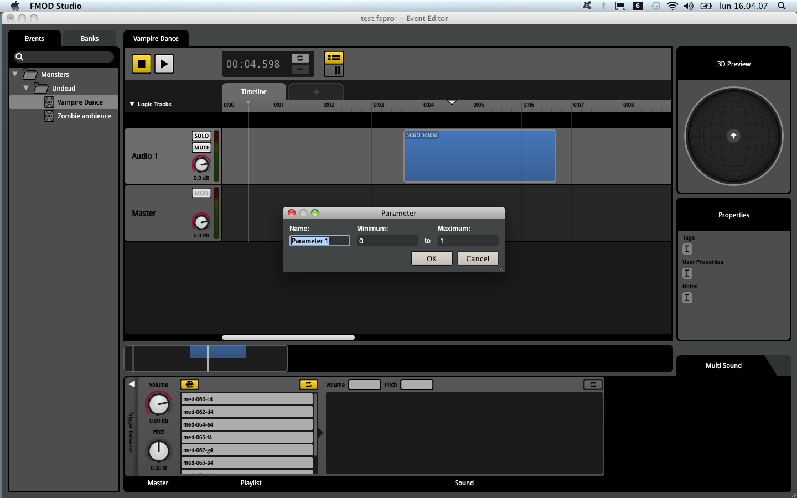 -->

The _Timeline_ is actually a special kind of parameter that automatically advances, and that all events have by default.

All instances of a given event have the same parameters, but the current values of those parameters can vary from different instances. This allows each instance of an event to have a unique state.

* An _Event_ can contain one or more _Parameters_.
* a _Parameter_ can contain one or more _trigger regions_.
* a _Sound Module_ has only one _trigger region_, for that a _Sound Module_ cannot have triggers regions on more than one _parameter_ of an _event_.

1. Parameters can trigger sound modules;
2. Parameters can automate sound module properties.

Note that, when automating the properties of a sound module, is possible to place the trigger region of that sound module on one parameter, and to automate a property of that sound module on a different parameter.

### Custom Parameters and Built-in Parameters

When you create an event with one or more parameter, the game code needs to include _function calls_ to update these parameters.

What values a parameter might have depends on the game engine and game mechanics. Lets pretend they says they are going to give us a boolean parameter: in this case we will create an event parameter which goes from 0.0 to 1.0.

If we want our event sound module to react to this parameter only when it is equal to 1, we are going to set the corresponding range slider (minimum = 1.0; maximum= 10.0).

In addition to this, if we don't want the output of our event sound module to change abruptly, as the boolean parameter will do, we need to set the event parameter **Seek Speed** to something greater than 0.0 secs.

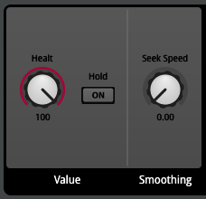

However FMOD includes a number of _built-in parameters_ that are automatically updated based on information routinely fed to FMOD Studio's geometry system.

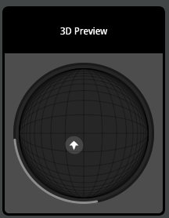

The 3D Panner:
* distance
* direction
* elevation
* event cone angle
* event orientation

<!-- 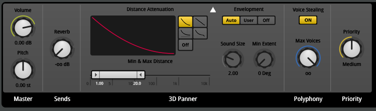 -->

### Modulators

TODO

## Making Interactive Music Tutorial

<!-- 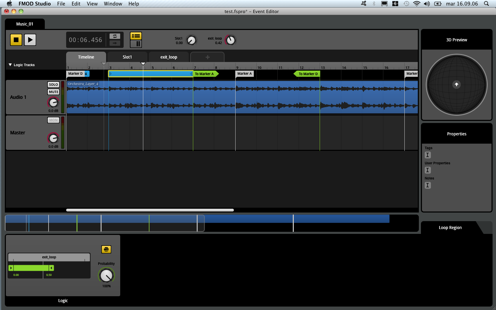 -->

We have interesting elements here:
* Tempo Marker
* Destination Marker
* Loop Region
* Sustain Point
* Transition marker
* Transition Region

(_Snap to ruler_ option)

<!-- 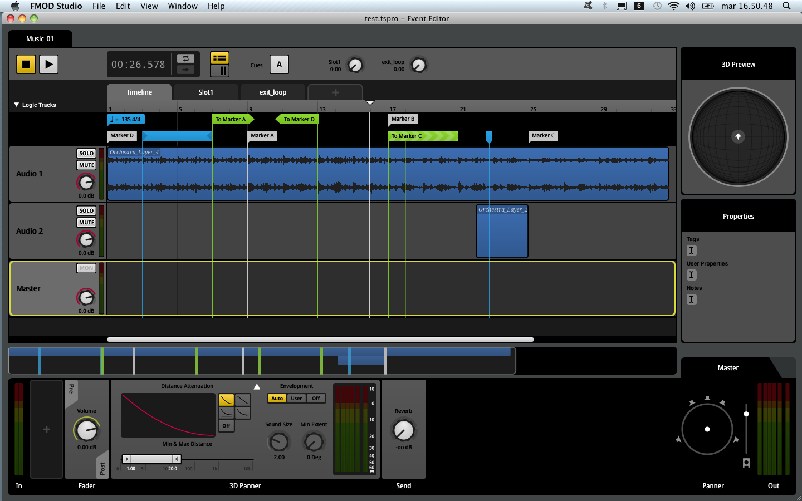 -->

1. background music + event triggered in quantization

2. Sending the cursor back in the timeline: Loop regions

3. Sending the cursor forward in the timeLine: Transition Markers. Conditions can be added to markers (create parameters and click on **+** on the corresponding module)

4. a Transition region is needed when the transition has to occur within a region of the timeline and not necessarily at a specific predictable point (quantization and parametrization possible).

5. Sustain point if it is necessary for to timeline cursor to stop! A sustain point for the timeline parameter doesn't mean other trigger regions on other parameters will pause too!

6. Transition Timeline: can be defined as short timelines that the timeline cursor travels along between disappearing at a transition marker and reappearing at the associated destination marker.

Pay attention not to get confused: Transition Region != Transition marker != Transition Timeline

## Routing & Mixing Tutorial

Here's the mixer window:

<!-- 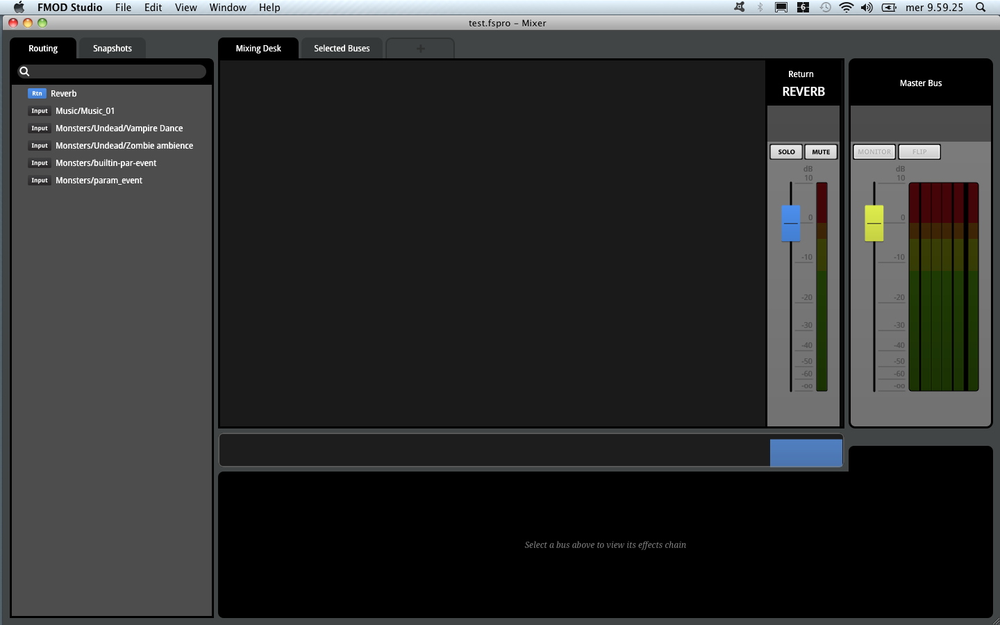 -->

Most mixing in FMOD Studio requires that all events in the project are routed into group buses (for example, sound effects, music, voices).

<!-- 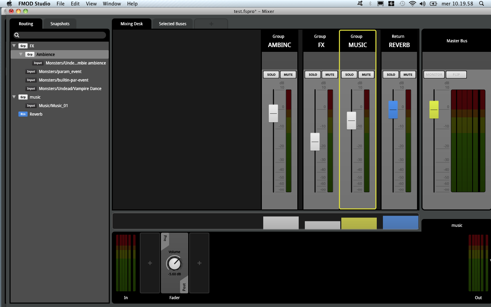 -->

When you assign an event _A_ to a group in the Mixer window, it means that whenever the game will instantiate a new _A_ event, its audio output will be routed to the group.

Mixing is normally done while the project's events are playing through the sandbox or in-game.

### Effect chain

Here's an image showing how to add effect on the channel.

Bypass is also possible. Like in many DAW _flip to faders_ is also possible. Rearranging effects is possible when you have more than one.

### Effect send

TODO

### Snapshots

<!-- 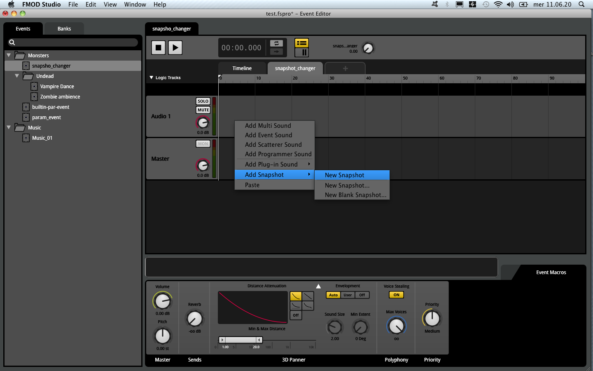 -->

**Overriding snapshots**: only buses and properties that are scoped in the snapshot can be affected by that snapshot (right click -> _scope-in_). When a snapshot is active, it acts like a mask, replacing the normal values of its scoped-in properties with the values specified in the snapshot.

Snapshots can be audited (snapshot have the _play_/_stop_ button in the transport bar)!

#### How to make smoother snapshot transitions?

<!-- 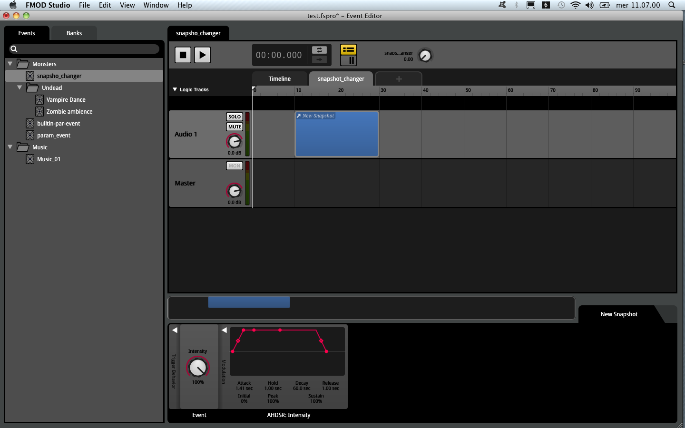 -->

With the snapshot mixer in focus, push the _track button_ in the transport to view track in an horizontal fashion. Now we can act on transitions over time.

**snapshot intensity** property - AHDSR modulator

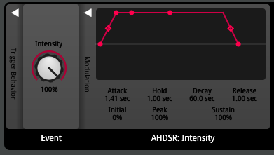

Snapshot can be triggered by:
* game code (see the FMOD API for more);
* an event via a **snapshot trigger region**

It is also possible for multiple snapshot or for multiple instances of the same snapshot.

When more than one snapshot acts on the same parameter, what happens when more of them are active at the same time? Well, their name is _overriding snapshot_ so the answer is that one "overrides" the other.

The order in witch snapshots appear in the snapshot browser is important: the snapshots at the top are applied last, overriding all the snapshots from lower down.

There are also **blending snapshots**: they work a little bit differently concerning the _volume_.

## Building the project Tutorial

Content created in Studio has to be built in a convenient **format** in order the game engine to use it.

### Assigning events to Banks

<!-- 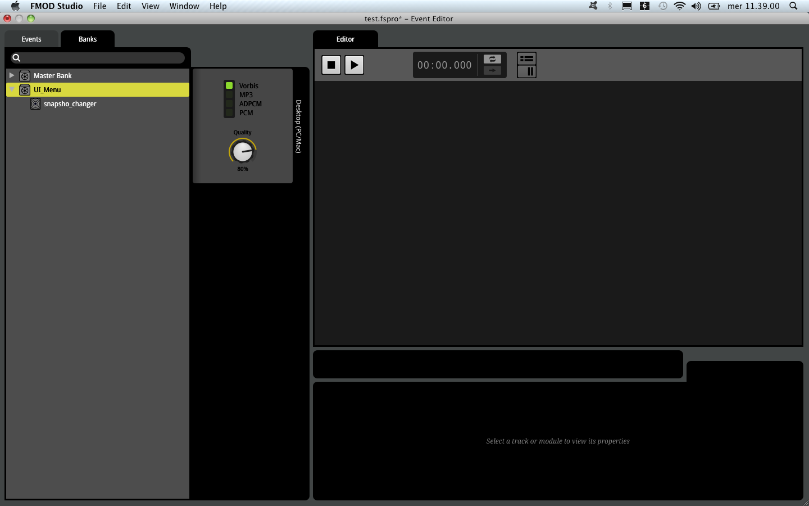 -->

A **bank** is a package which contains all the necessary files an data to make our game have audio. A game scene can have one or more banks, it will be useful for memory menagement purpose.

<!-- 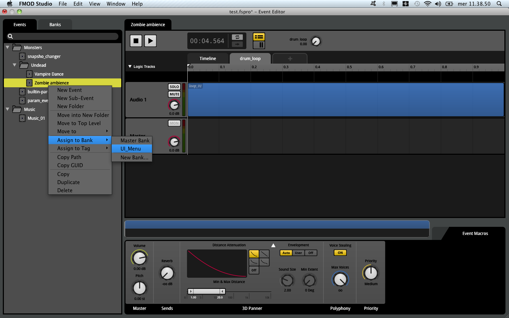-->

* prior to trigger an event, at least one _bank_ that contains that event must be loaded in the game;
* if we want our event to appear in the game, we need to assign it to _one_ or _more_ banks;
* for each bank we can select one or more target platform!

File > Build...

<!-- 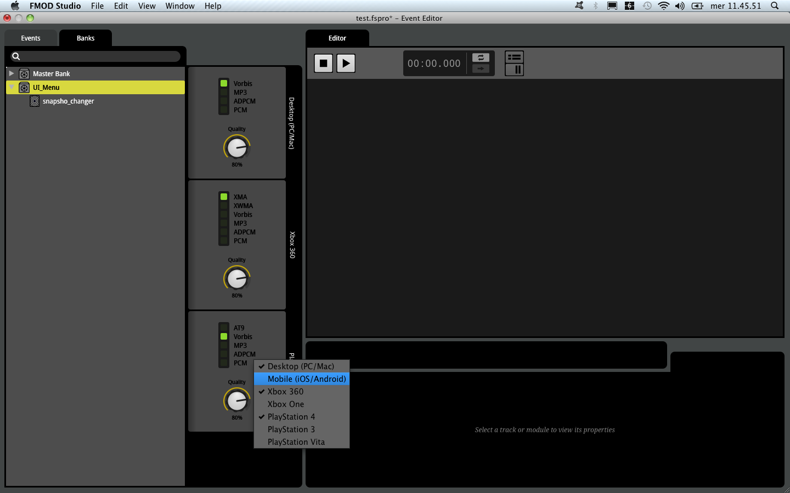-->

## Live Update Tutorial

When mixing and editing a project, it often helps to be able to hear the result in the game. **Live Update** allows you to connect FMOD Studio to your game as it runs, make changes to your project and hear the result in real time.

To use it, the game needs to set the __FMOD_STUDIO_INIT_LIVEUPDATE__ flag.

In Unity ([link](https://youtu.be/91GT1eb6xeQ?t=4m12s)):
1. Edit > Project Settings > Player
2. In _Resolution and Presentation_ make sure you have the _Run in background_ selected.
3. play the game
4. Open the FMOD Studio project
3. in Studio: File > Connect to Game...
4. insert the IP address of the machine where the game is running on (use _localhost_ if the game is running locally).
5. click Connect

## Understanding the Profiler

The **profiler** allows you to record _sessions_ live update. Profiler sessions are useful when investigating all sorts of issue that can arise in the audio of a game!

You can for example record action from a connected game and play them in a loop to find out where is the problem!

Profiler wold record:
* CPU usage
* memory used (in KB)
* File I/O
* Levels
* Voices (self/total) indicates the number of voices playing through a track.
* Lifespan
* Instances (self / Total)

## Case Study: Footsteps

How to implement footstep in your FMOD Studio project depends on the way the game is going to detect them ([link](https://youtu.be/DI72MHPfh0k?t=9m50s)):
* single footstep for multiple surfaces;
* a raycaster which detects the kind of surface the Player is walking on;

For example, if we have 4 different surfaces we need:
1. 4 different track with a multisample trigger region for each
2. 4 different parameter, one per material

We have to remove the 3D panner if we are modeling footstep for the main player character
We have to set the output _mono_.

## Case Study: Dynamic music

Delete the 3D panner: doing this we are changing our event to 2D event;

2D music track needs to be asigned to the main character in the game, the main audio listener.

## FMOD / UNITY integration

Studio Listener X Unity Audio Emitter
Unity Audio Listener X Studio Emitter
Studio Listener <-> Studio Emitter

when you have FMOD integrated with your Unity project, each time you build a bank, the unity integration plugin will copy this bank inside the _Streaming Assets_ folder, inside the Unity project folder.

In Unity
1. find the object you want your event to bind to
2. Add _Component_
3. _Studio Event Emitter_
4. select a _start_ condition (Object start: when the object is loaded in the scene);
5. select a _stop_ condition
6. select an event

To hear the sound we need a _Studio Event Listener_ (it is the equivalent of the _Unity Audio Listener_)

## TODO
* sub event
* File > Export GUIDs
* File > validate project
* File > Connect to Games
* How a Bank file is made
* Voices (what they are?)
* Profiler: What is API Capture Mode?
* sidechain
